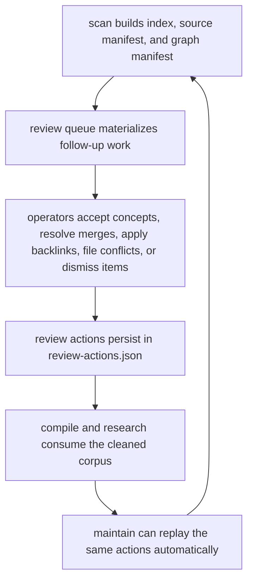

# Cognisync

[](https://github.com/shrijacked/Cognisync/actions/workflows/ci.yml)

Cognisync is a filesystem-first framework for building LLM-maintained knowledge bases.

It turns the workflow described by Andrej Karpathy into a reusable open source system:

1. Collect raw source material into a workspace.
2. Index and normalize that material into a deterministic manifest.
3. Generate structured work packets for LLM agents to compile a wiki.
4. Lint the resulting knowledge base for integrity problems.
5. Answer questions by searching the corpus and rendering outputs back into Markdown, slides, and other artifacts.

The goal is not to replace your favorite model or agent runner. The goal is to provide the workspace model, orchestration contracts, indexing primitives, and output formats that let people build serious tooling around this pattern.

## Core Ideas

- Filesystem-native: `raw/`, `wiki/`, and `outputs/` stay readable in tools like Obsidian.
- LLM-compatible: the framework produces prompt packets and execution plans for external LLM CLIs.
- Incremental: every scan, lint pass, query, and report can be filed back into the workspace.
- Deterministic where possible: indexing, search, linting, and report scaffolding work without network access.
- Extensible: users can write adapters, renderers, and orchestration layers on top of the core contracts.

## Workspace Layout

```text
workspace/
├── AGENTS.md
├── log.md
├── raw/
│   └── ... source documents, repos, datasets, images
├── wiki/
│   ├── index.md
│   ├── sources.md
│   ├── concepts.md
│   ├── queries.md
│   ├── sources/
│   ├── concepts/
│   └── queries/
├── outputs/
│   ├── reports/
│   │   ├── change-summaries/
│   │   ├── exports/
│   │   ├── research-jobs/
│   │   ├── review-exports/
│   │   └── review-ui/
│   └── slides/
├── prompts/
└── .cognisync/
    ├── access.json
    ├── audit.json
    ├── collaboration.json
    ├── config.json
    ├── control-plane.json
    ├── graph.json
    ├── index.json
    ├── notifications.json
    ├── review-actions.json
    ├── review-queue.json
    ├── runs/
    ├── shared-workspace.json
    ├── sync/
    ├── sources.json
    ├── usage.json
    └── plans/
```

## What Ships In This Reference Implementation

- Workspace scaffolding
- A root `AGENTS.md` workspace schema that explains the file-native contract to agents
- A root `log.md` activity ledger that records init, ingest, lint, compile, research, and maintenance work
- Deterministic corpus scanner and manifest builder
- Stable source and graph manifests under `.cognisync/`
- Stable review queue manifests for graph follow-up work under `.cognisync/`
- Durable review-action state so accepted concepts, merge decisions, and dismissals survive rescans
- Durable collaboration threads under `.cognisync/collaboration.json` so artifact review requests, comments, approvals, and change requests travel with the workspace
- Durable shared-workspace state under `.cognisync/shared-workspace.json` so peer bindings, accepted remote principals, and handoff bundles stay file-native too
- Durable control-plane state under `.cognisync/control-plane.json` so invites, bearer tokens, and scheduler ticks stay file-native too
- Regenerated wiki navigation catalogs at `wiki/index.md`, `wiki/sources.md`, `wiki/concepts.md`, and `wiki/queries.md`
- Deterministic corpus change summaries after scan, ingest, maintenance, and research runs
- Export bridges for JSONL research datasets, training bundles, and presentation bundles
- Evaluation reports over persisted research runs
- Research job notes and validation reports under `outputs/reports/research-jobs/`
- Markdown-aware search over `raw/` and `wiki/`
- Compile planner for missing summaries, concept pages, and repair work
- Knowledge-base linter for broken links, missing summaries, graph conflicts, and duplicate concepts
- Markdown and Marp report renderers
- Research and compile run manifests with persisted validation state
- Command adapter contracts for wiring in external LLM CLIs
- A tested Python API and CLI

## Quickstart

```bash
python3 -m pip install -e .
cognisync init .
cognisync doctor --strict
cognisync ingest batch sources.json
cognisync adapter list
cognisync adapter install codex --profile codex
cognisync compile --profile codex --strict
cognisync research "what are the main themes in this workspace?" --profile codex --mode memo --slides
```

## Try The Demo

If you want a concrete workspace immediately, Cognisync can scaffold a polished demo garden:

```bash
cognisync demo
```

By default this writes a browsable example into `examples/research-garden/`. The demo includes:

- seeded raw source material
- compiled source summaries and concept pages
- a filed query page
- generated reports, slides, and prompt packets

You can inspect the checked-in example in [examples/research-garden](examples/research-garden) or follow the walkthrough in [Demo Walkthrough](docs/demo-walkthrough.md).

## Operator Workflow

Cognisync is strongest when you use it as a loop, not a bag of separate commands:

```bash
cognisync doctor --strict
cognisync ingest batch sources.json
cognisync review
cognisync collab request-review outputs/reports/report.md --assign reviewer-1 --actor-id editor-1
cognisync maintain
cognisync compile --profile codex --strict
cognisync research "what changed in this corpus?" --profile codex --slides
```

The operator-facing workflow is documented in [Operator Workflows](docs/operator-workflows.md).

Each scan, ingest, maintenance, and research pass now also writes a small change artifact into `outputs/reports/change-summaries/` so the workspace records what moved:

- artifact and source count deltas
- orphan-page delta
- graph node and edge deltas
- new concept pages
- newly resolved merges
- newly dismissed review items
- newly surfaced conflicts
- suggested follow-up questions based on new conflicts, assertion growth, and coverage gaps

The workspace root now carries two operator-facing files inspired by the idea-file workflow:

- `AGENTS.md` is the durable workspace schema that tells an LLM how to treat `raw/`, `wiki/`, `outputs/`, and `.cognisync/`
- `log.md` is an append-only human-readable timeline of important workspace actions

The wiki root also regenerates four navigation surfaces on refresh:

- `wiki/index.md` is the top-level agent entry point
- `wiki/sources.md`, `wiki/concepts.md`, and `wiki/queries.md` catalog the durable pages in each section
- source and concept catalogs count as stable navigation backlinks
- query catalogs only become backlink-bearing when an explicit review action promotes them, so query pages can still surface as orphan review candidates until they are intentionally filed

The richer ingest layer now makes the loop more useful before an LLM even runs:

- `ingest pdf` preserves the source PDF and writes a sidecar Markdown file with extracted text and metadata
- `ingest url` captures page metadata such as description, canonical URL, headings, discovered links, content stats, and local image captures
- `ingest repo` captures repository stats, language signals, recent commits, and a nested tree snapshot in the repo manifest, whether the source is local or cloned from a remote Git URL
- `ingest urls` reads a plain-text or JSON URL list into `raw/urls/`
- `ingest sitemap` expands a sitemap into individual URL captures
- `ingest batch` processes a JSON manifest so larger source sets can land in one deterministic pass, including URL lists and sitemaps

Batch ingest accepts a JSON list or an object with an `items` list:

```json
{
  "items": [
    {"kind": "url", "source": "https://example.com/article"},
    {"kind": "urls", "source": "/path/to/urls.txt"},
    {"kind": "sitemap", "source": "/path/to/sitemap.xml"},
    {"kind": "pdf", "source": "/path/to/paper.pdf"},
    {"kind": "repo", "source": "https://github.com/example/repo.git"}
  ]
}
```

The query and research outputs are now more citation-friendly by default:

- reports render an evidence summary with inline source ids like `[S1]`
- reports now render `Fact Blocks` that separate source-backed claims from the looser narrative sections
- source blocks include path, source kind, score, retrieval reason, snippet, and embedded-image hints
- compile packets include input-context excerpts so external agents see richer raw context up front
- research runs validate inline citations and persist their status into `.cognisync/runs/`
- scans now materialize stable source, graph, and review manifests at `.cognisync/sources.json`, `.cognisync/graph.json`, and `.cognisync/review-queue.json`

## Research Command

`cognisync research` is the opinionated operator surface for question-driven work:

```bash
cognisync research "how do agent loops use memory?" --profile claude --mode memo --slides
```

It scans the workspace, searches the corpus, renders a cited report, builds a prompt packet, optionally runs the packet through an adapter profile, validates inline citations, and files the resulting answer back into the workspace.

Every research run now also writes:

- a research plan in `.cognisync/plans/`
- a run manifest in `.cognisync/runs/`
- a research job workspace in `outputs/reports/research-jobs/`
- per-step execution packets in `outputs/reports/research-jobs/<run>/execution-packets/`
- step execution and review state in `outputs/reports/research-jobs/<run>/checkpoints.json`
- a research change summary in `outputs/reports/change-summaries/`
- enough state to resume execution later without rebuilding the packet

That run-scoped workspace is now directly operable too:

```bash
cognisync research-step list --run latest
cognisync research-step run --run latest --step build-paper-matrix --profile codex
cognisync research-step dispatch --run latest --default-profile codex --profile-route build-paper-matrix=gemini
cognisync research-step review --run latest --step build-paper-matrix --status approved --reviewer reviewer-1
```

`research-step` turns the packet scaffold into a file-native operator loop:

- `list` shows every step with planned, execution, and review status
- `run` executes one step packet through any configured adapter profile and writes the step artifact back into the research-job workspace
- `dispatch` executes all eligible note-building steps in dependency order, lets you route specific step ids to different profiles, and records a dispatch manifest under the research job workspace
- `review` records approval or change-request state on the same checkpoint manifest so later resumes or exports can see which intermediate artifacts were trusted

Research now supports orchestration profiles too:

- `synthesis-report` for working-set and outline-driven synthesis
- `literature-review` for paper matrices and gap tracking
- `repo-analysis` for code-surface and interface mapping
- `contradiction-finding` for claim ledgers and disagreement handling
- `market-scan` for competitor-grid and positioning work

Research verification is now stricter too:

- unknown citations fail the run
- uncited narrative claims fail the run
- malformed answers, such as missing top-level headings, fail the run
- conflicting source statements now fail the run unless the answer explicitly acknowledges the disagreement and cites both sides

The graph layer is richer now as well:

- `.cognisync/graph.json` includes entity nodes and mention edges, not just artifacts and tags
- source-backed assertions now materialize as first-class assertion nodes with artifact support edges
- repeated entities and tags become concept candidates with support counts
- compile planning can propose concept pages from those candidates even when explicit tags are missing
- conflicting source claims are represented in the graph so downstream tools can inspect tensions in the corpus
- accepted concept pages now render grounded assertion sections so promoted concepts carry source-backed evidence instead of only source links

The operator loop now has a review layer too:

- `cognisync review` renders concept-page candidates, entity merge suggestions, conflicting claims, and backlink opportunities
- `.cognisync/review-queue.json` stores those items as a durable queue for follow-up automation or human review
- `.cognisync/review-actions.json` records accepted concept pages, resolved entity merges, and dismissed queue items so the graph stays cleaner on the next scan
- `cognisync review accept-concept <slug>` turns a concept candidate into a deterministic concept page scaffold
- `cognisync review resolve-merge "<canonical label>"` records a preferred label, updates concept metadata, and collapses future graph nodes into the resolved entity
- `cognisync review apply-backlink <wiki/path.md>` routes orphan pages back into stable navigation pages without mutating raw source material
- `cognisync review file-conflict "<subject>"` files a deterministic conflict note under `wiki/queries/conflicts/`
- `cognisync review dismiss <review-id> --reason "..."` closes a queue item intentionally and persists why it should stay closed
- `cognisync review reopen <review-id>` removes a dismissal so the underlying item can surface in the queue again
- `cognisync review list-dismissed` shows the current dismissal ledger
- `cognisync review clear-dismissed <review-id>` removes one dismissal record without reopening it through a separate queue action
- `cognisync review export` writes a machine-readable artifact with the open queue, dismissal ledger, and review action state for other agents or tools
- `cognisync collab list|request-review|comment|approve|request-changes|resolve` materializes artifact-level review state in `.cognisync/collaboration.json`, so human or agent review threads live beside the corpus instead of in chat logs
- `cognisync export jsonl` writes research-run records into `outputs/reports/exports/` as a portable JSONL dataset artifact
- `cognisync export training-bundle` writes a finetuning-friendly dataset bundle with labels derived from validation and conflict checks
- `cognisync export finetune-bundle` writes supervised and retrieval datasets together so research runs, validated remediation corrections, synthetic QA, and contrastive pairs can feed downstream finetuning jobs from one bundle
- `cognisync export finetune-bundle --provider-format openai-chat` also emits an OpenAI-style chat JSONL alongside the generic supervised dataset
- `cognisync export feedback-bundle` turns low-quality research runs into remediation-ready records so eval output can feed a real correction loop
- `cognisync remediate research --profile <profile>` replays weak research runs through remediation prompts and writes validated correction jobs under `outputs/reports/remediation-jobs/`
- `cognisync export correction-bundle` turns those validated remediation jobs into correction-training records for downstream repair or finetuning loops
- `cognisync export training-loop-bundle --provider-format openai-chat` packages evaluation, feedback, corrections, and finetune artifacts into one portable training-loop bundle
- `cognisync improve research --profile <profile> --provider-format openai-chat` runs the remediation loop and refreshes the bundled training artifact in one command
- `cognisync notify list` materializes a filesystem-native notification inbox from jobs, runs, connectors, and review state so operators can see backlog, due subscriptions, and failure signals without scraping logs
- `cognisync notify list` now also surfaces collaboration review backlog and outstanding requested-change threads from `.cognisync/collaboration.json`
- `cognisync access list|grant|revoke` materializes a file-native workspace roster in `.cognisync/access.json`, and mutating roster changes now accept `--actor-id` so only operator principals can change workspace membership
- `cognisync share status|bind-control-plane|invite-peer|accept-peer|list-peers|issue-peer-bundle|attach-remote-bundle|refresh-remote-bundle|list-attached-remotes|pull-remote|suspend-remote|detach-remote|set-peer-role|suspend-peer|remove-peer|set-policy|subscribe-sync|unsubscribe-sync|subscribe-remote-pull|unsubscribe-remote-pull` materializes a file-native shared-workspace manifest in `.cognisync/shared-workspace.json`, so accepted peers, attached upstream remotes, published control-plane URLs, trust policy, scheduled peer exports, scheduled remote pulls, and peer lifecycle changes can be handed off without inventing a second state store
- `cognisync control-plane status|invite|accept-invite|issue-token|list-tokens|revoke-token|schedule-research|schedule-compile|schedule-lint|schedule-maintain|list-scheduled-jobs|remove-scheduled-job|scheduler-status|scheduler-tick|serve` adds a hosted-alpha control plane on top of the same workspace, with durable invites, scoped bearer tokens, optional token expiry, recurring job subscriptions, scheduler state, due peer-sync visibility, due remote-pull visibility, and a local HTTP surface for remote workers
- `cognisync control-plane workers` surfaces the derived worker registry through the hosted-alpha layer too, so active and idle remote operators are inspectable without scraping queue manifests
- `cognisync audit list` derives a readable audit index in `.cognisync/audit.json` from runs, jobs, sync events, connectors, the workspace roster, and collaboration activity
- `cognisync usage report` derives a workspace usage ledger in `.cognisync/usage.json` with counts for runs, jobs, connectors, sync volume, roles, storage bytes, and collaboration threads
- `cognisync jobs enqueue ...`, `jobs claim-next`, `jobs heartbeat`, `jobs run-next`, `jobs retry`, `jobs work`, `jobs workers`, and `jobs list` provide a persisted local queue plus retry lineage, renewable worker leases, and a file-native worker roster for remote-style research, compile, lint, maintenance, ingest, scheduled connector execution, and attached-remote pull imports, and queue submission/retry now accepts `--actor-id` so only operator principals can schedule work
- queued job manifests now also declare a `worker_capability`, and `jobs claim-next|heartbeat|run-next|work --capability ...` can route workers toward compatible research, ingest, workspace, connector, or sync work instead of treating every worker as interchangeable
- `cognisync worker remote --server-url ... --token ...` polls the hosted-alpha control plane and executes queued jobs against the same manifest-backed runtime, so another process can drain work without sharing a shell session
- `cognisync worker remote --poll-interval-seconds 2 --max-idle-polls 30` lets a remote worker stay attached to the control plane long enough to catch future jobs instead of exiting immediately when the queue is briefly empty
- `cognisync worker remote --capability workspace --capability connector` lets a remote worker advertise its declared capability set over HTTP, and the queue will only hand it matching jobs
- `cognisync worker remote --workspace /path/to/mirror` now claims detached jobs over HTTP, executes them inside a mirrored workspace, and syncs only the resulting artifacts back to the served workspace, so remote execution no longer depends on the server process doing the actual work locally
- `cognisync worker remote --workspace /path/to/mirror --refresh-workspace-before-jobs` first imports an inline `sync export` snapshot from the served control plane, so an opted-in mirrored worker can catch raw/wiki/manifest changes before claiming the next detached job
- `cognisync sync export`, `sync import`, and `sync history` move portable workspace bundles between machines or operators, keep an audit trail in `.cognisync/sync/`, record a `state_manifests` map in each bundle manifest, attribute every export/import event to an explicit workspace actor, and can scope bundle exchange to an accepted shared peer with `--for-peer` and `--from-peer`
- `cognisync connector add|list|subscribe|unsubscribe|sync|sync-all` adds a file-native connector registry for repos, single URLs, URL lists, and sitemaps, and connector mutations now accept `--actor-id` so only operator principals can register, schedule, or run connector pulls
- `cognisync export presentations` bundles generated slide decks plus companion reports and answers into a shareable export directory
- `cognisync eval research` scores persisted research runs and now writes dimensioned quality metrics for grounding, citation integrity, retrieval coverage, structure, artifact completeness, and contradiction handling
- `cognisync synth qa` and `cognisync synth contrastive` generate assertion-grounded synthetic QA and retrieval data from the graph
- `cognisync ui review` builds a lightweight browser dashboard from the same review state, with graph and run drilldowns, artifact previews, source coverage, compile health, run timelines, concept-graph views, and local review actions when served
- `cognisync ui review --serve --actor-id reviewer-1` serves the same dashboard as an explicit workspace actor, so browser-side actions respect the file-native access roster instead of assuming every user is an operator
- `cognisync maintain` applies open concept, merge, backlink, and conflict actions automatically, then writes a maintenance run manifest
- `cognisync maintain` only auto-accepts stronger concept candidates by default, so generic one-word concepts stay in the queue for human review
- dismissed review items stay out of future queues and maintenance runs until the review-actions state is changed
- `scan`, `ingest`, and `maintain` each write a change-summary artifact under `outputs/reports/change-summaries/` so operators can review corpus deltas without diffing manifests by hand
- those change summaries now include graph deltas and follow-up questions so a run leaves behind next-step guidance, not just counters
- research job workspaces land under `outputs/reports/research-jobs/`, include deterministic note artifacts, a source packet, checkpoints, and a validation report, and are ignored by the scanner so orchestration scratchpads do not leak back into retrieval
- review exports land under `outputs/reports/review-exports/` and are ignored by the scanner so operator telemetry does not leak back into retrieval
- general export bundles land under `outputs/reports/exports/` and are also ignored by the scanner so bridge artifacts do not leak back into retrieval
- the review dashboard lands under `outputs/reports/review-ui/`, writes stable `review-export.json` and `dashboard-state.json` sidecars, emits static graph-node, run-detail, and artifact-preview pages, and can be served with `cognisync ui review --serve`
- when served locally, the dashboard can accept concepts, dismiss or reopen review items, apply backlinks, file conflict notes, and resolve merge candidates against the live workspace state
- the served dashboard now runs as an explicit `--actor-id`, shows that actor in the access panel, and returns a hard `403` when a reviewer tries operator-only actions like job execution or connector sync
- the dashboard now surfaces graph overview data from `.cognisync/graph.json`, connected artifact summaries, recent change summaries, filtered graph/run explorers, richer run history from `.cognisync/runs/`, and browser-readable previews for referenced artifacts
- the dashboard also surfaces source coverage from `.cognisync/sources.json`, compile health from lint and compile-plan state, a run timeline page, and a static concept-graph map backed by `.cognisync/graph.json`
- the same dashboard now also surfaces job-queue history from `.cognisync/jobs/` and sync audit history from `.cognisync/sync/`, with static job-detail and sync-detail pages for browser-first control-plane inspection
- the same dashboard now also surfaces `.cognisync/jobs/workers.json`, so active and idle worker ownership is visible next to the queue instead of only through the CLI
- that worker registry now also surfaces each worker's declared capabilities, so the UI can show whether a remote worker is meant for research, ingest, workspace maintenance, connectors, or sync handoffs
- the dashboard now surfaces connector definitions from `.cognisync/connectors.json` too, with static connector-detail pages and live actions for `run next job`, `sync connector`, and `sync all connectors` when the UI is served locally
- those job, sync, and connector views now also surface actor provenance, so the dashboard shows who queued work, who moved state, and who created or last synced each connector
- the same dashboard now reads `.cognisync/notifications.json` too, so backlog, validation-failure, and connector-attention signals show up as a durable inbox panel instead of living only in terminal output
- the same dashboard now reads `.cognisync/access.json` too, so the workspace roster and role distribution are visible in the browser next to the rest of the operator state
- the same dashboard now reads `.cognisync/audit.json` and `.cognisync/usage.json` too, so control-plane history and usage accounting show up alongside review, runs, jobs, sync, access, and notifications
- the same dashboard now reads `.cognisync/collaboration.json` too, with live request-review, comment, approve, request-changes, and resolve actions when the UI is served locally

Maintenance policy is now configurable too. Cognisync reads defaults from `.cognisync/config.json` and lets you override them per run:

- `maintain --min-concept-support 3`
- `maintain --deny-concept agents --deny-concept loops`
- `maintain --allow-short-concepts-without-entity`

The saved config surface looks like this:

```json
{
  "maintenance_policy": {
    "min_concept_support": 2,
    "require_entity_evidence_for_short_concepts": true,
    "deny_concepts": []
  }
}
```

`cognisync doctor` now reports the active maintenance policy too, and warns when the workspace is configured permissively enough that low-signal concept pages are more likely to slip through maintenance.
- lint now surfaces raw sources with no headings or tags, duplicate concept pages, conflicting claims, and stale source summaries as graph-aware issues
- compile planning now turns stale summaries into `refresh_source_summary` work items instead of leaving them as passive warnings

The hosted-alpha control-plane layer is now available too:

- `cognisync share bind-control-plane https://control.example.test/api --workspace .`
- `cognisync share invite-peer remote-ops operator --workspace . --base-url https://remote.example.test/cognisync --capability jobs.remote`
- `cognisync share accept-peer remote-ops --workspace .`
- `cognisync share set-peer-role remote-ops reviewer --workspace .`
- `cognisync share suspend-peer remote-ops --workspace .`
- `cognisync share remove-peer remote-ops --workspace .`
- `cognisync share set-policy --workspace . --allow-remote-workers --allow-sync-imports --max-peer-role reviewer --require-secure-control-plane --allow-control-plane-host control.example.test --allow-peer-capability review.remote --allow-peer-capability sync.import`
- `cognisync share subscribe-sync remote-ops --workspace . --every-hours 1`
- `cognisync share issue-peer-bundle remote-ops --workspace . --output-file remote-ops.json`
- `cognisync share attach-remote-bundle remote-ops.json --workspace ./mirror`
- `cognisync share refresh-remote-bundle remote-ops.json --workspace ./mirror`
- `cognisync share pull-remote remote-ops --workspace ./mirror`
- `cognisync share suspend-remote remote-ops --workspace ./mirror`
- `cognisync share detach-remote remote-ops --workspace ./mirror`
- `cognisync share subscribe-remote-pull remote-ops --workspace ./mirror --every-hours 1`
- `cognisync control-plane invite reviewer-2 reviewer --workspace .`
- `cognisync control-plane accept-invite reviewer-2 --workspace .`
- `cognisync control-plane issue-token local-operator --scope control.read --scope jobs.run --expires-in-hours 12 --output-file token.json`
- `cognisync control-plane schedule-research "map contradictions in deployment notes" --workspace . --every-hours 6 --mode memo`
- `cognisync control-plane schedule-maintain --workspace . --every-hours 12 --max-concepts 4 --max-backlinks 4`
- `cognisync control-plane list-scheduled-jobs --workspace .`
- `cognisync control-plane scheduler-status --workspace .`
- `cognisync control-plane workers --workspace .`
- `cognisync control-plane release-worker remote-a --workspace . --reason operator_recovery --requeue-active-jobs`
- `cognisync control-plane scheduler-tick --workspace . --enqueue-only`
- `cognisync control-plane serve --workspace .`
- `cognisync worker remote --server-url http://127.0.0.1:8766 --token "$(jq -r .token remote-ops.json)" --worker-id remote-a --max-jobs 5 --poll-interval-seconds 2 --max-idle-polls 30`
- `cognisync worker remote --server-url http://127.0.0.1:8766 --token "$(jq -r .token remote-ops.json)" --worker-id workspace-a --capability workspace --capability connector --max-jobs 5`
- `cognisync worker remote --server-url http://127.0.0.1:8766 --token "$(jq -r .token remote-ops.json)" --worker-id ingest-a --workspace /tmp/cognisync-mirror --capability ingest --max-jobs 5`
- `cognisync worker remote --server-url http://127.0.0.1:8766 --token "$(jq -r .token remote-ops.json)" --worker-id mirror-a --workspace /tmp/cognisync-mirror --refresh-workspace-before-jobs --max-jobs 5`

That layer keeps the same filesystem-first contract:

- accepted remote peers, attached upstream remotes, published control-plane URLs, trust policy, scheduled peer sync subscriptions, scheduled remote pulls, and the last issued peer bundle metadata persist in `.cognisync/shared-workspace.json`
- invites, issued tokens, scheduled job subscriptions, scheduler history, and the last due connector, peer-sync, remote-pull, and recurring-job ids persist in `.cognisync/control-plane.json`
- issued tokens stay scoped, so review-only actors can inspect status without being able to run jobs
- peer bundles carry the control-plane URL, token, scopes, and role for a specific accepted remote principal, so another machine can attach cleanly without manual token surgery
- peer bundle scopes now derive from declared peer capabilities like `jobs.remote`, `review.remote`, `scheduler.remote`, `connectors.sync`, `control.admin`, or explicit scope strings, so remote handoffs do not silently overgrant the full role default
- attached remotes can now be created directly from a peer bundle, then pulled over the hosted control plane into another workspace without manually exporting and unpacking bundle directories
- attached remotes can now also be refreshed from a rotated peer bundle, suspended without deleting local provenance, or detached entirely when the upstream relationship is no longer trusted
- shared-workspace trust policy can now also cap peer roles, require secure published control-plane URLs, restrict allowed control-plane hosts, and restrict allowed peer capabilities without editing manifests by hand
- shared peers can now be re-roled, suspended, or removed through the same file-native workflow, and those lifecycle changes revoke live access plus peer-issued control-plane tokens automatically
- control-plane tokens can now carry an hourly expiry and are marked invalid as soon as that TTL passes, so hosted-alpha bearer auth no longer defaults to effectively permanent credentials
- peer-scoped `sync export --for-peer` and `sync import --from-peer` now also require the accepted peer to declare `sync.import`, so bundle exchange is opt-in at the peer-capability layer instead of inferred from role alone
- scheduled connector automation can enqueue `connector-sync-all --scheduled-only` work, scheduled peer sync subscriptions can enqueue peer-scoped `sync-export` work, attached remotes can enqueue `remote-sync-pull` work, and recurring research, compile, lint, or maintain subscriptions can enqueue regular corpus work without adding a second queue system
- remote workers can poll through short idle windows and their live state is visible through `control-plane workers` plus `/api/workers`, including polling sessions before a job is claimed and running mirrored workers with their current job ids
- operators can now release a stale hosted worker and immediately requeue its live lease through `control-plane release-worker` or `POST /api/workers/release`, so recovery does not have to wait for a long lease timeout to expire
- remote workers now report their declared capability set through `.cognisync/jobs/workers.json` and `/api/workers`, and hosted job claims respect that routing data when a worker polls with `--capability`
- mirrored remote workers can now use `/api/jobs/dispatch-next`, `/api/jobs/complete`, and `/api/jobs/fail` to claim work, execute it against a synced local mirror, and push back only the result artifacts through a targeted sync bundle instead of asking the server process to do the execution itself
- mirrored remote workers now also keep renewing the active job lease while detached work is still running, so long-running mirror execution does not quietly outlive the hosted lease that owns it
- mirrored remote workers can now opt into `--refresh-workspace-before-jobs` when their bearer token has `sync.export`, pulling the latest served workspace snapshot into the local mirror before each hosted dispatch attempt
- `control-plane serve` now also exposes `/api/share`, `/api/access`, `/api/collab`, `/api/notifications`, `/api/audit`, and `/api/usage`, so the hosted-alpha surface can inspect shared-workspace, roster, review, inbox, and observability state remotely
- the same served control plane now accepts collaboration actions over HTTP, so editors and reviewers can request review, comment, approve, request changes, and resolve artifact threads through the same token-backed surface
- the same served control plane now exposes `GET /api/review` plus remote review actions like `/api/review/accept-concept`, `resolve-merge`, `apply-backlink`, `file-conflict`, `dismiss`, `reopen`, and `clear-dismissed`, so the filesystem-backed review queue is remotely readable and actionable without bypassing workspace roles
- the same served control plane now also exposes `GET /api/runs`, `GET /api/sync`, and `GET /api/change-summaries`, so remote operators can inspect run history, sync events, and corpus deltas without shelling into the workspace host
- the same served control plane now exposes `GET /api/artifacts/preview?path=...`, so remote operators can inspect text artifacts and manifests directly over the hosted surface
- the same served control plane now also exposes remote auth-admin endpoints like `POST /api/access/grant`, `/api/access/revoke`, `/api/invites/create`, `/api/invites/accept`, `/api/tokens/issue`, and `/api/tokens/revoke`, so roster and token management no longer require direct shell access either
- the same served control plane now also accepts shared-workspace policy updates plus peer sync subscription changes over HTTP, so trust policy and scheduled peer exports can be managed remotely without hand-editing manifests
- the same served control plane now also accepts peer invites, peer acceptance, peer bundle issuance, attached-remote attach and refresh actions, and attached-remote suspend and remove actions over HTTP, so remote operator handoffs can be prepared and tightened through the hosted-alpha surface too
- the same served control plane now also accepts peer role updates, suspension, and removal over HTTP, so shared-workspace trust can be tightened remotely instead of only granted
- connector registry state is now readable at `/api/connectors`, and operator tokens can add connectors, manage subscriptions, or trigger `/api/connectors/sync` and `/api/connectors/sync-all` remotely through the same hosted-alpha surface
- job queues are no longer read-only over HTTP: operator tokens can now enqueue research, compile, lint, maintain, ingest, connector, and peer-scoped sync-export jobs through `/api/jobs/enqueue/...`
- hosted job mutation endpoints stay role-gated too: matching `jobs.*` scopes are not enough on their own, because `/api/jobs/enqueue/...`, `/api/jobs/claim-next`, `/api/jobs/heartbeat`, and `/api/jobs/run-next` also resolve back through `.cognisync/access.json` and require an operator principal
- hosted detached-worker endpoints now also exist: `/api/jobs/dispatch-next`, `/api/jobs/complete`, and `/api/jobs/fail` let a mirrored worker claim work, execute it remotely, and return result artifacts plus sync history over the same scoped control-plane surface
- scheduler subscriptions are remotely manageable too: `GET /api/scheduler/jobs` and `POST /api/scheduler/jobs/research|compile|lint|maintain|remove` expose the recurring-job layer over the same token-backed surface
- sync bundles can now move directly over HTTP too: `POST /api/sync/export` can emit an inline archive payload and `POST /api/sync/import` can restore that archive into another served workspace with the same peer-trust checks as the local CLI
- sync bundles now include `.cognisync/control-plane.json`, so the remote-control surface can move with the workspace



The research surface now supports explicit answer modes:

- `--mode wiki` for reusable filed answers in `wiki/queries/`
- `--mode report` for report-shaped outputs in `outputs/reports/`
- `--mode memo` for tighter research memos in `outputs/reports/`
- `--mode brief` for concise briefing artifacts in `outputs/reports/`
- `--mode slides` for Marp-oriented slide-deck answers in `outputs/slides/`

You can also plan first and execute later:

```bash
cognisync research "map the open questions in this corpus"
cognisync research --resume latest --profile codex
```

## Export Bridges

Once a workspace has real runs in `.cognisync/runs/`, Cognisync can export that file-native state into downstream-friendly bundles:

```bash
cognisync export jsonl
cognisync export training-bundle
cognisync export finetune-bundle
cognisync export finetune-bundle --provider-format openai-chat
cognisync export feedback-bundle
cognisync remediate research --profile codex
cognisync export correction-bundle
cognisync export training-loop-bundle --provider-format openai-chat
cognisync improve research --profile codex --provider-format openai-chat
cognisync export presentations
cognisync eval research
cognisync synth qa
cognisync synth contrastive
```

- `export jsonl` writes one JSONL row per research run with the question, run metadata, cited report text, prompt packet text, filed answer text, slide path, and validation state
- exported JSONL rows now also include the research job profile, note paths, execution-packet paths, source-packet path, checkpoints path, and validation report path
- `export training-bundle` writes `dataset.jsonl` plus `manifest.json` with validation-derived labels like citation failures, unsupported-claim failures, and conflict gates
- `export finetune-bundle` writes `supervised.jsonl`, `retrieval.jsonl`, and `manifest.json` so downstream trainers get research-run SFT pairs, validated remediation-correction examples, synthetic QA examples, and contrastive retrieval pairs in one timestamped export
- `export finetune-bundle --provider-format openai-chat` also writes `supervised.openai-chat.jsonl` with `messages` arrays for direct OpenAI chat-finetuning pipelines
- `export feedback-bundle` writes `remediation.jsonl` plus `manifest.json` for runs that need improvement, including their weak dimensions, current answers, and remediation prompts
- `remediate research --profile <profile>` consumes those weak runs, writes a remediation packet plus corrected answer and validation report under `outputs/reports/remediation-jobs/`, and keeps those job artifacts out of retrieval
- `export correction-bundle` writes `dataset.jsonl` plus `manifest.json` for remediation jobs that passed validation, including the corrected answer, the previous failing answer, the improvement targets, and links back to the source and remediation manifests
- `export training-loop-bundle` writes a timestamped umbrella bundle with nested `evaluation/`, `feedback/`, `corrections/`, and `finetune/` directories plus a top-level manifest so downstream training systems can ingest the full loop from one artifact
- `improve research --profile <profile>` runs remediation first and then refreshes that training-loop bundle, so the corpus-to-model feedback loop can be driven as one operator action
- `export presentations` copies generated slide decks and their companion reports or filed answers into a timestamped bundle with a stable `manifest.json`
- `eval research` writes a Markdown scorecard and JSON payload with pass/fail counts, profile breakdowns, validation-label tallies, per-run dimension scores, and aggregate quality metrics such as grounding, citation integrity, retrieval coverage, structure, artifact completeness, and contradiction handling
- `synth qa` writes assertion-grounded question-answer pairs from `.cognisync/graph.json`
- `synth contrastive` writes positive/negative retrieval pairs from assertion support paths
- both export surfaces write into `outputs/reports/exports/`
- scanner ignores these bundles so dataset and sharing artifacts do not re-enter retrieval

## Queue And Sync

You can now stage remote-style work locally instead of running everything immediately:

```bash
cognisync jobs enqueue research --profile codex "map the open questions in this corpus"
cognisync jobs enqueue improve-research --profile codex --provider-format openai-chat
cognisync jobs enqueue ingest-url https://example.com/paper --name paper-source
cognisync jobs enqueue ingest-repo https://github.com/example/research-repo --name research-repo
cognisync jobs enqueue ingest-sitemap https://example.com/sitemap.xml
cognisync jobs enqueue compile
cognisync jobs enqueue lint
cognisync jobs enqueue maintain --max-concepts 2 --max-backlinks 2
cognisync jobs enqueue connector-sync repo-remote-sample
cognisync jobs enqueue connector-sync-all --scheduled-only
cognisync jobs claim-next --worker-id worker-a
cognisync jobs claim-next --worker-id workspace-a --capability workspace
cognisync jobs heartbeat --worker-id worker-a --lease-seconds 900
cognisync jobs heartbeat --worker-id workspace-a --lease-seconds 900 --capability workspace
cognisync jobs run-next --worker-id worker-a
cognisync jobs run-next --worker-id workspace-a --capability workspace
cognisync jobs retry research-... --profile codex
cognisync jobs work --worker-id worker-a --max-jobs 10
cognisync jobs work --worker-id ingest-a --max-jobs 5 --capability ingest
cognisync jobs workers
cognisync jobs list

cognisync sync export --actor-id local-operator
cognisync sync export --actor-id local-operator --for-peer remote-ops
cognisync sync history
cognisync sync import outputs/reports/sync-bundles/sync-bundle-... --workspace /tmp/other-workspace --actor-id local-operator
cognisync sync import outputs/reports/sync-bundles/sync-bundle-... --workspace /tmp/other-workspace --actor-id local-operator --from-peer remote-ops
```

- `jobs enqueue research` persists a queued research manifest under `.cognisync/jobs/manifests/`
- `jobs enqueue improve-research` queues the one-shot correction-and-training loop for later execution
- `jobs enqueue ingest-url`, `jobs enqueue ingest-repo`, and `jobs enqueue ingest-sitemap` let workers grow the raw corpus through the same leased queue model as the rest of the operator loop
- `jobs enqueue compile`, `jobs enqueue lint`, and `jobs enqueue maintain` let the same queue drive the rest of the operator loop instead of only question answering
- `jobs enqueue connector-sync <connector-id>` lets connector pulls land through the same worker and audit path
- `jobs enqueue connector-sync-all --scheduled-only` lets the queue execute only due connector subscriptions instead of re-walking the whole registry
- `jobs claim-next --worker-id worker-a` records an explicit lease on the oldest claimable job so ownership is durable in the manifest
- `jobs claim-next --worker-id workspace-a --capability workspace` routes the claim toward jobs that declare the `workspace` worker capability, leaving research or ingest jobs queued for other workers
- `jobs heartbeat --worker-id worker-a --lease-seconds 900` renews that worker's active lease and records the heartbeat in both the job manifest and queue summary
- `jobs run-next --worker-id worker-a` resumes that same worker's active claim or claims a fresh job when none is held
- `jobs retry` re-queues a terminal job with lineage back to the original manifest, and can override the profile for another attempt
- `jobs work --worker-id worker-a` drains claimable jobs sequentially under the same worker identity and lease settings
- `jobs workers` renders `.cognisync/jobs/workers.json`, a derived worker registry that shows the last-seen time, active lease, declared capabilities, and idle/completed state for every worker that has touched the queue
- `jobs enqueue ...` and `jobs retry` now accept `--actor-id`, so operators can submit queue work under an explicit principal while workers still claim and execute jobs through `--worker-id`
- queued job manifests now persist `requested_by`, so scheduled work keeps the submitting principal in `.cognisync/jobs/manifests/`
- `jobs enqueue sync-export remote-ops` lets the queue carry peer-scoped workspace handoffs through the same leased worker model as research and connector work
- `sync export` writes a portable workspace bundle under `outputs/reports/sync-bundles/` with `raw/`, `wiki/`, `prompts/`, `.cognisync/`, and the important report job directories
- `sync export` and `sync import` now accept `--actor-id`, require an operator workspace member, and persist that actor in both the bundle manifest and sync event history
- `sync export --for-peer <peer-id>` marks a bundle as intended for an accepted shared peer and records that peer in the bundle manifest
- `sync import --from-peer <peer-id>` validates that peer-scoped bundle against the target workspace trust policy and accepted peer roster before restoring it
- `sync import` restores that bundle into another workspace root so queued state, manifests, and corpus files travel together
- `sync history` reads `.cognisync/sync/history.json`, which now records export/import events, acting principals, and bundle lineage
- connector registry entries and connector run manifests now persist the mutating or syncing actor, so `.cognisync/connectors.json` and `.cognisync/runs/` agree on who touched a connector

## Connectors

You can now register file-native source connectors and sync them directly or through the job queue:

```bash
cognisync connector add repo file:///tmp/sample-repo --name remote-sample
cognisync connector add urls /tmp/urls.txt --name batch-sources
cognisync connector subscribe repo-remote-sample --every-hours 6
cognisync connector list
cognisync connector sync repo-remote-sample
cognisync connector sync-all --scheduled-only
cognisync jobs enqueue connector-sync urls-batch-sources
cognisync jobs enqueue connector-sync-all --scheduled-only
```

- connector definitions live in `.cognisync/connectors.json`
- supported connector kinds are `repo`, `url`, `urls`, and `sitemap`
- `connector subscribe <connector-id> --every-hours N` enables durable schedule metadata in the connector registry, including `next_sync_at` and `last_scheduled_sync_at`
- `connector unsubscribe <connector-id>` disables the scheduled subscription without deleting the connector definition
- `connector sync` runs the ingest path immediately and writes a `connector_sync` run manifest plus a change summary
- `connector sync-all` skips already-synced connectors by default and uses `--force` when you want to re-pull the whole registry
- `connector sync-all --scheduled-only` only pulls connectors whose subscription window is currently due
- queued connector syncs, including `connector-sync-all`, use the same job-worker path and audit trail as the rest of the operator loop

## Built-In Adapter Example

Cognisync now ships with real Codex, Gemini, and Claude CLI presets so users do not have to guess at the adapter shape:

```bash
cognisync adapter install codex --profile codex
cognisync adapter install gemini --profile gemini
cognisync adapter install claude --profile claude

cognisync run-packet prompts/compile-plan.md --profile codex --output-file outputs/reports/compile-pass.md
cognisync run-packet prompts/query-what-are-the-main-themes-in-this-workspace.md --profile gemini --output-file outputs/reports/gemini-brief.md
cognisync run-packet prompts/query-map-the-open-questions.md --profile claude --output-file outputs/reports/claude-brief.md
```

The built-in `codex` preset:

- streams the prompt packet to `codex exec` over stdin
- runs Codex in the current workspace root
- uses `--output-last-message` when you pass `--output-file`

The built-in `gemini` preset:

- streams the prompt packet to Gemini CLI over stdin
- runs Gemini in non-interactive mode using `--prompt`
- captures stdout into `--output-file` through Cognisync when you request a file output

The built-in `claude` preset:

- runs Claude Code in headless print mode
- streams the full prompt packet over stdin and captures the final text response from stdout
- sets `--output-format text` and `--input-format text` so the adapter stays script-friendly

Custom adapter commands can template three useful values into the configured command list:

- `{workspace_root}` for the current Cognisync workspace
- `{prompt_file}` for the packet path on disk
- `{prompt_text}` for CLIs that want the full packet injected as an argument instead of stdin

## Release Strategy

`v0.1.4` remains a GitHub-first source release.

The package metadata is already in place, but the project is staying repo-first for now so the adapter contract, CLI surface, and contributor workflow can stabilize before a PyPI push. The current release policy is documented in [Open Source Operations](docs/open-source-operations.md).

## Design Philosophy

Cognisync assumes the knowledge base itself is the product surface.

Instead of hiding data behind a vector database or a proprietary UI, it keeps the corpus inspectable and durable:

- raw inputs are preserved
- compiled wiki pages are versioned files
- generated reports are first-class artifacts
- agent work is represented as packets and plans that other tools can consume

This makes the system easy to automate, easy to audit, and easy to publish.

## Architecture

The implementation is documented in:

- [Architecture](docs/architecture.md)
- [Demo Walkthrough](docs/demo-walkthrough.md)
- [Execution Plan](docs/execution-plan.md)
- [Operator Workflows](docs/operator-workflows.md)
- [Open Source Operations](docs/open-source-operations.md)

## Community

- [Contributing Guide](CONTRIBUTING.md)
- [Code of Conduct](CODE_OF_CONDUCT.md)
- [Changelog](CHANGELOG.md)

## Roadmap

- Multi-agent dispatch and review on top of the existing research execution-packet artifacts
- Native repository and dataset ingestion adapters
- Richer semantic extraction, merge resolution, and entity graphs
- Continuous health checks and auto-remediation loops
- Fine-tuning and synthetic dataset export pipelines

## License

MIT
