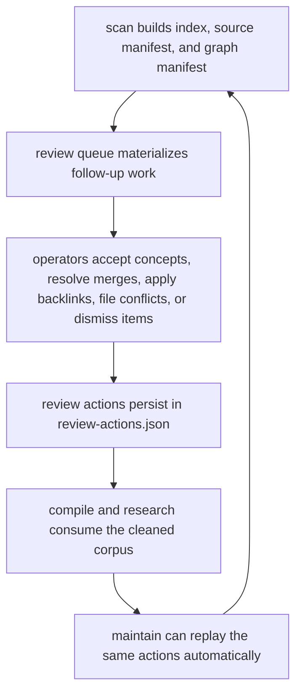

# Cognisync

[](https://github.com/shrijacked/Cognisync/actions/workflows/ci.yml)

Cognisync is a filesystem-first framework for building LLM-maintained knowledge bases.

It turns the workflow described by Andrej Karpathy into a reusable open source system:

1. Collect raw source material into a workspace.
2. Index and normalize that material into a deterministic manifest.
3. Generate structured work packets for LLM agents to compile a wiki.
4. Lint the resulting knowledge base for integrity problems.
5. Answer questions by searching the corpus and rendering outputs back into Markdown, slides, and other artifacts.

The goal is not to replace your favorite model or agent runner. The goal is to provide the workspace model, orchestration contracts, indexing primitives, and output formats that let people build serious tooling around this pattern.

## Core Ideas

- Filesystem-native: `raw/`, `wiki/`, and `outputs/` stay readable in tools like Obsidian.
- LLM-compatible: the framework produces prompt packets and execution plans for external LLM CLIs.
- Incremental: every scan, lint pass, query, and report can be filed back into the workspace.
- Deterministic where possible: indexing, search, linting, and report scaffolding work without network access.
- Extensible: users can write adapters, renderers, and orchestration layers on top of the core contracts.

## Workspace Layout

```text
workspace/
├── raw/
│   └── ... source documents, repos, datasets, images
├── wiki/
│   ├── index.md
│   ├── sources/
│   ├── concepts/
│   └── queries/
├── outputs/
│   ├── reports/
│   │   ├── change-summaries/
│   │   ├── review-exports/
│   │   └── review-ui/
│   └── slides/
├── prompts/
└── .cognisync/
    ├── config.json
    ├── graph.json
    ├── index.json
    ├── review-actions.json
    ├── review-queue.json
    ├── runs/
    ├── sources.json
    └── plans/
```

## What Ships In This Reference Implementation

- Workspace scaffolding
- Deterministic corpus scanner and manifest builder
- Stable source and graph manifests under `.cognisync/`
- Stable review queue manifests for graph follow-up work under `.cognisync/`
- Durable review-action state so accepted concepts, merge decisions, and dismissals survive rescans
- Deterministic corpus change summaries after scan, ingest, maintenance, and research runs
- Markdown-aware search over `raw/` and `wiki/`
- Compile planner for missing summaries, concept pages, and repair work
- Knowledge-base linter for broken links, missing summaries, graph conflicts, and duplicate concepts
- Markdown and Marp report renderers
- Research and compile run manifests with persisted validation state
- Command adapter contracts for wiring in external LLM CLIs
- A tested Python API and CLI

## Quickstart

```bash
python3 -m pip install -e .
cognisync init .
cognisync doctor --strict
cognisync ingest batch sources.json
cognisync adapter list
cognisync adapter install codex --profile codex
cognisync compile --profile codex --strict
cognisync research "what are the main themes in this workspace?" --profile codex --mode memo --slides
```

## Try The Demo

If you want a concrete workspace immediately, Cognisync can scaffold a polished demo garden:

```bash
cognisync demo
```

By default this writes a browsable example into `examples/research-garden/`. The demo includes:

- seeded raw source material
- compiled source summaries and concept pages
- a filed query page
- generated reports, slides, and prompt packets

You can inspect the checked-in example in [examples/research-garden](examples/research-garden) or follow the walkthrough in [Demo Walkthrough](docs/demo-walkthrough.md).

## Operator Workflow

Cognisync is strongest when you use it as a loop, not a bag of separate commands:

```bash
cognisync doctor --strict
cognisync ingest batch sources.json
cognisync review
cognisync maintain
cognisync compile --profile codex --strict
cognisync research "what changed in this corpus?" --profile codex --slides
```

The operator-facing workflow is documented in [Operator Workflows](docs/operator-workflows.md).

Each scan, ingest, maintenance, and research pass now also writes a small change artifact into `outputs/reports/change-summaries/` so the workspace records what moved:

- artifact and source count deltas
- orphan-page delta
- new concept pages
- newly resolved merges
- newly dismissed review items
- newly surfaced conflicts

The richer ingest layer now makes the loop more useful before an LLM even runs:

- `ingest pdf` preserves the source PDF and writes a sidecar Markdown file with extracted text and metadata
- `ingest url` captures page metadata such as description, canonical URL, headings, discovered links, content stats, and local image captures
- `ingest repo` captures repository stats, language signals, recent commits, and a nested tree snapshot in the repo manifest, whether the source is local or cloned from a remote Git URL
- `ingest urls` reads a plain-text or JSON URL list into `raw/urls/`
- `ingest sitemap` expands a sitemap into individual URL captures
- `ingest batch` processes a JSON manifest so larger source sets can land in one deterministic pass, including URL lists and sitemaps

Batch ingest accepts a JSON list or an object with an `items` list:

```json
{
  "items": [
    {"kind": "url", "source": "https://example.com/article"},
    {"kind": "urls", "source": "/path/to/urls.txt"},
    {"kind": "sitemap", "source": "/path/to/sitemap.xml"},
    {"kind": "pdf", "source": "/path/to/paper.pdf"},
    {"kind": "repo", "source": "https://github.com/example/repo.git"}
  ]
}
```

The query and research outputs are now more citation-friendly by default:

- reports render an evidence summary with inline source ids like `[S1]`
- source blocks include path, source kind, score, retrieval reason, snippet, and embedded-image hints
- compile packets include input-context excerpts so external agents see richer raw context up front
- research runs validate inline citations and persist their status into `.cognisync/runs/`
- scans now materialize stable source, graph, and review manifests at `.cognisync/sources.json`, `.cognisync/graph.json`, and `.cognisync/review-queue.json`

## Research Command

`cognisync research` is the opinionated operator surface for question-driven work:

```bash
cognisync research "how do agent loops use memory?" --profile claude --mode memo --slides
```

It scans the workspace, searches the corpus, renders a cited report, builds a prompt packet, optionally runs the packet through an adapter profile, validates inline citations, and files the resulting answer back into the workspace.

Every research run now also writes:

- a research plan in `.cognisync/plans/`
- a run manifest in `.cognisync/runs/`
- a research change summary in `outputs/reports/change-summaries/`
- enough state to resume execution later without rebuilding the packet

Research verification is now stricter too:

- unknown citations fail the run
- uncited narrative claims fail the run
- malformed answers, such as missing top-level headings, fail the run
- conflicting source statements now fail the run unless the answer explicitly acknowledges the disagreement and cites both sides

The graph layer is richer now as well:

- `.cognisync/graph.json` includes entity nodes and mention edges, not just artifacts and tags
- repeated entities and tags become concept candidates with support counts
- compile planning can propose concept pages from those candidates even when explicit tags are missing
- conflicting source claims are represented in the graph so downstream tools can inspect tensions in the corpus

The operator loop now has a review layer too:

- `cognisync review` renders concept-page candidates, entity merge suggestions, conflicting claims, and backlink opportunities
- `.cognisync/review-queue.json` stores those items as a durable queue for follow-up automation or human review
- `.cognisync/review-actions.json` records accepted concept pages, resolved entity merges, and dismissed queue items so the graph stays cleaner on the next scan
- `cognisync review accept-concept <slug>` turns a concept candidate into a deterministic concept page scaffold
- `cognisync review resolve-merge "<canonical label>"` records a preferred label, updates concept metadata, and collapses future graph nodes into the resolved entity
- `cognisync review apply-backlink <wiki/path.md>` routes orphan pages back into stable navigation pages without mutating raw source material
- `cognisync review file-conflict "<subject>"` files a deterministic conflict note under `wiki/queries/conflicts/`
- `cognisync review dismiss <review-id> --reason "..."` closes a queue item intentionally and persists why it should stay closed
- `cognisync review reopen <review-id>` removes a dismissal so the underlying item can surface in the queue again
- `cognisync review list-dismissed` shows the current dismissal ledger
- `cognisync review clear-dismissed <review-id>` removes one dismissal record without reopening it through a separate queue action
- `cognisync review export` writes a machine-readable artifact with the open queue, dismissal ledger, and review action state for other agents or tools
- `cognisync ui review` builds a lightweight browser dashboard from the same review state and can optionally serve it locally
- `cognisync maintain` applies open concept, merge, backlink, and conflict actions automatically, then writes a maintenance run manifest
- `cognisync maintain` only auto-accepts stronger concept candidates by default, so generic one-word concepts stay in the queue for human review
- dismissed review items stay out of future queues and maintenance runs until the review-actions state is changed
- `scan`, `ingest`, and `maintain` each write a change-summary artifact under `outputs/reports/change-summaries/` so operators can review corpus deltas without diffing manifests by hand
- review exports land under `outputs/reports/review-exports/` and are ignored by the scanner so operator telemetry does not leak back into retrieval
- the review dashboard lands under `outputs/reports/review-ui/`, writes a stable `review-export.json` sidecar, and can be served with `cognisync ui review --serve`

Maintenance policy is now configurable too. Cognisync reads defaults from `.cognisync/config.json` and lets you override them per run:

- `maintain --min-concept-support 3`
- `maintain --deny-concept agents --deny-concept loops`
- `maintain --allow-short-concepts-without-entity`

The saved config surface looks like this:

```json
{
  "maintenance_policy": {
    "min_concept_support": 2,
    "require_entity_evidence_for_short_concepts": true,
    "deny_concepts": []
  }
}
```

`cognisync doctor` now reports the active maintenance policy too, and warns when the workspace is configured permissively enough that low-signal concept pages are more likely to slip through maintenance.
- lint now surfaces raw sources with no headings or tags, duplicate concept pages, and conflicting claims as graph-aware issues



The research surface now supports explicit answer modes:

- `--mode wiki` for reusable filed answers in `wiki/queries/`
- `--mode report` for report-shaped outputs in `outputs/reports/`
- `--mode memo` for tighter research memos in `outputs/reports/`
- `--mode brief` for concise briefing artifacts in `outputs/reports/`
- `--mode slides` for Marp-oriented slide-deck answers in `outputs/slides/`

You can also plan first and execute later:

```bash
cognisync research "map the open questions in this corpus"
cognisync research --resume latest --profile codex
```

## Built-In Adapter Example

Cognisync now ships with real Codex, Gemini, and Claude CLI presets so users do not have to guess at the adapter shape:

```bash
cognisync adapter install codex --profile codex
cognisync adapter install gemini --profile gemini
cognisync adapter install claude --profile claude

cognisync run-packet prompts/compile-plan.md --profile codex --output-file outputs/reports/compile-pass.md
cognisync run-packet prompts/query-what-are-the-main-themes-in-this-workspace.md --profile gemini --output-file outputs/reports/gemini-brief.md
cognisync run-packet prompts/query-map-the-open-questions.md --profile claude --output-file outputs/reports/claude-brief.md
```

The built-in `codex` preset:

- streams the prompt packet to `codex exec` over stdin
- runs Codex in the current workspace root
- uses `--output-last-message` when you pass `--output-file`

The built-in `gemini` preset:

- streams the prompt packet to Gemini CLI over stdin
- runs Gemini in non-interactive mode using `--prompt`
- captures stdout into `--output-file` through Cognisync when you request a file output

The built-in `claude` preset:

- runs Claude Code in headless print mode
- streams the full prompt packet over stdin and captures the final text response from stdout
- sets `--output-format text` and `--input-format text` so the adapter stays script-friendly

Custom adapter commands can template three useful values into the configured command list:

- `{workspace_root}` for the current Cognisync workspace
- `{prompt_file}` for the packet path on disk
- `{prompt_text}` for CLIs that want the full packet injected as an argument instead of stdin

## Release Strategy

`v0.1.4` remains a GitHub-first source release.

The package metadata is already in place, but the project is staying repo-first for now so the adapter contract, CLI surface, and contributor workflow can stabilize before a PyPI push. The current release policy is documented in [Open Source Operations](docs/open-source-operations.md).

## Design Philosophy

Cognisync assumes the knowledge base itself is the product surface.

Instead of hiding data behind a vector database or a proprietary UI, it keeps the corpus inspectable and durable:

- raw inputs are preserved
- compiled wiki pages are versioned files
- generated reports are first-class artifacts
- agent work is represented as packets and plans that other tools can consume

This makes the system easy to automate, easy to audit, and easy to publish.

## Architecture

The implementation is documented in:

- [Architecture](docs/architecture.md)
- [Demo Walkthrough](docs/demo-walkthrough.md)
- [Execution Plan](docs/execution-plan.md)
- [Operator Workflows](docs/operator-workflows.md)
- [Open Source Operations](docs/open-source-operations.md)

## Community

- [Contributing Guide](CONTRIBUTING.md)
- [Code of Conduct](CODE_OF_CONDUCT.md)
- [Changelog](CHANGELOG.md)

## Roadmap

- Multi-agent orchestration profiles
- Native repository and dataset ingestion adapters
- Richer semantic extraction, merge resolution, and entity graphs
- Continuous health checks and auto-remediation loops
- Fine-tuning and synthetic dataset export pipelines

## License

MIT
