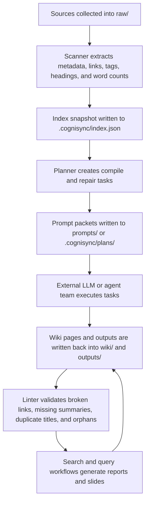
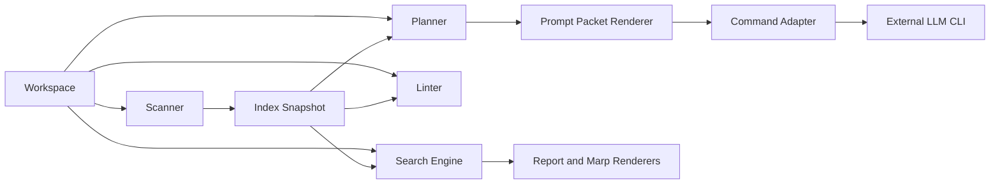
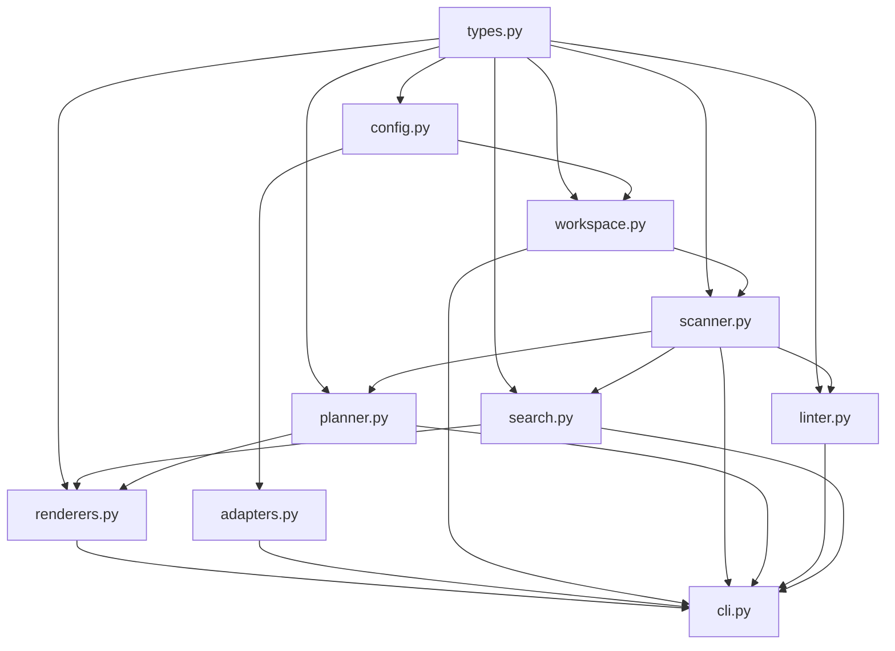

# Cognisync Architecture

## Purpose

Cognisync is a generalized framework for a filesystem-native, LLM-operated knowledge base workflow.

The reference implementation focuses on the minimal durable substrate required to build serious tools around that workflow:

- a predictable workspace model
- deterministic indexing
- agent work packets
- lintable wiki integrity
- reusable renderers for reports and slide decks

## End-to-End Flow

## Component Model

## Module Dependency Graph

## Design Constraints

### Filesystem first

The filesystem is the primary database. Any derived state must be reconstructable from workspace files plus small deterministic metadata snapshots.

### Model agnostic

Cognisync does not hardcode a provider SDK. It emits prompt packets and exposes an adapter contract so users can plug in Codex, Claude Code, custom shell tools, or their own orchestration systems.

### Useful without a network

Search, linting, planning, and rendering should be helpful even before an LLM is connected.

### Durable outputs

Rendered Markdown, slide decks, and plans are kept as first-class artifacts so query work compounds over time instead of disappearing into chat history.

## Traceability Map

| Task | Deliverable | Diagram Anchor |
| --- | --- | --- |
| T1 | Workspace scaffold and configuration contract | Component Model |
| T2 | Artifact scanner and index snapshot | End-to-End Flow, Component Model |
| T3 | Compile and repair planner | End-to-End Flow, Component Model |
| T4 | Linter and integrity checks | End-to-End Flow |
| T5 | Search engine and query workflow | Component Model |
| T6 | Markdown and Marp renderers | Component Model |
| T7 | CLI and adapter integration points | Module Dependency Graph |
| T8 | Test suite and verification | Applies across all diagrams |
