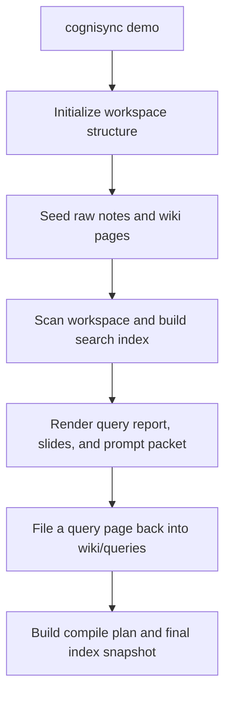

# Demo Walkthrough

## Purpose

The Cognisync demo workspace exists to make the framework feel concrete on first contact.

It shows a miniature research garden with:

- raw source notes
- compiled source summaries
- synthesized concept pages
- a filed query answer
- generated outputs and prompt packets

## Flow



## Demo Layout

```text
examples/research-garden/
├── raw/
├── wiki/
│   ├── sources/
│   ├── concepts/
│   └── queries/
├── outputs/
│   ├── reports/
│   └── slides/
└── prompts/
```

## Suggested Tour

1. Read `raw/` to see the seed material.
2. Open `wiki/sources/` to see how source summaries are expected to look.
3. Open `wiki/concepts/` to see cross-source synthesis.
4. Open `wiki/queries/research-garden-brief.md` to see how answers can be filed back into the garden.
5. Inspect `outputs/` and `prompts/` to see what Cognisync generates for downstream LLM runs.

## Why This Matters

The demo is not just documentation. It is a reference specimen for the filesystem contract.

That makes it useful for:

- onboarding new contributors
- explaining the product in a GitHub README or demo
- comparing future changes against a stable example workspace
