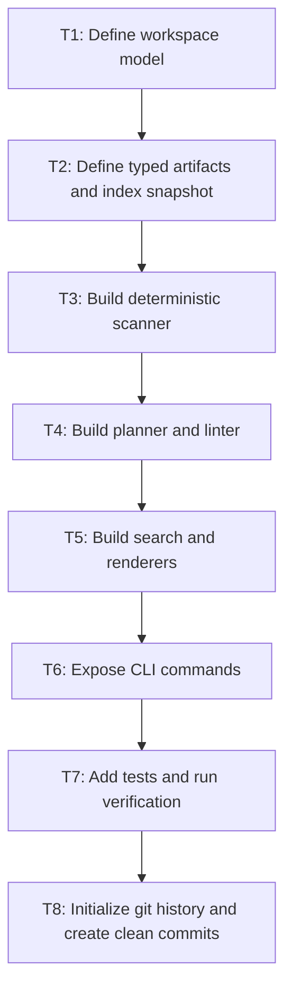

# Cognisync Execution Plan

## Objective

Ship an open-source-ready framework that developers can use to build LLM-operated knowledge bases around a shared filesystem workflow.

## Implementation Sequence

## Task List

| ID | Task | Output | Depends On |
| --- | --- | --- | --- |
| T1 | Create repo metadata and workspace conventions | `README.md`, `.gitignore`, package layout | None |
| T2 | Define core dataclasses and configuration loading | `types.py`, `config.py`, `workspace.py` | T1 |
| T3 | Implement artifact scanning and index persistence | `scanner.py` | T2 |
| T4 | Implement compile planning and linting | `planner.py`, `linter.py` | T3 |
| T5 | Implement deterministic search and output rendering | `search.py`, `renderers.py` | T3 |
| T6 | Implement adapter contract and CLI | `adapters.py`, `cli.py` | T2, T4, T5 |
| T7 | Add unit tests covering end-to-end flows | `tests/` | T2, T3, T4, T5, T6 |
| T8 | Verify, initialize git, and produce clean commits | git history | T7 |

## Verification Matrix

| Capability | Verification |
| --- | --- |
| Workspace initialization | Unit tests create a temporary workspace and verify scaffolded paths and config |
| Indexing | Unit tests scan mixed Markdown corpora and validate links, tags, titles, and counts |
| Planning | Unit tests verify missing summary and concept tasks are surfaced correctly |
| Linting | Unit tests verify broken links, duplicate titles, and missing summaries are reported |
| Query workflow | Unit tests verify search ranking and report generation |
| CLI | Unit tests execute commands against temporary workspaces and validate outputs |

## Non-Goals For This Initial Release

- Direct provider SDK integrations
- Networked ingestion
- Distributed agent execution
- Embedding stores and vector databases

These can be added later without changing the filesystem contract.
