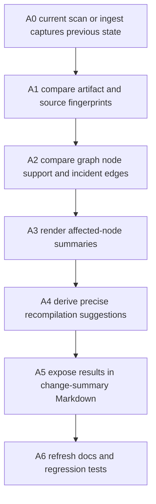
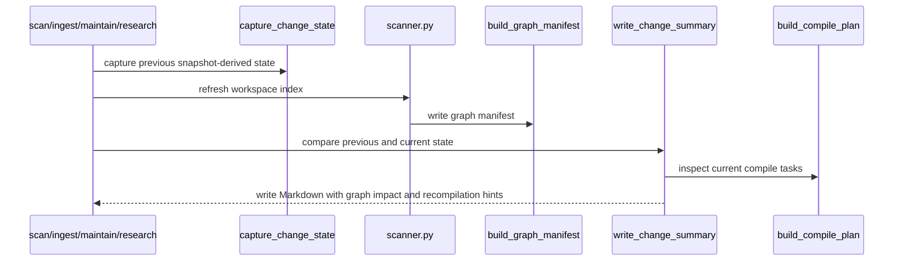

# Cognisync Graph Change Intelligence v1

## Summary

This slice deepens the existing graph refresh and change-summary layer after the ingest expansion. The goal is not to add a new command. The goal is to make every `scan`, `ingest`, `maintain`, and `research` change summary explain what changed in graph terms and what should be recompiled next.

Today Cognisync already writes graph manifests, review queues, stale-summary lint issues, compile-plan refresh tasks, and Markdown change summaries. The gap is precision: operators can see graph counts and new conflicts, but they do not yet get a compact affected-node view or source-specific recompilation suggestions.



## Office-Hours Framing

Mode: Builder / open source infrastructure.

The strongest version is "the workspace tells you what the new evidence disturbs." A new notebook, dataset card, PDF, source edit, or conflict should not only increment graph counters. It should answer:

- Which source or artifact groups changed?
- Which entity, assertion, concept candidate, or conflict nodes are newly affected?
- Which summary or concept pages should be refreshed first?
- Which changes are informational versus compile-blocking?

The narrow wedge is to enrich existing local artifacts. Do not add hosted APIs, background graph workers, or a new review UI panel in this slice.

## Scope

In scope:

- Extend in-memory `ChangeState` with artifact fingerprints, source groups, graph node signatures, graph incident edges, and compile-plan task summaries.
- Render new sections in change-summary Markdown:
  - `Changed Artifacts`
  - `Affected Graph Nodes`
  - `Recompilation Suggestions`
- Include changed raw source paths, changed source groups, affected entity/assertion/concept/conflict nodes, and ranked compile tasks.
- Improve compile-plan task rationale for stale summaries so the changed source path and target summary are explicit.
- Add regression tests for source edits that affect assertions/entities and trigger `refresh_source_summary`.
- Update README and operator docs to describe the richer graph delta output.

Out of scope:

- New CLI commands.
- Hosted graph refresh jobs or control-plane endpoints.
- Automatic recompilation or LLM execution.
- New review UI screens.
- Changing persisted graph manifest schema unless needed for deterministic affected-node summaries.
- Release version metadata cleanup.

## Current Data Flow



## Public Interfaces

No new command is added.

Existing commands that already write change summaries should gain richer Markdown output:

```bash
cognisync scan --workspace .
cognisync ingest notebook analysis.ipynb --workspace .
cognisync maintain --workspace .
cognisync research "what changed?" --workspace .
```

Expected new Markdown sections:

```markdown
## Changed Artifacts

- `raw/memory.md` changed source content; summary target `wiki/sources/memory.md`

## Affected Graph Nodes

- `assertion:agent-memory-uses-vector-databases` assertion support changed via `raw/memory.md`
- `entity:vector-databases` entity support changed via `raw/memory.md`

## Recompilation Suggestions

- `refresh_source_summary` `wiki/sources/memory.md` from `raw/memory.md`
- `create_concept_page` `wiki/concepts/vector-databases.md` from 2 supporting sources
```

The sections should remain deterministic and bounded. If a large ingest touches many artifacts, list the first stable set and report the omitted count.

## Implementation Tasks

| Task | Diagram Node | Files | Notes |
|---|---|---|---|
| A1 | B | `src/cognisync/change_summaries.py`, `tests/test_runtime_contracts.py` | Add artifact and source-group fingerprints to `ChangeState`. |
| A2 | C | `src/cognisync/change_summaries.py`, `src/cognisync/manifests.py` | Compare graph node signatures and incident edges without changing the persisted graph schema unless tests require it. |
| A3 | D | `src/cognisync/change_summaries.py` | Render deterministic affected-node summaries for entities, assertions, concept candidates, and conflicts. |
| A4 | E | `src/cognisync/planner.py`, `src/cognisync/change_summaries.py`, `tests/test_planner_and_linter.py` | Rank compile tasks tied to changed raw sources and stale summaries. |
| A5 | F | `tests/test_runtime_contracts.py`, `tests/test_graph_intelligence.py` | Verify changed source content produces affected graph-node summaries and precise refresh suggestions. |
| A6 | G | `README.md`, `docs/operator-workflows.md` | Document that graph deltas now include affected nodes and recompilation suggestions. |

## Engineering Review

Architecture recommendation: keep this inside the existing change-summary pipeline. `ChangeState` is in-memory and already derived from snapshots, source manifests, graph manifests, review actions, and lint. Extending it is lower risk than adding a second persisted graph-delta store.

Risk register:

| Risk | Severity | Mitigation |
|---|---:|---|
| Change summaries become too noisy on large ingests | Medium | Bound each section and report omitted counts. |
| Graph comparison creates nondeterministic ordering | Medium | Sort by node kind, title, id, then support path. |
| Compile suggestions duplicate existing compile-plan tasks | Medium | Render a compact view of existing `PlanTask` items rather than inventing separate task kinds. |
| Circular imports between planner and change summaries | Medium | Keep planner import one-way and call `build_compile_plan` only inside summary rendering if import graph stays acyclic. |
| Existing tests depend on exact summary text | Low | Add sections without removing existing headings or counters. |

## Test Plan

- Add runtime-contract coverage that editing an existing raw source with a stale summary writes:
  - `Changed Artifacts`
  - the changed raw source path
  - `Affected Graph Nodes`
  - the changed assertion/entity node
  - `Recompilation Suggestions`
  - `refresh_source_summary`
- Add graph-intelligence coverage that affected-node summaries are deterministic for assertion support changes.
- Add planner/linter coverage that stale-summary compile tasks include both source and summary paths in rationale or prompt hint.
- Re-run:
  - `PYTHONPYCACHEPREFIX=/tmp/cognisync-pyc python3 -m unittest discover -s tests -q`
  - `PYTHONPYCACHEPREFIX=/tmp/cognisync-pyc python3 -m compileall src tests`

## Autoplan Review Report

CEO review:

- Recommended scope is a local artifact-intelligence slice, not hosted graph orchestration.
- The user-facing win is immediate: after a corpus change, the operator sees what changed and what to refresh next.

Design review:

- No visual UI scope.
- Markdown output should be scannable and bounded. Big graph dumps belong in `.cognisync/graph.json`, not in a change-summary note.

Engineering review:

- Reuse `build_source_manifest`, `build_graph_manifest`, `lint_snapshot`, and `build_compile_plan`.
- Do not add a migration because `ChangeState` is not persisted.
- Keep existing summary headings stable so old tests and docs remain valid.

DX review:

- No new command means no new operator workflow to learn.
- Suggested tasks should name exact paths so a human or agent can act without diffing manifests by hand.

Decision audit:

| # | Phase | Decision | Classification | Principle | Rationale | Rejected |
|---|---|---|---|---|---|---|
| 1 | CEO | Enrich existing change summaries | Mechanical | Use the paved road | Operators already inspect these artifacts after scan/ingest/maintain/research. | New `graph diff` command. |
| 2 | Eng | Keep graph-delta state in memory | Mechanical | Minimize persisted schema churn | Previous and current snapshots are enough for this slice. | New `.cognisync/graph-deltas.json`. |
| 3 | Eng | Render compile suggestions from existing plan tasks | Taste | One source of truth | Avoids two systems disagreeing about recompilation. | Separate bespoke recompilation engine. |
| 4 | DX | Bound Markdown lists | Taste | Make output readable | Large ingests should be useful, not a wall of graph JSON. | Dump all changed nodes. |

## Approval Gate

Recommended approval: implement this exact local graph change-intelligence slice.

If approved, implementation order is A1 -> A2 -> A3 -> A4 -> A5 -> A6, with regression tests written before the production changes that satisfy them.
