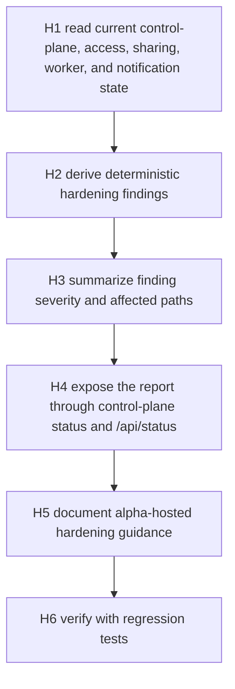

# Cognisync Hosted Hardening v1

## Summary

This slice tightens the hosted-alpha story without pretending Cognisync is a finished SaaS platform. The goal is a read-only hardening report that operators can see from the existing control-plane status surfaces before they hand a workspace to remote peers or hosted workers.

The current hosted layer already has scoped tokens, invite flows, trust policy, remote workers, scheduler state, notifications, audit, and usage manifests. The gap is posture visibility: an operator can inspect each manifest separately, but cannot ask "is this hosted control plane safe enough to expose right now?" in one place.



## Office-Hours Framing

Mode: Builder / open source infrastructure.

The strongest version is not "make hosted production-ready." The strongest small step is "make hosted-alpha honest and inspectable." Operators should see risk posture before they issue long-lived tokens, allow remote workers, accept peer bundles, or expose a control-plane server.

The narrow wedge is a deterministic local report. Do not add new auth providers, hosted persistence layers, deployment automation, billing-grade usage, or SaaS operators in this slice.

## Scope

In scope:

- Add a read-only hosted hardening report derived from existing manifests.
- Detect active tokens without expiry, expired-but-still-active tokens, broad operator tokens without expiry, permissive trust policy, due hosted work, stale/active worker ownership, and high-severity notifications.
- Expose the report through `cognisync control-plane status`.
- Expose the same report in `GET /api/status`.
- Update README and operator docs with alpha-hosted hardening guidance.
- Add regression tests for CLI and HTTP status output.

Out of scope:

- New CLI commands.
- Auth provider integrations.
- Secret managers.
- Hosted database or deployment topology.
- Changing token issuance defaults.
- Blocking existing local workflows based on hardening findings.
- Billing-grade usage or incident notification delivery.

## Public Interfaces

Existing command:

```bash
cognisync control-plane status --workspace .
```

Expected new section:

```markdown
## Hosted Hardening

- Status: `attention`
- Findings: `3`
- High findings: `1`
- Medium findings: `2`

### Findings

- `high` `token-operator-no-expiry:local-operator` Operator token has broad hosted scopes and no expiry.
  path: `.cognisync/control-plane.json`
  recommendation: Re-issue the token with `--expires-in-hours` and revoke the long-lived token.
```

Existing HTTP endpoint:

```http
GET /api/status
```

Expected new payload field:

```json
{
  "hardening": {
    "status": "attention",
    "summary": {
      "finding_count": 3,
      "counts_by_severity": {"high": 1, "medium": 2}
    },
    "findings": []
  }
}
```

## Implementation Tasks

| Task | Diagram Node | Files | Notes |
|---|---|---|---|
| H1 | A | `src/cognisync/control_plane.py`, `tests/test_control_plane.py` | Add failing tests for CLI and HTTP hardening posture. |
| H2 | B | `src/cognisync/hosted_hardening.py` | Build deterministic findings from existing manifests only. |
| H3 | C | `src/cognisync/hosted_hardening.py` | Summarize severity counts, status, recommendations, and related paths. |
| H4 | D | `src/cognisync/control_plane.py` | Render hardening in CLI status and include it in `/api/status`. |
| H5 | E | `README.md`, `docs/operator-workflows.md` | Document hosted-alpha posture checks and what remains alpha. |
| H6 | F | `tests/test_control_plane.py` | Verify CLI and HTTP output plus no raw token leakage. |

## Engineering Review

Architecture recommendation: keep hardening as a pure derived report. It should not mutate manifests, change token validation, or block operations. This keeps the feature safe to add while giving operators better visibility.

Risk register:

| Risk | Severity | Mitigation |
|---|---:|---|
| Findings become noisy for local-only users | Medium | Surface as status metadata, not command failure. |
| False production-readiness signal | High | Keep wording explicit: hosted-alpha posture, not SaaS hardening complete. |
| Report leaks secrets over HTTP | High | Use token metadata only and never include `token_hash` or raw token values. |
| Time-based worker checks become flaky | Medium | Use broad stale thresholds and test deterministic non-time-sensitive findings. |
| Scope expands into auth redesign | Medium | Keep this slice read-only and manifest-derived. |

## Test Plan

- Add CLI coverage that `control-plane status` renders hosted hardening summary and findings for a workspace with a long-lived operator token and permissive trust policy.
- Add HTTP coverage that `GET /api/status` includes the same hardening summary and finding ids.
- Verify `/api/status` does not include raw token values or token hashes in hardening output.
- Re-run:
  - `PYTHONPYCACHEPREFIX=/tmp/cognisync-pyc python3 -m unittest -q tests.test_control_plane`
  - `PYTHONPYCACHEPREFIX=/tmp/cognisync-pyc python3 -m unittest discover -s tests -q`
  - `PYTHONPYCACHEPREFIX=/tmp/cognisync-pyc python3 -m compileall src tests`

## Autoplan Review Report

CEO review:

- Keep this as hosted-alpha honesty and operator confidence, not a premature SaaS platform promise.
- The product win is a single posture readout before remote work starts.

Design review:

- No visual UI scope.
- CLI output should be compact: summary first, bounded findings second.

Engineering review:

- Use a new pure module for hardening derivation.
- Feed existing control-plane and HTTP surfaces.
- Do not create a new persisted manifest or migration.

DX review:

- No new command to learn.
- Findings should include exact manifest paths and concrete recommendations.

## Approval Gate

Approved direction: implement the read-only hosted hardening report through existing status surfaces.
