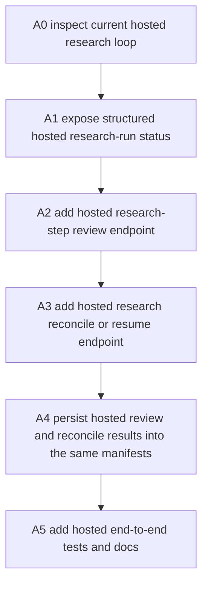
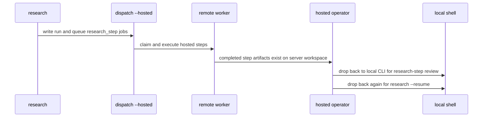
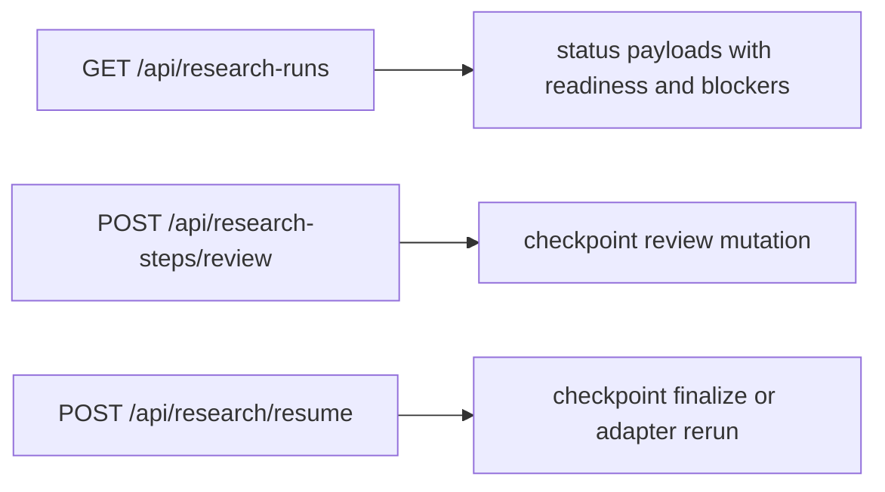

# Cognisync Hosted Research Review And Reconcile v1

Generated on 2026-04-21
Branch: main
Repo: shrijacked/Cognisync
Status: DRAFT
Mode: Builder

## Summary

The local and mirrored research runtime is now real:

- `research` writes the run, agent plan, checkpoints, and prompt packet
- `research-step dispatch --hosted` queues remote-eligible assignments
- `worker remote` executes those `research_step` jobs in a mirrored workspace
- `research-step review` records approval or change-request state
- `research --resume` can now finalize from approved checkpoint state without rerunning a model

What is still missing is the hosted product finish.

Today a remote operator can inspect runs and jobs over HTTP, and a remote worker can execute hosted research steps, but the operator still cannot do the last two research-specific actions over the hosted surface:

1. approve or request changes on a research step
2. trigger checkpoint-aware resume or reconciliation

That means the hosted runtime is one local shell away from feeling complete.

This slice closes that gap.

## Problem Statement

The runtime is doing the right work. The control plane is not yet exposing the right operator controls.

Current hosted loop:

The problem is not missing compute. It is missing product surface.

For a hosted-alpha operator, the job to be done is:

"I can see the step outputs, approve or reject them, and then finalize the run from the same hosted control plane."

Right now Cognisync makes the operator leave the hosted surface for the two most research-specific actions. Not great.

## Office-Hours Framing

This is builder mode for a developer-facing research system.

The strongest version is not "add random API parity." The strongest version is:

- hosted operators can inspect research runtime state in a structured way
- hosted operators can record step review state with the same role model as local CLI review
- hosted operators can trigger the existing checkpoint-aware resume logic without inventing a second reconciliation path

Premises:

1. Research review should stay file-native, not migrate to a second hosted-only store.
2. Hosted review should call the same research-step review path the CLI already trusts.
3. Hosted reconcile should call the same resume path the CLI already trusts.
4. The control plane should explain readiness, blockers, and last recommended action in structured JSON.
5. This slice should productize the existing runtime, not redesign it.

## Scope

In scope:

- add a hosted research-run status payload that exposes run-level and step-level readiness
- add a hosted endpoint to record research-step review decisions
- add a hosted endpoint to trigger `research --resume` behavior, including checkpoint finalize when no profile is supplied
- preserve the existing local CLI behavior and manifest formats
- document the hosted research operator loop
- add hosted end-to-end coverage

Out of scope:

- background auto-finalization after approval
- automatic review decisions
- new remote execution semantics for validation or filing
- a new queue worker type just for reconciliation
- a browser UI redesign

## Recommended Surface

### 1. Structured research-run status

Add a hosted read surface for research runs that exposes:

- run id
- question
- run status
- resume strategy, if already resumed
- plan, agent plan, and checkpoints paths
- assignment summary counts
- step-level execution and review status
- `ready_for_reconcile`
- `reconcile_blockers`
- `recommended_action`

### 2. Hosted research-step review

Add a hosted write surface that records:

- run ref
- step id
- review status
- reviewer id
- optional summary

This should reuse the same validation and checkpoint update path as `research-step review`.

### 3. Hosted research reconcile or resume

Add a hosted write surface that triggers:

- checkpoint finalization when no profile is supplied
- adapter rerun when an explicit profile is supplied

This should reuse the same runtime path as `research --resume`.

## API Sketch

Suggested payloads:

- `GET /api/research-runs`
  - optional `run` query for one run, otherwise list all research runs
- `POST /api/research-steps/review`
  - body: `run`, `step_id`, `status`, `reviewer`, `summary`
- `POST /api/research/resume`
  - body: `run`, optional `profile_name`

## Why This Order

This is the next correct dependency because:

1. checkpoint-aware reconcile already exists and should be reused
2. hosted step execution already exists and should not be rebuilt
3. remote operator review comes before hosted resume because reconcile must honor review gates
4. structured status comes first so operators can trust what the hosted actions are doing

## Test Plan

- add hosted API coverage that `GET /api/research-runs` exposes research-step readiness, blockers, and assignment summary data
- add hosted API coverage that `POST /api/research-steps/review` updates checkpoint review state exactly like local CLI review
- add hosted API coverage that `POST /api/research/resume` finalizes from approved checkpoint state without rerunning a profile
- add hosted API coverage that `POST /api/research/resume` with `profile_name` still records adapter rerun provenance
- add end-to-end hosted coverage for:
  - plan
  - hosted dispatch
  - mirrored remote execution
  - hosted step review
  - hosted reconcile
  - finalized run manifest
- re-run `python3 -m unittest discover -s tests -q`
- re-run `PYTHONPYCACHEPREFIX=/tmp/cognisync-pyc python3 -m compileall src tests`

## Success Criteria

After this slice, a hosted operator can:

1. inspect the current research-run state over HTTP
2. approve hosted research-step artifacts over HTTP
3. finalize the run over HTTP without a local shell

That makes the hosted research runtime feel like a real product loop instead of a half-hosted toolkit.
