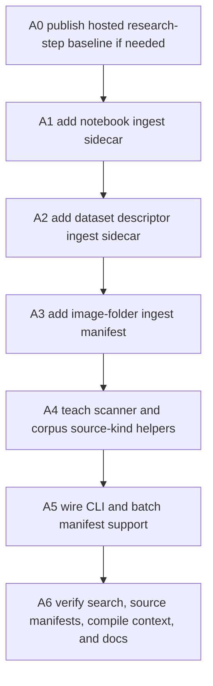
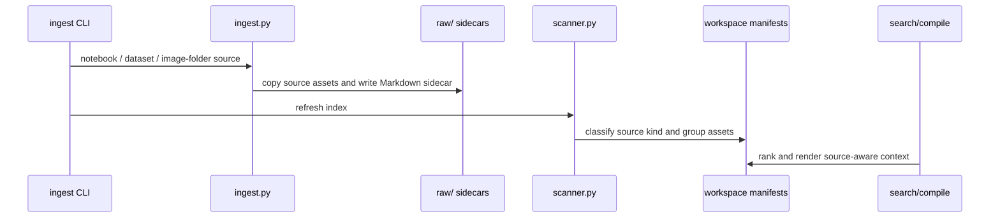

# Cognisync Ingest Gaps v1

## Summary

This slice closes the next roadmap dependency after hosted research-step orchestration: notebooks, dataset descriptors, and explicit image-folder ingest.

The recommended implementation keeps Cognisync's existing file-native contract:

- local ingest commands materialize readable Markdown sidecars under `raw/`
- original or copied source assets remain inspectable beside those sidecars
- `scan`, source manifests, graph manifests, search, compile context, and change summaries continue to derive from files
- no hosted queue, connector, or remote-worker scope is added for these local filesystem ingest paths in this milestone

Precondition: baseline starts from published commit `f4efbab feat: queue hosted research step jobs`, which is now on `origin/main`.



## Office-Hours Framing

Mode: Builder / open source infrastructure.

The strongest version is not "copy more file types into raw/". It is "make richer research substrate useful before a model runs." A notebook, dataset card, or folder of diagrams should become a durable, searchable, citeable workspace source with enough summary structure for agents to plan around it.

Premises:

1. Cognisync should not ingest entire large datasets row-by-row in this slice; it should ingest descriptors and lightweight previews so the workspace remains small and readable.
2. Image-folder ingest should create a folder-level manifest and preserve image assets, not attempt computer-vision captioning without an explicit model/runtime dependency.
3. Notebook ingest should extract markdown cells, code-cell previews, outputs metadata, and attachment names into Markdown, while preserving the original `.ipynb`.
4. The scanner should understand the new source families, but the canonical retrieval text should remain the generated Markdown sidecars.

## Scope

In scope:

- `cognisync ingest notebook <source.ipynb> [--name ...] [--force]`
- `cognisync ingest dataset <descriptor> [--name ...] [--force]`
- `cognisync ingest image-folder <directory> [--name ...] [--force]`
- `ingest batch` support for `notebook`, `dataset`, `image-folder`, `image_folder`, and `images`
- source-kind support for `notebook`, `dataset`, and `image_folder`
- scan/source-manifest/search/compile-context compatibility
- README and operator docs updates
- regression tests for each new ingest path

Out of scope:

- executing notebooks
- downloading datasets from remote registries
- OCR or vision caption generation for images
- remote/hosted queued execution for local notebook, dataset, or image-folder paths
- connector support for these new ingest kinds
- release version metadata cleanup

## Target File Layout

```text
raw/
├── notebooks/
│   ├── memory-analysis.ipynb
│   └── memory-analysis.md
├── datasets/
│   ├── memory-corpus.json
│   └── memory-corpus.md
└── images/
    ├── architecture-sketches.md
    └── architecture-sketches-assets/
        ├── overview.png
        └── pipeline.svg
```

## Data Flow



## Public Interfaces

### Notebook Ingest

Command:

```bash
cognisync ingest notebook analysis.ipynb --workspace . --name memory-analysis
```

Writes:

- `raw/notebooks/<slug>.ipynb`
- `raw/notebooks/<slug>.md`

Markdown sidecar should include:

- frontmatter tag `notebook-ingest`
- original filename and source path
- notebook cell counts by type
- kernel/language metadata if present
- markdown-cell content
- code-cell previews with fenced code blocks
- output count and output type summaries, but not full binary output payloads

### Dataset Descriptor Ingest

Command:

```bash
cognisync ingest dataset dataset-card.json --workspace . --name memory-corpus
```

Writes:

- copied descriptor asset when the source is a local file
- `raw/datasets/<slug>.md`

Markdown sidecar should include:

- frontmatter tag `dataset-ingest`
- descriptor path and detected descriptor type
- top-level JSON keys when JSON is parseable
- CSV header, row preview count, and column count when CSV/TSV is provided as the descriptor
- a compact raw excerpt for non-JSON text descriptors
- explicit note that this is descriptor-level ingest, not full dataset materialization

### Image-Folder Ingest

Command:

```bash
cognisync ingest image-folder ./diagrams --workspace . --name architecture-sketches
```

Writes:

- `raw/images/<slug>.md`
- copied supported image files under `raw/images/<slug>-assets/`

Markdown sidecar should include:

- frontmatter tag `image-folder-ingest`
- source folder path
- image count by extension
- copied image list with Markdown image references
- byte size for each image
- optional sibling text/Markdown captions when files like `overview.md` or `overview.txt` exist beside an image

## Implementation Tasks

| Task | Diagram Node | Files | Notes |
|---|---|---|---|
| A1 | B | `src/cognisync/ingest.py`, `tests/test_ingest_expanded.py` | Add notebook parser and sidecar writer without executing notebooks. |
| A2 | C | `src/cognisync/ingest.py`, `tests/test_ingest_expanded.py` | Add descriptor-focused dataset ingest with JSON and CSV/TSV previews. |
| A3 | D | `src/cognisync/ingest.py`, `tests/test_ingest_expanded.py` | Add deterministic image-folder copy and manifest writer. |
| A4 | E | `src/cognisync/scanner.py`, `src/cognisync/corpus.py`, `tests/test_scanner.py`, `tests/test_runtime_contracts.py` | Add kind detection, source grouping, extraction statuses, and source-aware ranking tokens. |
| A5 | F | `src/cognisync/cli.py`, `src/cognisync/ingest.py`, `tests/test_ingest_expanded.py` | Add CLI subcommands and batch manifest kinds. |
| A6 | G | `README.md`, `docs/operator-workflows.md`, `tests/test_runtime_contracts.py` | Document the new ingest paths and verify manifests/search/compile context. |

## Engineering Review

Architecture recommendation: reuse the existing ingest sidecar pattern rather than introducing a new `.cognisync/datasets.json` or binary asset index. The current source manifest already groups raw artifacts, so the lowest-risk path is to add source-kind helpers and make sidecars rich enough for search.

Risk register:

| Risk | Severity | Mitigation |
|---|---:|---|
| Large notebook outputs bloat raw sidecars | High | Summarize output metadata and omit binary payloads. |
| Dataset ingest accidentally copies huge data files | High | Name this command `dataset` but document descriptor-level behavior; only copy the descriptor file. |
| Image folder copy clobbers assets | Medium | Preserve `--force` semantics and fail if target manifest/assets already exist. |
| Scanner indexes both binary asset and sidecar incorrectly | Medium | Group source assets under the sidecar source key and keep retrieval text in Markdown only. |
| Search ranking ignores the new kinds | Medium | Add notebook/dataset/image query-token boosts in `corpus.py`. |

## Test Plan

- Add notebook ingest coverage:
  - `.ipynb` is copied
  - `.md` sidecar contains markdown/code cells and cell counts
  - scan groups both artifacts under `source_kind=notebook`
- Add dataset descriptor coverage:
  - JSON descriptor sidecar renders top-level keys
  - CSV/TSV descriptor sidecar renders column and preview metadata
  - scan/source manifest reports `source_kind=dataset`
- Add image-folder coverage:
  - supported images are copied into an assets directory
  - sidecar embeds Markdown image references
  - scan/source manifest reports `source_kind=image_folder` and captured assets
- Add batch ingest coverage for `notebook`, `dataset`, and `image-folder`.
- Add search/runtime coverage that notebook, dataset, and image-folder sources rank for relevant queries.
- Re-run:
  - `PYTHONPYCACHEPREFIX=/tmp/cognisync-pyc python3 -m unittest discover -s tests -q -b`
  - `PYTHONPYCACHEPREFIX=/tmp/cognisync-pyc python3 -m compileall src tests`

## Autoplan Review Report

CEO review:

- Recommended scope is the full three-ingest slice because these are sibling gaps in the same ingest/scanner/corpus blast radius.
- Do not expand into remote dataset registry downloads or notebook execution; both change the risk model and are not required to close the stated roadmap gap.

Design review:

- No visual UI scope.
- CLI naming should optimize for guessability: `notebook`, `dataset`, and `image-folder`.
- Docs must explicitly say dataset ingest is descriptor-level to avoid surprising operators with partial data coverage.

Engineering review:

- Existing code already has `ingest.py`, `scanner.py`, `corpus.py`, source manifests, and search boosts. Reuse them.
- Python support is `>=3.9`, so do not rely on `tomllib` for TOML parsing. Treat non-JSON descriptors as text unless using existing stdlib parsing.
- Keep notebook parsing pure JSON; do not import notebook execution dependencies.

DX review:

- New commands should mirror existing ingest commands: positional source, `--workspace`, `--name`, `--force`.
- Batch manifest examples should be copy-paste complete in docs.
- Error messages should preserve the existing pattern: missing source, duplicate target, unsupported extension or empty folder.

Decision audit:

| # | Phase | Decision | Classification | Principle | Rationale | Rejected |
|---|---|---|---|---|---|---|
| 1 | CEO | Implement all three ingest gaps together | Mechanical | Boil lakes | They share the same ingest/scanner/source-kind blast radius. | Separate one-file mini-slices. |
| 2 | Eng | Keep dataset ingest descriptor-level | Mechanical | Explicit over clever | Full dataset ingestion has size and format risks beyond this milestone. | Row-level dataset materialization. |
| 3 | Eng | Keep new local filesystem ingest out of hosted queueing | Taste | Pragmatic | Existing remote workers may not have access to arbitrary local source paths. | Add queued jobs for every new ingest kind now. |
| 4 | DX | Use `image-folder` as the primary CLI spelling | Taste | Explicit over clever | It is more readable than `images` and clearer than `image-dir`. | `images` only. |

## Approval Gate

Recommended approval: implement this exact local-first ingest slice.

If approved, implementation order is A1 -> A2 -> A3 -> A4 -> A5 -> A6, with tests written alongside each ingest path before claiming completion.
