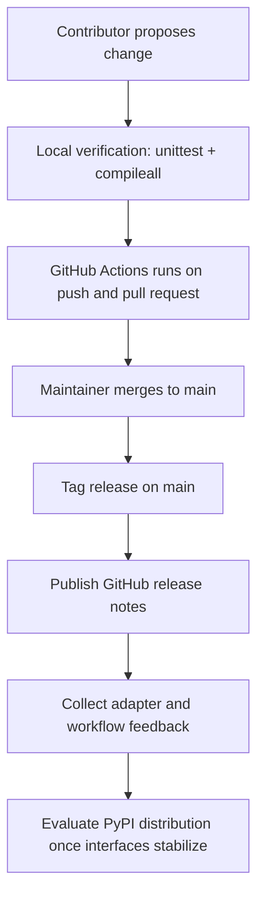

# Open Source Operations

## Purpose

This document defines how Cognisync operates as an open source project in its initial public phase.

It covers:

- contributor workflow
- automated verification
- release packaging strategy
- the rationale for a GitHub-first `v0.1.0`

## Delivery Flow

## Release Decision

For `v0.1.0`, Cognisync ships as a repository-first release on GitHub.

### Why GitHub first

- The framework is already installable from source with `pip install -e .`.
- The adapter contract is still young, and a source-first release keeps iteration lightweight.
- Early users will likely want to inspect and adapt the repository rather than treat it as a black-box package.
- GitHub releases are enough to establish versioning, changelog discipline, and a public entry point.

### Why not PyPI yet

- The CLI surface may still grow as more frontier-model adapters are added.
- The contributor and compatibility story benefits from one or two source releases first.
- Publishing to PyPI too early would freeze rough edges that are still best treated as repository-level evolution.

## Traceable Tasks

| Task | Deliverable | Related Flow Stage |
| --- | --- | --- |
| O1 | CI workflow for tests and bytecode compilation | Local verification, GitHub Actions |
| O2 | Contributor docs and templates | Contributor proposes change |
| O3 | Built-in adapter onboarding docs | Collect adapter feedback |
| O4 | Changelog and tagged release | Tag release, Publish release notes |
| O5 | Packaging decision record | Evaluate PyPI distribution |

## Maintainer Checklist

1. Run `python3 -m unittest discover -s tests -v`.
2. Run `/usr/bin/env PYTHONPYCACHEPREFIX=/tmp/cognisync-pyc python3 -m compileall src tests`.
3. Ensure docs reflect any new CLI commands or adapter presets.
4. Update `CHANGELOG.md` before tagging a release.
5. Tag and publish from `main`.
