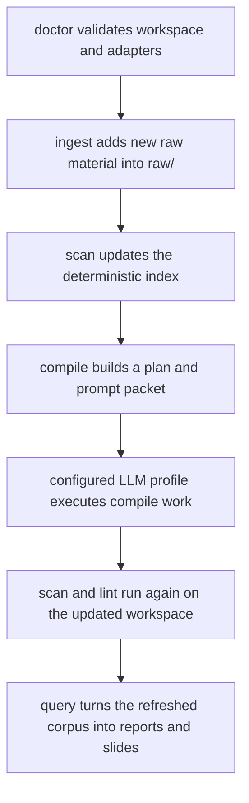

# Operator Workflows

## Purpose

This document describes the day-to-day operational loop for Cognisync.

It focuses on three commands that make the framework feel like a product rather than a toolkit:

- `cognisync doctor`
- `cognisync ingest ...`
- `cognisync compile ...`

## Workflow Diagram

## Command Roles

### `doctor`

Use `doctor` before a long run or after cloning the repo onto a new machine.

It checks:

- workspace layout
- config readability
- index snapshot presence
- whether configured adapter commands resolve on the current machine

### `ingest`

Use `ingest` to pull more substrate into `raw/`.

Supported paths in this release:

- `cognisync ingest file ...`
- `cognisync ingest pdf ...`
- `cognisync ingest url ...`
- `cognisync ingest repo ...`

### `compile`

Use `compile` when you want one command to drive the main maintenance loop.

The command:

1. scans the workspace
2. builds a compile plan
3. renders the compile prompt packet
4. optionally executes the packet through a configured adapter profile
5. re-scans and lints the workspace

## Traceability

| Task | Command Surface | Output |
| --- | --- | --- |
| O6 | `doctor` | readiness report |
| O7 | `ingest` | raw source artifacts plus updated index |
| O8 | `compile` | compile plan, prompt packet, optional model output, fresh lint state |
