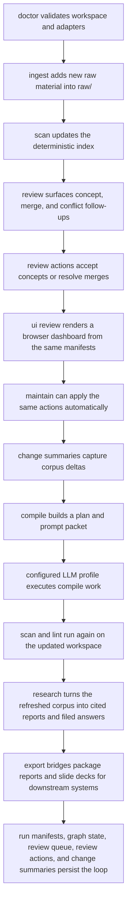

# Operator Workflows

## Purpose

This document describes the day-to-day operational loop for Cognisync.

It focuses on seven commands that make the framework feel like a product rather than a toolkit:

- `cognisync doctor`
- `cognisync ingest ...`
- `cognisync review`
- `cognisync ui review`
- `cognisync export ...`
- `cognisync maintain`
- `cognisync compile ...`
- `cognisync research ...`

## Workflow Diagram

## Command Roles

### `doctor`

Use `doctor` before a long run or after cloning the repo onto a new machine.

It checks:

- workspace layout
- config readability
- index snapshot presence
- whether configured adapter commands resolve on the current machine

### `ingest`

Use `ingest` to pull more substrate into `raw/`.

Supported paths in this release:

- `cognisync ingest file ...`
- `cognisync ingest pdf ...`
- `cognisync ingest url ...`
- `cognisync ingest urls ...`
- `cognisync ingest sitemap ...`
- `cognisync ingest repo ...`
- `cognisync ingest batch manifest.json`

The richer ingest pass extracts more structure up front so later compile and query steps have better substrate:

- PDF ingest preserves the source file and writes a Markdown sidecar with extracted text plus ingest metadata
- URL ingest records description, canonical URL, headings, discovered links, content stats, and local image captures
- URL-list ingest expands text or JSON URL inventories into deterministic per-page captures
- sitemap ingest expands a sitemap into URL captures without shell scripting around the CLI
- repo ingest records repository stats, language signals, recent commits, and a nested tree snapshot in the manifest, even when the source is cloned from a remote Git URL

### `compile`

Use `compile` when you want one command to drive the main maintenance loop.

The command:

1. scans the workspace
2. builds a compile plan
3. renders the compile prompt packet
4. optionally executes the packet through a configured adapter profile
5. re-scans and lints the workspace

Compile packets now include an `Input Context` section that excerpts the raw artifacts behind each task, including PDF sidecar text, URL image references, and repository tree snapshots. Compile runs also persist run metadata in `.cognisync/runs/`.

### `review`

Use `review` when you want the graph to suggest what should happen next before you burn tokens on a compile or research run.

The command:

1. refreshes the workspace manifests if needed
2. materializes `.cognisync/review-queue.json`
3. prints a queue of concept candidates, entity merge suggestions, conflict reviews, and backlink opportunities
4. can apply deterministic actions directly through subcommands:
   `accept-concept`, `resolve-merge`, `apply-backlink`, `file-conflict`, `dismiss`, `reopen`, `list-dismissed`, `clear-dismissed`, and `export`

The queue is intentionally durable and machine-readable so later automation can consume it directly.
Dismissed items persist in `.cognisync/review-actions.json` with a reason, and they stay out of future queues and maintenance runs unless that state is edited.
`reopen` removes a persisted dismissal so the next queue refresh can surface the item again if the underlying condition still exists.
`list-dismissed` and `clear-dismissed` make the dismissal ledger reviewable without opening the manifest file directly.
`export` writes a machine-readable snapshot under `outputs/reports/review-exports/` with the open queue, dismissal ledger, and review-action state, and those artifacts are ignored by the scanner so they do not pollute retrieval.

### `ui review`

Use `ui review` when you want a lightweight browser surface over the same review state.

The command:

1. refreshes the workspace manifests if needed
2. writes a standalone HTML dashboard into `outputs/reports/review-ui/`
3. writes stable `review-export.json` and `dashboard-state.json` sidecars in the same directory
4. can optionally serve that directory locally with `--serve`

The dashboard is intentionally thin. It reads the same review queue and review-action state you already use through the CLI, then layers in graph-overview data from `.cognisync/graph.json`, source coverage from `.cognisync/sources.json`, compile health from lint and compile-plan state, recent change summaries, run history from `.cognisync/runs/`, queued-job history from `.cognisync/jobs/`, sync audit history from `.cognisync/sync/`, connector definitions from `.cognisync/connectors.json`, workspace access state from `.cognisync/access.json`, and operator notifications from `.cognisync/notifications.json`. It also writes static graph-node, run-detail, run-timeline, concept-graph, job-detail, sync-detail, connector-detail, and artifact-preview pages plus lightweight browser-side filters, so operators can drill into the current graph, source mix, change ledger, queued work, connector registry, access roster, and sync handoffs without leaving the file-native workflow. When served locally, the same surface can accept concepts, dismiss or reopen queue items, apply backlinks, file conflicts, resolve merge candidates, run the next queued job, sync one registered connector, or sync the unsynced portion of the whole connector registry. The filesystem stays canonical and the UI remains a control layer rather than a second source of truth.

### `access`

Use `access` when you want a durable roster of workspace roles that travels with the same filesystem state as the corpus.

Supported paths in this release:

- `cognisync access list`
- `cognisync access grant <principal-id> <viewer|editor|reviewer|operator>`
- `cognisync access revoke <principal-id>`

The command set:

1. materializes `.cognisync/access.json` if it does not exist yet
2. keeps a default `local-operator` member so a local workspace always has one explicit operator identity
3. lets sync bundles carry the same roster to another machine through the copied `.cognisync` state

This keeps the control-plane surface file-native too. The roster is simple on purpose: it is meant to be durable workspace state first, and a future hosted permission layer second.

### `notify`

Use `notify` when you want a durable operator inbox built from the current workspace state.

Supported path in this release:

- `cognisync notify list`

The command:

1. writes `.cognisync/notifications.json`
2. derives notifications from queued and failed jobs, validation-failed runs, warning-bearing runs, unsynced connectors, and due connector subscriptions
3. prints a human-readable inbox view for the same manifest

This keeps backlog and failure signals file-native, so later automation or UI layers can read the same inbox instead of scraping terminal logs.

### `audit`

Use `audit` when you want a readable control-plane event index derived from the manifests the workspace already writes.

Supported path in this release:

- `cognisync audit list`

The command:

1. writes `.cognisync/audit.json`
2. derives events from access members, connector definitions, job manifests, run manifests, and sync events
3. prints a human-readable audit summary for the same manifest

This is not a separate database. It is a deterministic index over the same filesystem-native state the operator loop already uses.

### `usage`

Use `usage` when you want a compact accounting view over the current workspace.

Supported path in this release:

- `cognisync usage report`

The command:

1. writes `.cognisync/usage.json`
2. counts runs, jobs, connectors, sync volume, access roles, and storage bytes by area
3. makes the same summary available to later UI or automation layers without scraping terminal output

This gives Cognisync a file-native usage and activity baseline before any hosted billing or quota layer exists.

### `export`

Use `export` when you want the same workspace state to leave Cognisync in a portable bundle instead of staying only as Markdown and manifests.

Supported paths in this release:

- `cognisync export jsonl`
- `cognisync export training-bundle`
- `cognisync export finetune-bundle`
- `cognisync export finetune-bundle --provider-format openai-chat`
- `cognisync export feedback-bundle`
- `cognisync export correction-bundle`
- `cognisync export training-loop-bundle --provider-format openai-chat`
- `cognisync improve research --profile codex --provider-format openai-chat`
- `cognisync export presentations`
- `cognisync eval research`
- `cognisync synth qa`
- `cognisync synth contrastive`

`export jsonl` walks `.cognisync/runs/`, selects research runs, and writes a JSONL dataset artifact under `outputs/reports/exports/` with:

- question text
- run status and mode
- research job profile
- report, answer, and prompt-packet text
- citations and validation state
- note paths, source-packet path, checkpoints path, validation-report path, and paths back to the original workspace artifacts

`export presentations` copies slide decks plus companion reports and answers into a timestamped bundle under `outputs/reports/exports/` and writes a stable `manifest.json` for downstream viewers or sharing flows.

`export training-bundle` writes a timestamped bundle under `outputs/reports/exports/` with:

- `dataset.jsonl` records for each research run
- validation-derived labels such as citation failures, unsupported-claim failures, and conflict gates
- a bundle `manifest.json` with record counts, label counts, and run-status counts

`export finetune-bundle` writes a timestamped bundle under `outputs/reports/exports/` with:

- `supervised.jsonl` examples sourced from persisted research runs, validated remediation corrections, and synthetic QA records
- `retrieval.jsonl` contrastive retrieval examples sourced from assertion support paths
- a bundle `manifest.json` with supervised and retrieval counts plus example-type tallies

You can also ask the same bundle to emit provider-specific supervised records. For example, `--provider-format openai-chat` writes `supervised.openai-chat.jsonl` with `messages` arrays for direct chat-finetuning flows while keeping the generic files intact, including any validated remediation corrections already present in the supervised bundle.

`export feedback-bundle` writes a timestamped remediation bundle under `outputs/reports/exports/` with:

- `remediation.jsonl` records for runs whose quality dimensions fell below the remediation threshold
- the current answer text, weak dimensions, and a remediation prompt per record
- a bundle `manifest.json` with counts grouped by improvement target

`export correction-bundle` writes a timestamped correction bundle under `outputs/reports/exports/` with:

- `dataset.jsonl` records for remediation jobs that finished with passing validation
- the corrected answer, the previous failing answer, the recorded improvement targets, and the validation payload per record
- a bundle `manifest.json` with counts grouped by improvement target, completion status, and example type

`export training-loop-bundle` writes a timestamped umbrella bundle under `outputs/reports/exports/` with:

- `evaluation/` for the Markdown scorecard and JSON eval payload
- `feedback/` for remediation-ready low-quality records
- `corrections/` for validated remediation-correction training examples
- `finetune/` for the supervised and retrieval training exports, including any requested provider-specific records
- a top-level `manifest.json` that ties the whole bundle together with counts and relative paths

`eval research` reads the same persisted research runs and writes a Markdown scorecard plus JSON payload with:

- validation pass and failure counts
- warning-bearing run counts
- average source and citation usage
- run-status and job-profile breakdowns
- validation-label tallies for downstream evaluation tracking
- dimension averages for grounding, citation integrity, retrieval coverage, structure, artifact completeness, and contradiction handling
- per-run dimension payloads so downstream feedback loops can consume more than pass/fail labels

`synth qa` reads the assertion graph and writes deterministic question-answer pairs with source ids and support paths.

`synth contrastive` reads the same assertion support paths and writes positive/negative retrieval pairs for downstream ranking work.

The scanner ignores `outputs/reports/exports/` so these bridge artifacts never pollute search or retrieval.

### `remediate`

Use `remediate research` when you want Cognisync to turn weak research runs into executable correction jobs instead of stopping at diagnosis.

The command:

1. reads the low-quality candidates implied by `export feedback-bundle`
2. writes a remediation packet for each selected run under `outputs/reports/remediation-jobs/`
3. executes that packet through the chosen adapter profile
4. validates the corrected answer against the original retrieved sources
5. writes a remediation manifest and validation report beside the corrected answer
6. leaves those successful corrections ready for `export correction-bundle` without mutating the original research run

`remediate research --profile codex` is intentionally conservative. It does not overwrite the original research run or filed answer. Instead it leaves a separate correction workspace under `outputs/reports/remediation-jobs/`, and the scanner ignores that directory so remediation artifacts do not leak back into retrieval until a later operator step promotes them.

### `improve`

Use `improve research` when you want the correction loop and the training package refresh to happen together.

The command:

1. remediates the weak research runs selected by the current feedback state
2. validates the corrected answers against the original retrieved sources
3. refreshes the umbrella `training-loop-bundle` so evaluation, feedback, corrections, and finetune artifacts stay in sync

`improve research --profile codex --provider-format openai-chat` is the shortest end-to-end path from weak research runs to a provider-ready training package.

### `jobs`

Use `jobs` when you want Cognisync to behave more like a local control plane than a one-shot CLI.

Supported paths in this release:

- `cognisync jobs enqueue research --profile codex "..."`
- `cognisync jobs enqueue improve-research --profile codex --provider-format openai-chat`
- `cognisync jobs enqueue compile`
- `cognisync jobs enqueue lint`
- `cognisync jobs enqueue maintain --max-concepts 2 --max-backlinks 2`
- `cognisync jobs enqueue connector-sync <connector-id>`
- `cognisync jobs enqueue connector-sync-all`
- `cognisync jobs enqueue connector-sync-all --scheduled-only`
- `cognisync jobs claim-next --worker-id worker-a`
- `cognisync jobs heartbeat --worker-id worker-a --lease-seconds 900`
- `cognisync jobs run-next --worker-id worker-a`
- `cognisync jobs retry <job-id> --profile codex`
- `cognisync jobs work --worker-id worker-a --max-jobs 10`
- `cognisync jobs list`

The command family:

1. persists queued job manifests under `.cognisync/jobs/manifests/`
2. keeps a lightweight queue summary in `.cognisync/jobs/queue.json`
3. can claim jobs under an explicit worker id and lease before execution, so ownership is durable in the manifest instead of being implicit in one local process
4. can renew that lease with `jobs heartbeat`, so long-running workers do not need to drop and reclaim ownership just to stay alive
5. reuses the same `research`, `improve research`, `compile`, `lint`, `maintain`, `connector sync`, and `connector sync-all` runtimes when a worker executes queued jobs
6. lets `run-next` resume the same worker's active claim or claim fresh work when nothing is already held
7. allows expired leases to be reclaimed by another worker without deleting the original manifest lineage
8. records result paths back into the job manifest instead of dropping that state into terminal-only output
9. supports `jobs retry` for terminal jobs, preserving lineage through `retry_of_job_id` when you need another execution attempt
10. supports `jobs work` when you want the local queue to drain like a small worker instead of stepping one job at a time

```mermaid
flowchart LR
    A["jobs enqueue research, compile, lint, maintain, connector-sync, connector-sync-all, or improve-research"] --> B["persist job manifest in .cognisync/jobs/manifests"]
    B --> C["jobs claim-next records worker lease"]
    C --> D["jobs heartbeat can renew the active worker lease"]
    D --> E["jobs run-next or jobs work resumes owned claims or claims fresh work"]
    E --> F["existing runtime executes the matching operator loop"]
    F --> G["job manifest stores result paths, lease history, and completion status"]
    G --> H["jobs retry can re-queue a terminal job with lineage"]
    H --> I["queue summary reflects remaining queued work"]
```

### `sync`

Use `sync` when you want to move a workspace between operators or machines without requiring a hosted database first.

Supported paths in this release:

- `cognisync sync history`
- `cognisync sync export`
- `cognisync sync import <bundle-dir> --workspace /path/to/workspace`

`sync export` writes a portable bundle under `outputs/reports/sync-bundles/` and currently includes:

- `raw/`
- `wiki/`
- `prompts/`
- `.cognisync/`
- `outputs/slides/`
- `outputs/reports/change-summaries/`
- `outputs/reports/research-jobs/`
- `outputs/reports/remediation-jobs/`

`sync import` restores those same paths into another workspace root so corpus files, job state, and execution manifests can move together.

Every export and import also records a sync event under `.cognisync/sync/manifests/` and refreshes `.cognisync/sync/history.json`, so a later operator or UI can inspect how the workspace moved without parsing bundle directories manually.

The scanner ignores `outputs/reports/sync-bundles/` so exported handoff artifacts never re-enter retrieval.

### `connector`

Use `connector` when you want remote-style source definitions to live as workspace manifests instead of external shell scripts.

Supported paths in this release:

- `cognisync connector add repo <source> --name <name>`
- `cognisync connector add url <source> --name <name>`
- `cognisync connector add urls <source-list> --name <name>`
- `cognisync connector add sitemap <source> --name <name>`
- `cognisync connector list`
- `cognisync connector subscribe <connector-id> --every-hours 6`
- `cognisync connector unsubscribe <connector-id>`
- `cognisync connector sync <connector-id>`
- `cognisync connector sync-all`
- `cognisync connector sync-all --scheduled-only`

The command family:

1. stores connector definitions in `.cognisync/connectors.json`
2. supports `repo`, `url`, `urls`, and `sitemap` source shapes
3. can persist schedule metadata per connector, including interval hours, `next_sync_at`, and `last_scheduled_sync_at`
4. runs the existing ingest flows when `connector sync` executes
5. writes a `connector_sync` run manifest plus a change summary when a sync completes
6. lets `connector sync-all` walk the registry and skip already-synced connectors unless `--force` is provided
7. lets `connector sync-all --scheduled-only` select only connectors whose subscription window is currently due
8. can be routed through `jobs enqueue connector-sync <connector-id>` or `jobs enqueue connector-sync-all --scheduled-only` when you want the worker loop to own connector pulls

### `maintain`

Use `maintain` when you want Cognisync to apply the obvious graph-backed follow-up work without a manual review pass.

The command:

1. refreshes the current queue
2. applies a bounded number of backlink suggestions
3. accepts a bounded number of open concept candidates
4. resolves a bounded number of entity merge candidates
5. files a bounded number of conflict notes
6. re-scans the workspace and writes a maintenance run manifest

The current maintenance surface is intentionally conservative. It only applies deterministic scaffolds and routing actions, and it skips low-signal concept candidates so generic one-word tags do not silently turn into weak concept pages.
It also writes a change-summary artifact so you can see what the maintenance pass actually changed without inspecting JSON manifests directly.

Maintenance policy can now be tuned in `.cognisync/config.json` and overridden per run.

Config keys:

- `min_concept_support`
- `require_entity_evidence_for_short_concepts`
- `deny_concepts`

CLI overrides:

- `--min-concept-support`
- `--deny-concept`
- `--allow-short-concepts-without-entity`

### `doctor`

`doctor` now reports the active maintenance policy as a separate health line. Permissive settings like `min_concept_support=1` or allowing short concepts without entity evidence are surfaced as warnings so operators can spot noisy automation before a maintenance pass expands the graph too aggressively.

### Change summaries

Use the change summaries when you want a compact diff of the corpus after an operator action.

`scan`, `ingest`, `maintain`, and `research` now write Markdown artifacts under `outputs/reports/change-summaries/` with:

- artifact count delta
- source count delta
- orphan-page delta
- graph node and edge deltas
- new concept pages
- newly resolved merge decisions
- newly dismissed review items
- newly surfaced conflict edges
- suggested follow-up questions based on new conflicts, assertion growth, and coverage gaps

### `research`

Use `research` when you want one command to turn a question into reusable workspace artifacts.

The command:

1. scans the workspace
2. searches the corpus for relevant sources
3. renders a cited report and prompt packet
4. optionally executes the packet through a configured adapter profile
5. validates citations and files the resulting answer back into the workspace

Reports and prompt packets now also include `Fact Blocks`, which aggregate source-backed claims from the retrieved hits before the broader narrative sections. This helps distinguish grounded assertions from the surrounding synthesis.
Accepted concept pages now also render grounded assertion sections, so promoted concepts are backed by explicit source evidence instead of only a supporting-source list.

Research supports explicit output modes:

- `wiki` for `wiki/queries/`
- `report`, `memo`, and `brief` for `outputs/reports/`
- `slides` for `outputs/slides/`

Research also supports orchestration profiles through `--job-profile`:

- `synthesis-report`
- `literature-review`
- `repo-analysis`
- `contradiction-finding`
- `market-scan`

Research and scan now persist:

- `.cognisync/sources.json` for grouped raw-source manifests
- `.cognisync/graph.json` for artifact and tag graph state
- `.cognisync/review-queue.json` for graph follow-up work
- `.cognisync/review-actions.json` for accepted concept pages and resolved merge decisions
- `.cognisync/review-actions.json` also records dismissed queue items with reasons
- `.cognisync/runs/` for compile and research run manifests with validation details

Research now also writes a dedicated plan in `.cognisync/plans/`, a run-scoped job workspace in `outputs/reports/research-jobs/`, and supports `--resume latest` or `--resume /path/to/run.json` so a planned run can be executed later without rebuilding the prompt packet.
Each research job workspace contains deterministic intermediate notes plus a source packet, a checkpoints manifest, and a validation report, and the scanner ignores `outputs/reports/research-jobs/` so those orchestration artifacts do not pollute retrieval.
Every planned, resumed, or completed research run also writes a research-scoped change summary so operators can see what the question actually changed in the corpus.

Before a research run is considered complete, Cognisync now checks:

- citation validity against the retrieved source set
- unsupported uncited claims in the answer body
- answer lint, such as missing top-level headings
- conflicting source statements, which now fail validation unless the answer acknowledges the disagreement and cites both sides

The scan and compile loop also uses a richer graph substrate now:

- `.cognisync/graph.json` materializes entities, concept candidates, and conflict edges
- `.cognisync/graph.json` also materializes source-backed assertion nodes with `asserts` edges from supporting artifacts
- repeated headings, entity mentions, and tags can all feed concept-page planning
- concept creation is no longer limited to explicit tag overlap
- `cognisync review` turns that graph state into a usable operator queue
- resolved merge actions collapse future entity nodes onto a preferred label
- backlink actions route orphan wiki pages into durable navigation surfaces
- filed conflict notes suppress resolved conflict reviews while preserving the disagreement as a first-class artifact
- `cognisync maintain` turns the deterministic parts of that queue into a one-command maintenance pass
- lint now flags stale source summaries, and compile planning turns them into `refresh_source_summary` tasks

## Traceability

| Task | Command Surface | Output |
| --- | --- | --- |
| O6 | `doctor` | readiness report |
| O7 | `ingest` | richer raw source artifacts, updated index and grouped source manifest, change summary artifact |
| O8 | `review` | durable review queue with concept, merge, conflict, and backlink follow-ups, plus export artifacts for other tools |
| O9 | `ui review` | browser-ready dashboard bundle with review, graph, and run-history state |
| O10 | `export` | JSONL research datasets and timestamped presentation bundles under `outputs/reports/exports/` |
| O11 | `maintain` | accepted concept scaffolds, merge resolutions, refreshed manifests, maintenance run manifest, change summary artifact |
| O12 | `compile` | compile plan, prompt packet, optional model output, fresh lint state, run manifest |
| O13 | `research` | cited report, prompt packet, source packet, checkpoints manifest, intermediate job notes, validation report, run manifest, change summary artifact |
