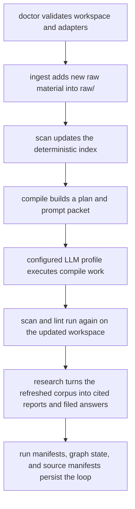

# Operator Workflows

## Purpose

This document describes the day-to-day operational loop for Cognisync.

It focuses on four commands that make the framework feel like a product rather than a toolkit:

- `cognisync doctor`
- `cognisync ingest ...`
- `cognisync compile ...`
- `cognisync research ...`

## Workflow Diagram

## Command Roles

### `doctor`

Use `doctor` before a long run or after cloning the repo onto a new machine.

It checks:

- workspace layout
- config readability
- index snapshot presence
- whether configured adapter commands resolve on the current machine

### `ingest`

Use `ingest` to pull more substrate into `raw/`.

Supported paths in this release:

- `cognisync ingest file ...`
- `cognisync ingest pdf ...`
- `cognisync ingest url ...`
- `cognisync ingest urls ...`
- `cognisync ingest sitemap ...`
- `cognisync ingest repo ...`
- `cognisync ingest batch manifest.json`

The richer ingest pass extracts more structure up front so later compile and query steps have better substrate:

- PDF ingest preserves the source file and writes a Markdown sidecar with extracted text plus ingest metadata
- URL ingest records description, canonical URL, headings, discovered links, content stats, and local image captures
- URL-list ingest expands text or JSON URL inventories into deterministic per-page captures
- sitemap ingest expands a sitemap into URL captures without shell scripting around the CLI
- repo ingest records repository stats, language signals, recent commits, and a nested tree snapshot in the manifest, even when the source is cloned from a remote Git URL

### `compile`

Use `compile` when you want one command to drive the main maintenance loop.

The command:

1. scans the workspace
2. builds a compile plan
3. renders the compile prompt packet
4. optionally executes the packet through a configured adapter profile
5. re-scans and lints the workspace

Compile packets now include an `Input Context` section that excerpts the raw artifacts behind each task, including PDF sidecar text, URL image references, and repository tree snapshots. Compile runs also persist run metadata in `.cognisync/runs/`.

### `research`

Use `research` when you want one command to turn a question into reusable workspace artifacts.

The command:

1. scans the workspace
2. searches the corpus for relevant sources
3. renders a cited report and prompt packet
4. optionally executes the packet through a configured adapter profile
5. validates citations and files the resulting answer back into the workspace

Research supports explicit output modes:

- `wiki` for `wiki/queries/`
- `report`, `memo`, and `brief` for `outputs/reports/`
- `slides` for `outputs/slides/`

Research and scan now persist:

- `.cognisync/sources.json` for grouped raw-source manifests
- `.cognisync/graph.json` for artifact and tag graph state
- `.cognisync/runs/` for compile and research run manifests with validation details

Research now also writes a dedicated plan in `.cognisync/plans/` and supports `--resume latest` or `--resume /path/to/run.json` so a planned run can be executed later without rebuilding the prompt packet.

Before a research run is considered complete, Cognisync now checks:

- citation validity against the retrieved source set
- unsupported uncited claims in the answer body
- answer lint, such as missing top-level headings
- conflicting source statements, which are recorded as warnings when the answer does not acknowledge them

The scan and compile loop also uses a richer graph substrate now:

- `.cognisync/graph.json` materializes entities, concept candidates, and conflict edges
- repeated headings, entity mentions, and tags can all feed concept-page planning
- concept creation is no longer limited to explicit tag overlap

## Traceability

| Task | Command Surface | Output |
| --- | --- | --- |
| O6 | `doctor` | readiness report |
| O7 | `ingest` | richer raw source artifacts plus updated index and grouped source manifest |
| O8 | `compile` | compile plan, prompt packet, optional model output, fresh lint state, run manifest |
| O9 | `research` | cited report, prompt packet, validated answer artifact, run manifest |
