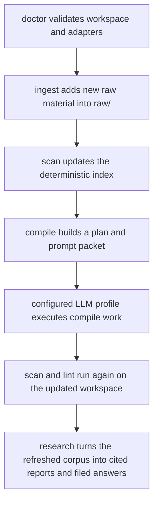

# Operator Workflows

## Purpose

This document describes the day-to-day operational loop for Cognisync.

It focuses on four commands that make the framework feel like a product rather than a toolkit:

- `cognisync doctor`
- `cognisync ingest ...`
- `cognisync compile ...`
- `cognisync research ...`

## Workflow Diagram

## Command Roles

### `doctor`

Use `doctor` before a long run or after cloning the repo onto a new machine.

It checks:

- workspace layout
- config readability
- index snapshot presence
- whether configured adapter commands resolve on the current machine

### `ingest`

Use `ingest` to pull more substrate into `raw/`.

Supported paths in this release:

- `cognisync ingest file ...`
- `cognisync ingest pdf ...`
- `cognisync ingest url ...`
- `cognisync ingest repo ...`
- `cognisync ingest batch manifest.json`

The richer ingest pass extracts more structure up front so later compile and query steps have better substrate:

- PDF ingest preserves the source file and writes a Markdown sidecar with extracted text plus ingest metadata
- URL ingest records description, canonical URL, headings, discovered links, content stats, and local image captures
- repo ingest records repository stats, language signals, recent commits, and a nested tree snapshot in the manifest

### `compile`

Use `compile` when you want one command to drive the main maintenance loop.

The command:

1. scans the workspace
2. builds a compile plan
3. renders the compile prompt packet
4. optionally executes the packet through a configured adapter profile
5. re-scans and lints the workspace

Compile packets now include an `Input Context` section that excerpts the raw artifacts behind each task, including PDF sidecar text, URL image references, and repository tree snapshots.

### `research`

Use `research` when you want one command to turn a question into reusable workspace artifacts.

The command:

1. scans the workspace
2. searches the corpus for relevant sources
3. renders a cited report and prompt packet
4. optionally executes the packet through a configured adapter profile
5. files the resulting answer back into `wiki/queries/`

## Traceability

| Task | Command Surface | Output |
| --- | --- | --- |
| O6 | `doctor` | readiness report |
| O7 | `ingest` | richer raw source artifacts plus updated index |
| O8 | `compile` | compile plan, prompt packet, optional model output, fresh lint state |
| O9 | `research` | cited report, prompt packet, optional filed answer |
