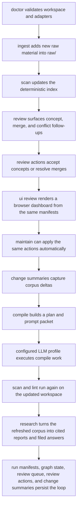

# Operator Workflows

## Purpose

This document describes the day-to-day operational loop for Cognisync.

It focuses on seven commands that make the framework feel like a product rather than a toolkit:

- `cognisync doctor`
- `cognisync ingest ...`
- `cognisync review`
- `cognisync ui review`
- `cognisync maintain`
- `cognisync compile ...`
- `cognisync research ...`

## Workflow Diagram

## Command Roles

### `doctor`

Use `doctor` before a long run or after cloning the repo onto a new machine.

It checks:

- workspace layout
- config readability
- index snapshot presence
- whether configured adapter commands resolve on the current machine

### `ingest`

Use `ingest` to pull more substrate into `raw/`.

Supported paths in this release:

- `cognisync ingest file ...`
- `cognisync ingest pdf ...`
- `cognisync ingest url ...`
- `cognisync ingest urls ...`
- `cognisync ingest sitemap ...`
- `cognisync ingest repo ...`
- `cognisync ingest batch manifest.json`

The richer ingest pass extracts more structure up front so later compile and query steps have better substrate:

- PDF ingest preserves the source file and writes a Markdown sidecar with extracted text plus ingest metadata
- URL ingest records description, canonical URL, headings, discovered links, content stats, and local image captures
- URL-list ingest expands text or JSON URL inventories into deterministic per-page captures
- sitemap ingest expands a sitemap into URL captures without shell scripting around the CLI
- repo ingest records repository stats, language signals, recent commits, and a nested tree snapshot in the manifest, even when the source is cloned from a remote Git URL

### `compile`

Use `compile` when you want one command to drive the main maintenance loop.

The command:

1. scans the workspace
2. builds a compile plan
3. renders the compile prompt packet
4. optionally executes the packet through a configured adapter profile
5. re-scans and lints the workspace

Compile packets now include an `Input Context` section that excerpts the raw artifacts behind each task, including PDF sidecar text, URL image references, and repository tree snapshots. Compile runs also persist run metadata in `.cognisync/runs/`.

### `review`

Use `review` when you want the graph to suggest what should happen next before you burn tokens on a compile or research run.

The command:

1. refreshes the workspace manifests if needed
2. materializes `.cognisync/review-queue.json`
3. prints a queue of concept candidates, entity merge suggestions, conflict reviews, and backlink opportunities
4. can apply deterministic actions directly through subcommands:
   `accept-concept`, `resolve-merge`, `apply-backlink`, `file-conflict`, `dismiss`, `reopen`, `list-dismissed`, `clear-dismissed`, and `export`

The queue is intentionally durable and machine-readable so later automation can consume it directly.
Dismissed items persist in `.cognisync/review-actions.json` with a reason, and they stay out of future queues and maintenance runs unless that state is edited.
`reopen` removes a persisted dismissal so the next queue refresh can surface the item again if the underlying condition still exists.
`list-dismissed` and `clear-dismissed` make the dismissal ledger reviewable without opening the manifest file directly.
`export` writes a machine-readable snapshot under `outputs/reports/review-exports/` with the open queue, dismissal ledger, and review-action state, and those artifacts are ignored by the scanner so they do not pollute retrieval.

### `ui review`

Use `ui review` when you want a lightweight browser surface over the same review state.

The command:

1. refreshes the workspace manifests if needed
2. writes a standalone HTML dashboard into `outputs/reports/review-ui/`
3. writes stable `review-export.json` and `dashboard-state.json` sidecars in the same directory
4. can optionally serve that directory locally with `--serve`

The dashboard is intentionally thin. It reads the same review queue and review-action state you already use through the CLI, then layers in graph-overview data from `.cognisync/graph.json`, recent change summaries, and run history from `.cognisync/runs/`. It also writes static graph-node, run-detail, and artifact-preview pages plus lightweight browser-side filters, so operators can drill into the current graph, change ledger, and run artifacts without leaving the file-native workflow. When served locally, the same surface can accept concepts, dismiss or reopen queue items, apply backlinks, file conflicts, and resolve merge candidates against the live workspace. The filesystem stays canonical and the UI remains a control layer rather than a second source of truth.

### `maintain`

Use `maintain` when you want Cognisync to apply the obvious graph-backed follow-up work without a manual review pass.

The command:

1. refreshes the current queue
2. applies a bounded number of backlink suggestions
3. accepts a bounded number of open concept candidates
4. resolves a bounded number of entity merge candidates
5. files a bounded number of conflict notes
6. re-scans the workspace and writes a maintenance run manifest

The current maintenance surface is intentionally conservative. It only applies deterministic scaffolds and routing actions, and it skips low-signal concept candidates so generic one-word tags do not silently turn into weak concept pages.
It also writes a change-summary artifact so you can see what the maintenance pass actually changed without inspecting JSON manifests directly.

Maintenance policy can now be tuned in `.cognisync/config.json` and overridden per run.

Config keys:

- `min_concept_support`
- `require_entity_evidence_for_short_concepts`
- `deny_concepts`

CLI overrides:

- `--min-concept-support`
- `--deny-concept`
- `--allow-short-concepts-without-entity`

### `doctor`

`doctor` now reports the active maintenance policy as a separate health line. Permissive settings like `min_concept_support=1` or allowing short concepts without entity evidence are surfaced as warnings so operators can spot noisy automation before a maintenance pass expands the graph too aggressively.

### Change summaries

Use the change summaries when you want a compact diff of the corpus after an operator action.

`scan`, `ingest`, `maintain`, and `research` now write Markdown artifacts under `outputs/reports/change-summaries/` with:

- artifact count delta
- source count delta
- orphan-page delta
- new concept pages
- newly resolved merge decisions
- newly dismissed review items
- newly surfaced conflict edges

### `research`

Use `research` when you want one command to turn a question into reusable workspace artifacts.

The command:

1. scans the workspace
2. searches the corpus for relevant sources
3. renders a cited report and prompt packet
4. optionally executes the packet through a configured adapter profile
5. validates citations and files the resulting answer back into the workspace

Research supports explicit output modes:

- `wiki` for `wiki/queries/`
- `report`, `memo`, and `brief` for `outputs/reports/`
- `slides` for `outputs/slides/`

Research and scan now persist:

- `.cognisync/sources.json` for grouped raw-source manifests
- `.cognisync/graph.json` for artifact and tag graph state
- `.cognisync/review-queue.json` for graph follow-up work
- `.cognisync/review-actions.json` for accepted concept pages and resolved merge decisions
- `.cognisync/review-actions.json` also records dismissed queue items with reasons
- `.cognisync/runs/` for compile and research run manifests with validation details

Research now also writes a dedicated plan in `.cognisync/plans/` and supports `--resume latest` or `--resume /path/to/run.json` so a planned run can be executed later without rebuilding the prompt packet.
Every planned, resumed, or completed research run also writes a research-scoped change summary so operators can see what the question actually changed in the corpus.

Before a research run is considered complete, Cognisync now checks:

- citation validity against the retrieved source set
- unsupported uncited claims in the answer body
- answer lint, such as missing top-level headings
- conflicting source statements, which now fail validation unless the answer acknowledges the disagreement and cites both sides

The scan and compile loop also uses a richer graph substrate now:

- `.cognisync/graph.json` materializes entities, concept candidates, and conflict edges
- repeated headings, entity mentions, and tags can all feed concept-page planning
- concept creation is no longer limited to explicit tag overlap
- `cognisync review` turns that graph state into a usable operator queue
- resolved merge actions collapse future entity nodes onto a preferred label
- backlink actions route orphan wiki pages into durable navigation surfaces
- filed conflict notes suppress resolved conflict reviews while preserving the disagreement as a first-class artifact
- `cognisync maintain` turns the deterministic parts of that queue into a one-command maintenance pass

## Traceability

| Task | Command Surface | Output |
| --- | --- | --- |
| O6 | `doctor` | readiness report |
| O7 | `ingest` | richer raw source artifacts, updated index and grouped source manifest, change summary artifact |
| O8 | `review` | durable review queue with concept, merge, conflict, and backlink follow-ups, plus export artifacts for other tools |
| O9 | `ui review` | browser-ready dashboard bundle with review, graph, and run-history state |
| O10 | `maintain` | accepted concept scaffolds, merge resolutions, refreshed manifests, maintenance run manifest, change summary artifact |
| O11 | `compile` | compile plan, prompt packet, optional model output, fresh lint state, run manifest |
| O12 | `research` | cited report, prompt packet, validated answer artifact, run manifest, change summary artifact |
