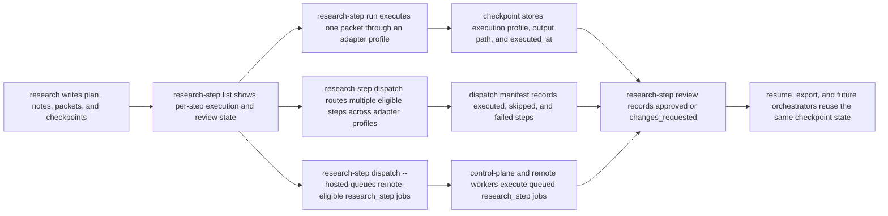

# Operator Workflows

## Purpose

This document describes the day-to-day operational loop for Cognisync.

It focuses on seven commands that make the framework feel like a product rather than a toolkit:

- `cognisync init`
- `cognisync doctor`
- `cognisync ingest ...`
- `cognisync review`
- `cognisync collab ...`
- `cognisync control-plane ...`
- `cognisync worker remote`
- `cognisync ui review`
- `cognisync export ...`
- `cognisync maintain`
- `cognisync compile ...`
- `cognisync research ...`

## Workflow Diagram

```mermaid
flowchart TD
    A["doctor validates workspace and adapters"] --> B["ingest adds new raw material into raw/"]
    B --> C["scan refreshes AGENTS.md, log.md, and wiki catalogs"]
    C --> D["review surfaces concept, merge, and conflict follow-ups"]
    D --> E["review actions accept concepts or resolve merges"]
    E --> F["collab tracks artifact-level review requests and decisions"]
    F --> G["control-plane issues tokens and scheduler ticks"]
    G --> H["worker remote drains queued jobs over HTTP"]
    H --> I["ui review renders a browser dashboard from the same manifests"]
    I --> J["maintain can apply the same actions automatically"]
    J --> K["change summaries capture corpus deltas"]
    K --> L["compile builds a plan and prompt packet"]
    L --> M["configured LLM profile executes compile work"]
    M --> N["scan and lint run again on the updated workspace"]
    N --> O["research turns the refreshed corpus into cited reports and filed answers"]
    O --> P["export bridges package reports and slide decks for downstream systems"]
    P --> Q["run manifests, graph state, review queue, collaboration state, control-plane state, and change summaries persist the loop"]
```

## Command Roles

### `doctor`

Use `doctor` before a long run or after cloning the repo onto a new machine.

It checks:

- workspace layout
- config readability
- index snapshot presence
- whether configured adapter commands resolve on the current machine

### `init`

Use `init` to create the workspace contract before you ingest or compile anything.

The command now materializes:

- the canonical directories under `raw/`, `wiki/`, `outputs/`, `prompts/`, and `.cognisync/`
- a root `AGENTS.md` schema file that tells agents how to maintain the workspace
- a root `log.md` activity ledger
- generated navigation surfaces at `wiki/index.md`, `wiki/sources.md`, `wiki/concepts.md`, and `wiki/queries.md`

Those files are not just scaffolding. They are part of the operator surface and get refreshed as the corpus evolves.

### `ingest`

Use `ingest` to pull more substrate into `raw/`.

Supported paths in this release:

- `cognisync ingest file ...`
- `cognisync ingest pdf ...`
- `cognisync ingest url ...`
- `cognisync ingest urls ...`
- `cognisync ingest sitemap ...`
- `cognisync ingest repo ...`
- `cognisync ingest batch manifest.json`

The richer ingest pass extracts more structure up front so later compile and query steps have better substrate:

- PDF ingest preserves the source file and writes a Markdown sidecar with extracted text plus ingest metadata
- URL ingest records description, canonical URL, headings, discovered links, content stats, and local image captures
- URL-list ingest expands text or JSON URL inventories into deterministic per-page captures
- sitemap ingest expands a sitemap into URL captures without shell scripting around the CLI
- repo ingest records repository stats, language signals, recent commits, and a nested tree snapshot in the manifest, even when the source is cloned from a remote Git URL

### `compile`

Use `compile` when you want one command to drive the main maintenance loop.

The command:

1. scans the workspace
2. builds a compile plan
3. renders the compile prompt packet
4. optionally executes the packet through a configured adapter profile
5. re-scans and lints the workspace

Compile packets now include an `Input Context` section that excerpts the raw artifacts behind each task, including PDF sidecar text, URL image references, and repository tree snapshots. Compile runs also persist run metadata in `.cognisync/runs/`.

### `review`

Use `review` when you want the graph to suggest what should happen next before you burn tokens on a compile or research run.

The command:

1. refreshes the workspace manifests if needed
2. materializes `.cognisync/review-queue.json`
3. prints a queue of concept candidates, entity merge suggestions, conflict reviews, and backlink opportunities
4. can apply deterministic actions directly through subcommands:
   `accept-concept`, `resolve-merge`, `apply-backlink`, `file-conflict`, `dismiss`, `reopen`, `list-dismissed`, `clear-dismissed`, and `export`

The queue is intentionally durable and machine-readable so later automation can consume it directly.
Dismissed items persist in `.cognisync/review-actions.json` with a reason, and they stay out of future queues and maintenance runs unless that state is edited.
`reopen` removes a persisted dismissal so the next queue refresh can surface the item again if the underlying condition still exists.
`list-dismissed` and `clear-dismissed` make the dismissal ledger reviewable without opening the manifest file directly.
`export` writes a machine-readable snapshot under `outputs/reports/review-exports/` with the open queue, dismissal ledger, and review-action state, and those artifacts are ignored by the scanner so they do not pollute retrieval.

The catalog pages matter here too:

- `wiki/sources.md` and `wiki/concepts.md` count as durable navigation backlinks
- `wiki/queries.md` stays non-binding until a review action explicitly promotes a query page into navigable state
- that keeps query pages visible as orphan candidates until someone files them intentionally

### `ui review`

Use `ui review` when you want a lightweight browser surface over the same review state.

The command:

1. refreshes the workspace manifests if needed
2. writes a standalone HTML dashboard into `outputs/reports/review-ui/`
3. writes stable `review-export.json` and `dashboard-state.json` sidecars in the same directory
4. can optionally serve that directory locally with `--serve`
5. can run the live server as an explicit workspace actor with `--actor-id`

The dashboard is intentionally thin. It reads the same review queue and review-action state you already use through the CLI, then layers in graph-overview data from `.cognisync/graph.json`, source coverage from `.cognisync/sources.json`, compile health from lint and compile-plan state, recent change summaries, run history from `.cognisync/runs/`, queued-job history from `.cognisync/jobs/`, worker ownership from `.cognisync/jobs/workers.json`, sync audit history from `.cognisync/sync/`, connector definitions from `.cognisync/connectors.json`, workspace access state from `.cognisync/access.json`, collaboration state from `.cognisync/collaboration.json`, and operator notifications from `.cognisync/notifications.json`. It also writes static graph-node, run-detail, run-timeline, concept-graph, job-detail, sync-detail, connector-detail, and artifact-preview pages plus lightweight browser-side filters, so operators can drill into the current graph, source mix, change ledger, queued work, connector registry, access roster, collaboration queue, and sync handoffs without leaving the file-native workflow. When served locally, the same surface can accept concepts, dismiss or reopen queue items, apply backlinks, file conflicts, resolve merge candidates, request artifact review, add collaboration comments, record approvals or requested changes, resolve collaboration threads, run the next queued job, sync one registered connector, or sync the unsynced portion of the whole connector registry. Those live actions now run as an explicit workspace actor, with editor-or-reviewer-or-operator access for collaboration requests and comments, reviewer-or-operator access for approvals and change requests, and operator-only access for job and connector mutations. The filesystem stays canonical and the UI remains a control layer rather than a second source of truth.

### `collab`

Use `collab` when you want artifact-level review to persist inside the same workspace instead of staying implicit in chat history.

Supported paths in this release:

- `cognisync collab list`
- `cognisync collab request-review <artifact-path> --assign reviewer-1 --actor-id editor-1`
- `cognisync collab comment <artifact-path> --message "..." --actor-id reviewer-1`
- `cognisync collab approve <artifact-path> --summary "..." --actor-id reviewer-1`
- `cognisync collab request-changes <artifact-path> --summary "..." --actor-id reviewer-1`
- `cognisync collab resolve <artifact-path> --actor-id editor-1`

The command set:

1. materializes `.cognisync/collaboration.json`
2. keeps artifact-path keyed review threads with assignees, comments, decisions, and resolution state
3. requires a non-viewer workspace actor for review requests and comments
4. requires a reviewer or operator actor for approvals and requested changes
5. lets sync bundles, audit manifests, usage manifests, notifications, and the review UI consume the same collaboration state without a separate backing store

### `access`

Use `access` when you want a durable roster of workspace roles that travels with the same filesystem state as the corpus.

Supported paths in this release:

- `cognisync access list`
- `cognisync access grant <principal-id> <viewer|editor|reviewer|operator> --actor-id <principal-id>`
- `cognisync access revoke <principal-id> --actor-id <principal-id>`

The command set:

1. materializes `.cognisync/access.json` if it does not exist yet
2. keeps a default `local-operator` member so a local workspace always has one explicit operator identity
3. requires an operator actor for grant and revoke mutations, so roster edits follow the same workspace role model as the rest of the control plane
4. lets sync bundles carry the same roster to another machine through the copied `.cognisync` state

This keeps the control-plane surface file-native too. The roster is simple on purpose: it is meant to be durable workspace state first, and a future hosted permission layer second.

### `share`

Use `share` when you want to bind a published control-plane URL, track accepted remote peers, and issue a handoff bundle that another machine can actually use.

Supported paths in this release:

- `cognisync share status`
- `cognisync share bind-control-plane https://control.example.test/api --workspace .`
- `cognisync share invite-peer remote-ops operator --workspace . --base-url https://remote.example.test/cognisync --capability jobs.remote`
- `cognisync share accept-peer remote-ops --workspace .`
- `cognisync share list-peers`
- `cognisync share set-peer-role remote-ops reviewer --workspace .`
- `cognisync share suspend-peer remote-ops --workspace .`
- `cognisync share remove-peer remote-ops --workspace .`
- `cognisync share set-policy --workspace . --allow-remote-workers --allow-sync-imports --max-peer-role reviewer --require-secure-control-plane --allow-control-plane-host control.example.test --allow-peer-capability review.remote --allow-peer-capability sync.import`
- `cognisync share subscribe-sync remote-ops --workspace . --every-hours 1`
- `cognisync share unsubscribe-sync remote-ops --workspace .`
- `cognisync share issue-peer-bundle remote-ops --workspace . --output-file remote-ops.json`
- `cognisync share attach-remote-bundle remote-ops.json --workspace ./mirror`
- `cognisync share refresh-remote-bundle remote-ops.json --workspace ./mirror`
- `cognisync share list-attached-remotes --workspace ./mirror`
- `cognisync share pull-remote remote-ops --workspace ./mirror`
- `cognisync share suspend-remote remote-ops --workspace ./mirror`
- `cognisync share detach-remote remote-ops --workspace ./mirror`
- `cognisync share subscribe-remote-pull remote-ops --workspace ./mirror --every-hours 1`
- `cognisync share unsubscribe-remote-pull remote-ops --workspace ./mirror`

The command family:

1. materializes `.cognisync/shared-workspace.json`
2. keeps accepted peer state, peer capabilities, and the published control-plane URL file-native instead of hiding them in shell history
3. records the last issued peer bundle timestamp and token id on each accepted peer so remote handoffs are inspectable later
4. persists a shared-workspace trust policy so remote worker bundles and peer-originated sync imports can be enabled or disabled, peer roles can be capped, control-plane hosts can be allowlisted, and peer capabilities can be restricted without editing JSON by hand
5. can subscribe accepted peers to scheduled sync exports on an hourly interval, keeping that schedule beside the rest of the shared-workspace state
6. issues peer bundles only for accepted peers and only after a control-plane URL is bound, so remote workers receive a coherent package
7. derives bundle scopes from declared peer capabilities like `jobs.remote`, `review.remote`, `scheduler.remote`, `connectors.sync`, `control.admin`, or explicit scope strings, so peer handoffs stay intentionally least-privilege
8. reuses the same scoped token issuance path as `control-plane issue-token`, so peer bundles inherit the role-aware control-plane contract instead of inventing a second auth model
9. lets operators re-role, suspend, or remove a peer without hand-editing manifests, and those lifecycle actions revoke shared access plus peer-issued tokens automatically
10. lets another workspace attach a peer bundle as an upstream remote, then pull and import that remote state over HTTP without manually unpacking sync archives
11. can subscribe attached remotes to hourly pull imports, so the same manifest now tracks both outbound peer exports and inbound upstream syncs
12. lets operators refresh an attached remote from a rotated peer bundle, suspend it without deleting local provenance, or detach it entirely when the upstream relationship should be removed

### `control-plane`

Use `control-plane` when you want to expose the manifest-backed queue, scheduler, and access layer to another process without introducing a separate service database first.

Supported paths in this release:

- `cognisync control-plane status`
- `cognisync control-plane invite reviewer-2 reviewer --workspace .`
- `cognisync control-plane accept-invite reviewer-2 --workspace .`
- `cognisync control-plane issue-token local-operator --scope control.read --scope jobs.run --expires-in-hours 12 --output-file token.json`
- `cognisync control-plane list-tokens`
- `cognisync control-plane revoke-token <token-id>`
- `cognisync control-plane schedule-research "map contradictions in deployment notes" --every-hours 6`
- `cognisync control-plane schedule-compile --every-hours 12`
- `cognisync control-plane schedule-lint --every-hours 12`
- `cognisync control-plane schedule-maintain --every-hours 12 --max-concepts 4 --max-backlinks 4`
- `cognisync control-plane list-scheduled-jobs`
- `cognisync control-plane remove-scheduled-job <subscription-id>`
- `cognisync control-plane scheduler-status`
- `cognisync control-plane workers`
- `cognisync control-plane release-worker <worker-id> --reason operator_recovery --requeue-active-jobs`
- `cognisync control-plane scheduler-tick --enqueue-only --actor-id local-operator`
- `cognisync control-plane serve --host 127.0.0.1 --port 8766`

The command family:

1. materializes `.cognisync/control-plane.json`
2. keeps workspace invites and accepted memberships file-native instead of hiding them in process memory
3. issues scoped bearer tokens whose raw value is only emitted once, while the manifest stores only token hashes plus prefixes and optional expiry timestamps
4. persists recurring research, compile, lint, and maintain subscriptions beside connector, peer-sync, and attached-remote pull schedules, so the scheduler can drive corpus work without a second orchestration store
5. supports scheduler ticks that enqueue or execute scheduled connector sync work, due peer-scoped sync-export jobs, due attached-remote pull imports, and recurring corpus jobs against the same queue and connector manifests the local CLI already uses
6. serves a lightweight HTTP layer for status, shared-workspace state, access roster, collaboration threads, notifications, audit, usage, queue inspection, worker inspection, scheduler ticks, lease-aware job execution, and lease renewal
7. keeps actor checks aligned with `.cognisync/access.json`, so tokens still resolve back to explicit workspace principals
8. travels with sync bundles because the control-plane manifest is now part of the declared state manifest set
9. requires an operator principal for hosted job mutation endpoints even when a token carries matching `jobs.*` scopes, so HTTP queue execution does not bypass the workspace roster
10. carries worker capability routing through `/api/jobs/run-next`, `/api/jobs/claim-next`, `/api/jobs/heartbeat`, and `/api/workers`, so remote workers can advertise what they handle, stay visible while polling, and expose their current job while the hosted queue respects that routing
11. lets operators release a stale worker and immediately requeue its active lease, so hosted recovery can happen on demand instead of waiting for a lease timeout to expire
12. exposes hosted research-step queueing through the same surface, so remote-eligible research assignments can be enqueued either by `research-step dispatch --hosted` or directly through `/api/jobs/enqueue/research-step` without inventing a second orchestration path

This is intentionally a hosted-alpha surface, not a full SaaS backend. The filesystem remains canonical and the server is just another way to drive the same manifests.

The served API now covers a real remote review surface too:

- `GET /api/share`, `GET /api/access`, `GET /api/collab`, `GET /api/notifications`, `GET /api/audit`, and `GET /api/usage` expose the same file-native state the local CLI renders
- `GET /api/scheduler` now exposes due recurring job ids alongside due connectors, peer syncs, and attached-remote pulls, and `GET /api/scheduler/jobs` exposes the persisted recurring-job manifest itself
- `GET /api/review` exposes the live open queue, dismissal ledger, and persisted review-action state over the same token-backed surface
- `GET /api/runs`, `GET /api/sync`, and `GET /api/change-summaries` expose run history, sync history, and corpus-delta history over the same file-native control-plane surface
- `GET /api/artifacts/preview?path=...` exposes text artifact previews and manifest inspection over the same hosted layer
- `POST /api/access/grant`, `revoke`, `GET /api/invites`, `POST /api/invites/create`, `accept`, `GET /api/tokens`, and `POST /api/tokens/issue`, `revoke` let operator tokens manage the remote auth layer itself instead of falling back to the local shell
- `POST /api/scheduler/jobs/research|compile|lint|maintain|remove` lets operator tokens manage recurring job subscriptions over HTTP instead of hand-editing control-plane state
- `POST /api/review/accept-concept`, `resolve-merge`, `apply-backlink`, `file-conflict`, `dismiss`, `reopen`, and `clear-dismissed` let reviewer or operator tokens mutate the review loop remotely while still resolving back through `.cognisync/access.json`
- `POST /api/collab/request-review`, `comment`, `approve`, `request-changes`, and `resolve` let editors and reviewers mutate artifact-review state over HTTP while still enforcing the workspace role model
- `POST /api/share/set-policy`, `subscribe-sync`, and `unsubscribe-sync` let operator tokens manage shared-workspace trust policy and scheduled peer exports remotely
- `POST /api/share/invite-peer`, `accept-peer`, `issue-peer-bundle`, `peers/role`, `peers/suspend`, and `peers/remove` let operator tokens prepare or tighten remote peer handoffs over HTTP too
- `GET /api/connectors` plus `POST /api/connectors/add`, `subscribe`, `unsubscribe`, `sync`, and `sync-all` let the hosted-alpha layer inspect and execute connector work without falling back to a local shell
- `POST /api/jobs/enqueue/research|research-step|compile|lint|maintain|ingest-url|ingest-repo|ingest-sitemap|connector-sync|connector-sync-all|sync-export` lets operator tokens submit new work into the manifest-backed queue remotely
- `POST /api/sync/export` and `POST /api/sync/import` let operator tokens exchange inline sync archives over HTTP while still honoring accepted-peer trust policy on import
- peer-scoped sync handoffs now require the accepted peer to declare `sync.import`, so `sync export --for-peer`, `sync import --from-peer`, and their HTTP equivalents remain explicit capability-based trust decisions instead of role-only defaults
- `POST /api/jobs/run-next`, `claim-next`, and `heartbeat` now also accept `worker_capabilities`, and `GET /api/workers` persists those declared capabilities in the derived worker registry
- `POST /api/workers/release` can now also requeue a stale worker's live lease immediately, so remote recovery can happen through the hosted surface instead of waiting for lease expiry
- `POST /api/jobs/dispatch-next`, `complete`, and `fail` now support detached mirrored workers too, so remote operators can claim a job, execute it against a synced local mirror, and return only the resulting artifacts instead of asking the server process to do the work locally

### `worker remote`

Use `worker remote` when you want a second process or machine to execute queued work through the control-plane HTTP surface instead of sharing a terminal session.

Supported path in this release:

- `cognisync worker remote --server-url http://127.0.0.1:8766 --token <token> --worker-id remote-a --max-jobs 5`
- `cognisync worker remote --server-url http://127.0.0.1:8766 --token <token> --worker-id remote-a --poll-interval-seconds 2 --max-idle-polls 30`
- `cognisync worker remote --server-url http://127.0.0.1:8766 --token <token> --worker-id workspace-a --capability workspace --capability connector`
- `cognisync worker remote --server-url http://127.0.0.1:8766 --token <token> --worker-id ingest-a --workspace /tmp/cognisync-mirror --capability ingest`
- `cognisync worker remote --server-url http://127.0.0.1:8766 --token <token> --worker-id mirror-a --workspace /tmp/cognisync-mirror --refresh-workspace-before-jobs`

The command:

1. polls `/api/jobs/run-next` when no mirror workspace is provided, so the hosted-alpha shim can still execute work directly on the served workspace
2. switches to `/api/jobs/dispatch-next`, `complete`, and `fail` when `--workspace` points at a mirrored workspace, so the remote process actually performs the job locally and then syncs the result artifacts back
3. reuses the same manifest-backed runtimes as `jobs run-next`
4. keeps worker identity explicit through `--worker-id`
5. can keep polling through short idle windows, so a remote worker can stay warm for scheduled jobs instead of exiting on the first empty queue
6. can advertise declared capabilities like `workspace`, `research`, `ingest`, `connector`, or `sync`, so the hosted queue only hands it compatible work
7. works with scheduler-enqueued connector jobs and peer-scoped sync-export jobs, so scheduled connector pulls and shared-workspace handoffs can be drained by a remote worker instead of the local shell
8. keeps renewing the active lease while mirrored work is still executing, so detached runs do not silently outlive the hosted job ownership that dispatched them
9. syncs back only the touched result artifacts from the mirrored workspace, which keeps remote execution file-native without copying the whole mirror state on every job
10. can opt into `--refresh-workspace-before-jobs` when the worker token carries `sync.export`, importing the served workspace snapshot into the mirror before each hosted dispatch attempt

Together, `control-plane serve`, `control-plane scheduler-tick`, and `worker remote` give Cognisync a remote-ready operator loop without breaking the local-first contract.

### `notify`

Use `notify` when you want a durable operator inbox built from the current workspace state.

Supported path in this release:

- `cognisync notify list`

The command:

1. writes `.cognisync/notifications.json`
2. derives notifications from queued and failed jobs, validation-failed runs, warning-bearing runs, unsynced connectors, and due connector subscriptions
3. also derives collaboration notifications for pending review threads and outstanding requested-change threads
4. prints a human-readable inbox view for the same manifest

This keeps backlog and failure signals file-native, so later automation or UI layers can read the same inbox instead of scraping terminal logs.

### `audit`

Use `audit` when you want a readable control-plane event index derived from the manifests the workspace already writes.

Supported path in this release:

- `cognisync audit list`

The command:

1. writes `.cognisync/audit.json`
2. derives events from access members, collaboration threads, connector definitions, job manifests, run manifests, and sync events
3. prints a human-readable audit summary for the same manifest

This is not a separate database. It is a deterministic index over the same filesystem-native state the operator loop already uses.

### `usage`

Use `usage` when you want a compact accounting view over the current workspace.

Supported path in this release:

- `cognisync usage report`

The command:

1. writes `.cognisync/usage.json`
2. counts runs, jobs, connectors, sync volume, access roles, collaboration threads, and storage bytes by area
3. makes the same summary available to later UI or automation layers without scraping terminal output

This gives Cognisync a file-native usage and activity baseline before any hosted billing or quota layer exists.

### `export`

Use `export` when you want the same workspace state to leave Cognisync in a portable bundle instead of staying only as Markdown and manifests.

Supported paths in this release:

- `cognisync export jsonl`
- `cognisync export training-bundle`
- `cognisync export finetune-bundle`
- `cognisync export finetune-bundle --provider-format openai-chat`
- `cognisync export feedback-bundle`
- `cognisync export correction-bundle`
- `cognisync export training-loop-bundle --provider-format openai-chat`
- `cognisync improve research --profile codex --provider-format openai-chat`
- `cognisync export presentations`
- `cognisync eval research`
- `cognisync synth qa`
- `cognisync synth contrastive`

`export jsonl` walks `.cognisync/runs/`, selects research runs, and writes a JSONL dataset artifact under `outputs/reports/exports/` with:

- question text
- run status and mode
- research job profile
- report, answer, and prompt-packet text
- citations and validation state
- note paths, source-packet path, checkpoints path, validation-report path, and paths back to the original workspace artifacts

`export presentations` copies slide decks plus companion reports and answers into a timestamped bundle under `outputs/reports/exports/` and writes a stable `manifest.json` for downstream viewers or sharing flows.

`export training-bundle` writes a timestamped bundle under `outputs/reports/exports/` with:

- `dataset.jsonl` records for each research run
- validation-derived labels such as citation failures, unsupported-claim failures, and conflict gates
- a bundle `manifest.json` with record counts, label counts, and run-status counts

`export finetune-bundle` writes a timestamped bundle under `outputs/reports/exports/` with:

- `supervised.jsonl` examples sourced from persisted research runs, validated remediation corrections, and synthetic QA records
- `retrieval.jsonl` contrastive retrieval examples sourced from assertion support paths
- a bundle `manifest.json` with supervised and retrieval counts plus example-type tallies

You can also ask the same bundle to emit provider-specific supervised records. For example, `--provider-format openai-chat` writes `supervised.openai-chat.jsonl` with `messages` arrays for direct chat-finetuning flows while keeping the generic files intact, including any validated remediation corrections already present in the supervised bundle.

`export feedback-bundle` writes a timestamped remediation bundle under `outputs/reports/exports/` with:

- `remediation.jsonl` records for runs whose quality dimensions fell below the remediation threshold
- the current answer text, weak dimensions, and a remediation prompt per record
- a bundle `manifest.json` with counts grouped by improvement target

`export correction-bundle` writes a timestamped correction bundle under `outputs/reports/exports/` with:

- `dataset.jsonl` records for remediation jobs that finished with passing validation
- the corrected answer, the previous failing answer, the recorded improvement targets, and the validation payload per record
- a bundle `manifest.json` with counts grouped by improvement target, completion status, and example type

`export training-loop-bundle` writes a timestamped umbrella bundle under `outputs/reports/exports/` with:

- `evaluation/` for the Markdown scorecard and JSON eval payload
- `feedback/` for remediation-ready low-quality records
- `corrections/` for validated remediation-correction training examples
- `finetune/` for the supervised and retrieval training exports, including any requested provider-specific records
- a top-level `manifest.json` that ties the whole bundle together with counts and relative paths

`eval research` reads the same persisted research runs and writes a Markdown scorecard plus JSON payload with:

- validation pass and failure counts
- warning-bearing run counts
- average source and citation usage
- run-status and job-profile breakdowns
- validation-label tallies for downstream evaluation tracking
- dimension averages for grounding, citation integrity, retrieval coverage, structure, artifact completeness, and contradiction handling
- per-run dimension payloads so downstream feedback loops can consume more than pass/fail labels

`synth qa` reads the assertion graph and writes deterministic question-answer pairs with source ids and support paths.

`synth contrastive` reads the same assertion support paths and writes positive/negative retrieval pairs for downstream ranking work.

The scanner ignores `outputs/reports/exports/` so these bridge artifacts never pollute search or retrieval.

### `remediate`

Use `remediate research` when you want Cognisync to turn weak research runs into executable correction jobs instead of stopping at diagnosis.

The command:

1. reads the low-quality candidates implied by `export feedback-bundle`
2. writes a remediation packet for each selected run under `outputs/reports/remediation-jobs/`
3. executes that packet through the chosen adapter profile
4. validates the corrected answer against the original retrieved sources
5. writes a remediation manifest and validation report beside the corrected answer
6. leaves those successful corrections ready for `export correction-bundle` without mutating the original research run

`remediate research --profile codex` is intentionally conservative. It does not overwrite the original research run or filed answer. Instead it leaves a separate correction workspace under `outputs/reports/remediation-jobs/`, and the scanner ignores that directory so remediation artifacts do not leak back into retrieval until a later operator step promotes them.

### `improve`

Use `improve research` when you want the correction loop and the training package refresh to happen together.

The command:

1. remediates the weak research runs selected by the current feedback state
2. validates the corrected answers against the original retrieved sources
3. refreshes the umbrella `training-loop-bundle` so evaluation, feedback, corrections, and finetune artifacts stay in sync

`improve research --profile codex --provider-format openai-chat` is the shortest end-to-end path from weak research runs to a provider-ready training package.

### `jobs`

Use `jobs` when you want Cognisync to behave more like a local control plane than a one-shot CLI.

Supported paths in this release:

- `cognisync jobs enqueue research --profile codex "..." --actor-id local-operator`
- `cognisync jobs enqueue improve-research --profile codex --provider-format openai-chat --actor-id local-operator`
- `cognisync jobs enqueue ingest-url https://example.com/paper --name paper-source --actor-id local-operator`
- `cognisync jobs enqueue ingest-repo https://github.com/example/research-repo --name research-repo --actor-id local-operator`
- `cognisync jobs enqueue ingest-sitemap https://example.com/sitemap.xml --actor-id local-operator`
- `cognisync jobs enqueue compile --actor-id local-operator`
- `cognisync jobs enqueue lint --actor-id local-operator`
- `cognisync jobs enqueue maintain --max-concepts 2 --max-backlinks 2 --actor-id local-operator`
- `cognisync jobs enqueue connector-sync <connector-id> --actor-id local-operator`
- `cognisync jobs enqueue connector-sync-all --actor-id local-operator`
- `cognisync jobs enqueue connector-sync-all --scheduled-only --actor-id local-operator`
- `cognisync jobs enqueue sync-export remote-ops --actor-id local-operator`
- `cognisync jobs enqueue remote-sync-pull remote-ops --actor-id local-operator`
- `cognisync jobs claim-next --worker-id worker-a`
- `cognisync jobs claim-next --worker-id workspace-a --capability workspace`
- `cognisync jobs heartbeat --worker-id worker-a --lease-seconds 900`
- `cognisync jobs run-next --worker-id worker-a`
- `cognisync jobs work --worker-id ingest-a --capability ingest --max-jobs 5`
- `cognisync jobs retry <job-id> --profile codex --actor-id local-operator`
- `cognisync jobs work --worker-id worker-a --max-jobs 10`
- `cognisync jobs workers`
- `cognisync jobs list`

The command family:

1. persists queued job manifests under `.cognisync/jobs/manifests/`
2. keeps a lightweight queue summary in `.cognisync/jobs/queue.json`
3. requires an operator actor for queue submission and retry mutations, so scheduler-facing actions obey the same workspace role model as sync and the review UI
4. can claim jobs under an explicit worker id and lease before execution, so ownership is durable in the manifest instead of being implicit in one local process
5. can renew that lease with `jobs heartbeat`, so long-running workers do not need to drop and reclaim ownership just to stay alive
6. assigns each queued job a required worker capability like `research`, `ingest`, `workspace`, `connector`, or `sync`, so worker routing is durable in the manifest instead of living only in process arguments
7. reuses the same `research`, `improve research`, `ingest`, `compile`, `lint`, `maintain`, `connector sync`, `connector sync-all`, peer-scoped `sync export`, and attached-remote `remote sync pull` runtimes when a worker executes queued jobs
8. lets `run-next` resume the same worker's active claim or claim fresh compatible work when nothing is already held
9. allows expired leases to be reclaimed by another worker without deleting the original manifest lineage
10. records result paths back into the job manifest instead of dropping that state into terminal-only output
11. supports `jobs retry` for terminal jobs, preserving lineage through `retry_of_job_id` when you need another execution attempt
12. supports `jobs work` when you want the local queue to drain like a small worker instead of stepping one job at a time
13. derives `.cognisync/jobs/workers.json` so queue ownership can be inspected as a worker roster instead of only by reading individual job manifests
14. persists each worker's declared capabilities in that same worker registry, so operators can see what a worker is meant to handle instead of inferring it from the current lease alone
15. persists the scheduling principal as `requested_by` in each queued job manifest, so submitted work keeps its actor provenance even when a different worker executes it later

```mermaid
flowchart LR
    A["jobs enqueue research, compile, lint, maintain, connector-sync, connector-sync-all, sync-export, remote-sync-pull, or improve-research"] --> B["persist job manifest in .cognisync/jobs/manifests"]
    B --> C["jobs claim-next records worker lease"]
    C --> D["jobs heartbeat can renew the active worker lease"]
    D --> E["jobs run-next or jobs work resumes owned claims or claims fresh work"]
    E --> F["existing runtime executes the matching operator loop"]
    F --> G["job manifest stores result paths, lease history, and completion status"]
    G --> H["jobs retry can re-queue a terminal job with lineage"]
    H --> I["queue summary reflects remaining queued work"]
```

### `sync`

Use `sync` when you want to move a workspace between operators or machines without requiring a hosted database first.

Supported paths in this release:

- `cognisync sync history`
- `cognisync sync export --actor-id <principal-id>`
- `cognisync sync export --for-peer <peer-id> --actor-id <principal-id>`
- `cognisync sync import <bundle-dir> --workspace /path/to/workspace --actor-id <principal-id>`
- `cognisync sync import <bundle-dir> --workspace /path/to/workspace --actor-id <principal-id> --from-peer <peer-id>`

`sync export` writes a portable bundle under `outputs/reports/sync-bundles/`, requires an operator actor from `.cognisync/access.json`, and currently includes:

- `raw/`
- `wiki/`
- `prompts/`
- `.cognisync/`
- `outputs/slides/`
- `outputs/reports/change-summaries/`
- `outputs/reports/research-jobs/`
- `outputs/reports/remediation-jobs/`

`sync export --for-peer` writes accepted peer metadata into the bundle manifest so a later import can be checked against shared-workspace state.

`sync import` also requires an operator actor from the target workspace roster. When `--from-peer` is provided, the target workspace additionally checks the shared-workspace trust policy and accepted-peer roster before restoring those same paths into another workspace root.

Every export and import also records a sync event under `.cognisync/sync/manifests/` and refreshes `.cognisync/sync/history.json`, so a later operator or UI can inspect how the workspace moved without parsing bundle directories manually. Those events now include the acting principal and, on import, the source bundle actor too. The declared `state_manifests` map now includes `.cognisync/control-plane.json` as well, so hosted-alpha tokens, invites, and scheduler state can travel with the same bundle.

The scanner ignores `outputs/reports/sync-bundles/` so exported handoff artifacts never re-enter retrieval.

### `connector`

Use `connector` when you want remote-style source definitions to live as workspace manifests instead of external shell scripts.

Supported paths in this release:

- `cognisync connector add repo <source> --name <name>`
- `cognisync connector add url <source> --name <name>`
- `cognisync connector add urls <source-list> --name <name>`
- `cognisync connector add sitemap <source> --name <name>`
- `cognisync connector list`
- `cognisync connector subscribe <connector-id> --every-hours 6 --actor-id local-operator`
- `cognisync connector unsubscribe <connector-id> --actor-id local-operator`
- `cognisync connector sync <connector-id> --actor-id local-operator`
- `cognisync connector sync-all --actor-id local-operator`
- `cognisync connector sync-all --scheduled-only --actor-id local-operator`

The command family:

1. stores connector definitions in `.cognisync/connectors.json`
2. supports `repo`, `url`, `urls`, and `sitemap` source shapes
3. requires an operator actor for register, subscribe, unsubscribe, and sync mutations
4. can persist schedule metadata per connector, including interval hours, `next_sync_at`, and `last_scheduled_sync_at`
5. runs the existing ingest flows when `connector sync` executes
6. writes a `connector_sync` run manifest plus a change summary when a sync completes
7. lets `connector sync-all` walk the registry and skip already-synced connectors unless `--force` is provided
8. lets `connector sync-all --scheduled-only` select only connectors whose subscription window is currently due
9. can be routed through `jobs enqueue connector-sync <connector-id>` or `jobs enqueue connector-sync-all --scheduled-only` when you want the worker loop to own connector pulls
10. persists `created_by`, `updated_by`, and `last_synced_by` in `.cognisync/connectors.json`, while connector run manifests record the same actor snapshot in `.cognisync/runs/`

### `maintain`

Use `maintain` when you want Cognisync to apply the obvious graph-backed follow-up work without a manual review pass.

The command:

1. refreshes the current queue
2. applies a bounded number of backlink suggestions
3. accepts a bounded number of open concept candidates
4. resolves a bounded number of entity merge candidates
5. files a bounded number of conflict notes
6. re-scans the workspace and writes a maintenance run manifest

The current maintenance surface is intentionally conservative. It only applies deterministic scaffolds and routing actions, and it skips low-signal concept candidates so generic one-word tags do not silently turn into weak concept pages.
It also writes a change-summary artifact so you can see what the maintenance pass actually changed without inspecting JSON manifests directly.

Maintenance policy can now be tuned in `.cognisync/config.json` and overridden per run.

Config keys:

- `min_concept_support`
- `require_entity_evidence_for_short_concepts`
- `deny_concepts`

CLI overrides:

- `--min-concept-support`
- `--deny-concept`
- `--allow-short-concepts-without-entity`

### `doctor`

`doctor` now reports the active maintenance policy as a separate health line. Permissive settings like `min_concept_support=1` or allowing short concepts without entity evidence are surfaced as warnings so operators can spot noisy automation before a maintenance pass expands the graph too aggressively.

### Change summaries

Use the change summaries when you want a compact diff of the corpus after an operator action.

`scan`, `ingest`, `maintain`, and `research` now write Markdown artifacts under `outputs/reports/change-summaries/` with:

- artifact count delta
- source count delta
- orphan-page delta
- graph node and edge deltas
- new concept pages
- newly resolved merge decisions
- newly dismissed review items
- newly surfaced conflict edges
- suggested follow-up questions based on new conflicts, assertion growth, and coverage gaps

### `research`

Use `research` when you want one command to turn a question into reusable workspace artifacts.

The command:

1. scans the workspace
2. searches the corpus for relevant sources
3. renders a cited report and prompt packet
4. optionally executes the packet through a configured adapter profile
5. validates citations and files the resulting answer back into the workspace

Reports and prompt packets now also include `Fact Blocks`, which aggregate source-backed claims from the retrieved hits before the broader narrative sections. This helps distinguish grounded assertions from the surrounding synthesis.
Accepted concept pages now also render grounded assertion sections, so promoted concepts are backed by explicit source evidence instead of only a supporting-source list.

Research supports explicit output modes:

- `wiki` for `wiki/queries/`
- `report`, `memo`, and `brief` for `outputs/reports/`
- `slides` for `outputs/slides/`

Research also supports orchestration profiles through `--job-profile`:

- `synthesis-report`
- `literature-review`
- `repo-analysis`
- `contradiction-finding`
- `market-scan`

Research and scan now persist:

- `.cognisync/sources.json` for grouped raw-source manifests
- `.cognisync/graph.json` for artifact and tag graph state
- `.cognisync/review-queue.json` for graph follow-up work
- `.cognisync/review-actions.json` for accepted concept pages and resolved merge decisions
- `.cognisync/review-actions.json` also records dismissed queue items with reasons
- `.cognisync/runs/` for compile and research run manifests with validation details

Research now also writes a dedicated plan in `.cognisync/plans/`, a run-scoped job workspace in `outputs/reports/research-jobs/`, and supports `--resume latest` or `--resume /path/to/run.json` so a planned run can be executed later without rebuilding the prompt packet.
Each research job workspace contains deterministic intermediate notes plus a source packet, an explicit `agent-plan.json` and `agent-plan.md` pair, per-step execution packets, a checkpoints manifest, and a validation report, and the scanner ignores `outputs/reports/research-jobs/` so those orchestration artifacts do not pollute retrieval.
Checkpoint steps include the matching `execution_packet_path`, `assignment_id`, plus execution and review state, so a future orchestrator or human operator can run one profile step without reverse-engineering the main prompt packet.
Every planned, resumed, or completed research run also writes a research-scoped change summary so operators can see what the question actually changed in the corpus.

### `research-step`

Use `research-step` when you want to operate on the deterministic sub-tasks inside a research job instead of rerunning the whole question.

Supported paths in this release:

- `cognisync research-step list --run latest`
- `cognisync research-step run --run latest --step build-paper-matrix --profile codex`
- `cognisync research-step dispatch --run latest --default-profile codex --profile-route build-paper-matrix=gemini`
- `cognisync research-step dispatch --run latest --default-profile codex --hosted`
- `cognisync research-step review --run latest --step build-paper-matrix --status approved --reviewer reviewer-1`

The command family:

1. reads the existing research run manifest from `.cognisync/runs/`
2. resolves the explicit agent-plan and per-step execution packets from the research-job workspace
3. writes step-level execution state, output paths, review decisions, and assignment-linked status back into `checkpoints.json`
4. can route eligible note-building steps to different adapter profiles in one local `dispatch` call while respecting step dependencies and any assignment-level default profile already recorded in the agent plan
5. leaves the filesystem canonical, so remote workers, humans, and later automation all see the same operator history
6. can also queue remote-eligible note-building and synthesis assignments as first-class hosted `research_step` jobs through `dispatch --hosted`, with the same assignment metadata and adapter defaults carried into the queue manifests
7. intentionally keeps deterministic validation and filing steps local-only in this milestone, so the hosted layer handles research generation first while the workspace remains the canonical validator and filer

Before a research run is considered complete, Cognisync now checks:

- citation validity against the retrieved source set
- unsupported uncited claims in the answer body
- answer lint, such as missing top-level headings
- conflicting source statements, which now fail validation unless the answer acknowledges the disagreement and cites both sides

The scan and compile loop also uses a richer graph substrate now:

- `.cognisync/graph.json` materializes entities, concept candidates, and conflict edges
- `.cognisync/graph.json` also materializes source-backed assertion nodes with `asserts` edges from supporting artifacts
- repeated headings, entity mentions, and tags can all feed concept-page planning
- concept creation is no longer limited to explicit tag overlap
- `cognisync review` turns that graph state into a usable operator queue
- resolved merge actions collapse future entity nodes onto a preferred label
- backlink actions route orphan wiki pages into durable navigation surfaces
- filed conflict notes suppress resolved conflict reviews while preserving the disagreement as a first-class artifact
- `cognisync maintain` turns the deterministic parts of that queue into a one-command maintenance pass
- lint now flags stale source summaries, and compile planning turns them into `refresh_source_summary` tasks

## Traceability

| Task | Command Surface | Output |
| --- | --- | --- |
| O6 | `doctor` | readiness report |
| O7 | `ingest` | richer raw source artifacts, updated index and grouped source manifest, change summary artifact |
| O8 | `review` | durable review queue with concept, merge, conflict, and backlink follow-ups, plus export artifacts for other tools |
| O9 | `ui review` | browser-ready dashboard bundle with review, graph, and run-history state |
| O10 | `export` | JSONL research datasets and timestamped presentation bundles under `outputs/reports/exports/` |
| O11 | `maintain` | accepted concept scaffolds, merge resolutions, refreshed manifests, maintenance run manifest, change summary artifact |
| O12 | `compile` | compile plan, prompt packet, optional model output, fresh lint state, run manifest |
| O13 | `research` | cited report, prompt packet, source packet, checkpoints manifest, intermediate job notes, validation report, run manifest, change summary artifact |
