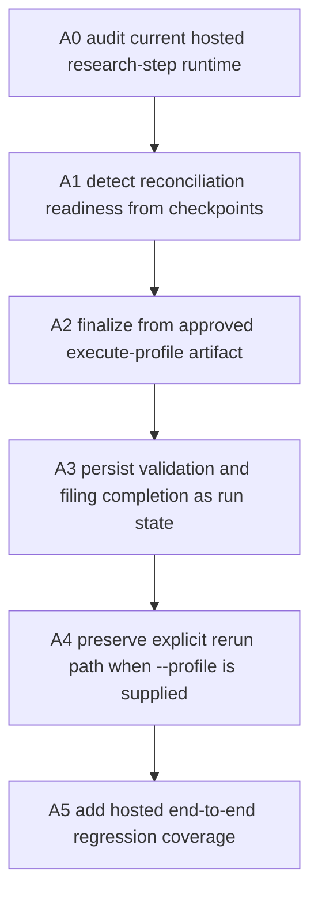
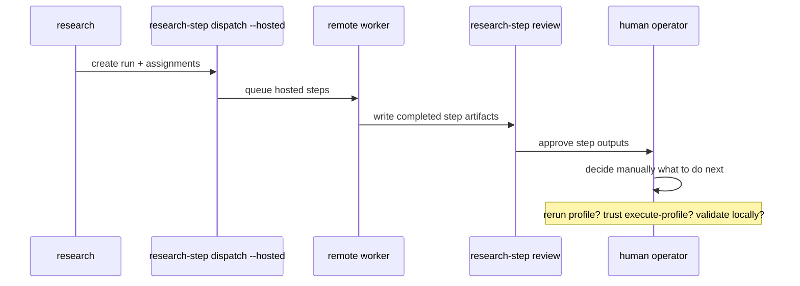
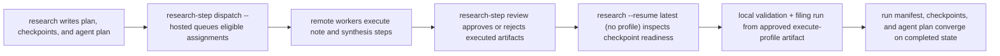

# Cognisync Research Run Reconciliation v1

Generated on 2026-04-21
Branch: main
Repo: shrijacked/Cognisync
Status: DRAFT
Mode: Builder

## Summary

Audit result on 2026-04-21:

- planner, assignment schema, and `agent-plan.json` already exist
- hosted `research_step` jobs already exist
- mirrored remote workers already execute hosted research steps end to end
- ingest-gap closure, graph change intelligence, hosted hardening, and release metadata alignment are already in the repo too

The real remaining E2E seam is smaller and more important:

Distributed research steps can now be planned, queued, executed, and reviewed, but the run is not yet reconciled as a first-class system outcome. After remote note-building or remote synthesis finishes, the workspace still depends on a human knowing when to rerun `research --resume --profile ...` and when an approved `execute-profile` artifact should instead be trusted and finalized locally.

That means Cognisync already distributes and verifies pieces of multi-agent work, but it does not yet deterministically resume and reconcile that work back into a completed research run without manual glue.

This slice closes that seam.



## Problem Statement

Today there are two good halves:

1. `research` can run straight through locally and produce a fully validated answer.
2. `research-step dispatch --hosted` can distribute note-building and synthesis work to remote workers.

What is missing is the bridge between them.

Right now, after a distributed run:

- step artifacts can be complete
- review decisions can be recorded
- assignment statuses can show `pending_review` or `approved`
- the final answer artifact can already exist on disk from `execute-profile`

But the run manifest still is not deterministically finalized from that state. Validation and filing remain local-only steps, and there is no checkpoint-aware resume path that says:

"The synthesis artifact is approved. Use it. Validate it. File it. Mark the run complete."

That gap matters because it is the last thing preventing the hosted research path from feeling like one continuous runtime instead of a powerful set of operator primitives.

## What Makes This Cool

This is where the system stops being "a really good toolkit" and starts feeling like a runtime.

After this slice:

- the same run can move from planned -> queued -> executed -> reviewed -> reconciled -> finalized
- approved remote synthesis work will not be rerun just because the operator wants to finish the run
- the filesystem stays canonical, so the final answer still comes from durable artifacts, not hidden worker state
- local one-shot `research --profile ...` behavior stays fast and simple

## Office-Hours Framing

Mode: Builder / open source infrastructure.

The strongest version is not "add one more command." The strongest version is "make the existing run lifecycle actually close."

The user job to be done is simple:

"I distributed the research work. I reviewed it. Now finish the run without making me manually reconstruct what should happen next."

Premises:

1. The run checkpoint already knows enough to decide whether finalization is allowed.
2. An approved `execute-profile` artifact should be a valid finalization source.
3. Explicit `--profile` on resume should still mean "rerun synthesis now", because that is an operator override.
4. Automatic finalization must never bypass review gates for executed review-required steps.
5. The cleanest operator surface is extending `research --resume`, not adding a parallel finalize command.

## Scope

In scope:

- extend `research --resume` so it can finalize from checkpoint state without rerunning the adapter when the run is ready
- require explicit approval for any executed step whose assignment declares review roles before checkpoint-based finalization can proceed
- treat an approved `execute-profile` output as the final answer source for local validation and filing
- persist reconciliation provenance into the research run manifest
- update plan/checkpoint/agent-plan state for `validate-citations` and `file-answer`
- add hosted end-to-end regression tests for queue -> remote worker -> review -> reconcile -> finalized run
- document the new checkpoint-aware resume behavior

Out of scope:

- new hosted review endpoints or background auto-finalization
- automatic review decisions
- remote execution for `validate-citations` or `file-answer`
- a new `research-step finalize` command
- a new control-plane endpoint just for reconciliation
- changes to ingest, graph, or hosted auth scope

## Current Operator Pain



The operator currently has to infer runtime state from artifacts that already exist. That is backwards. The checkpoint should tell the system what is ready and what is blocked.

## Approaches Considered

### Approach A: Teach `research --resume` to reconcile from checkpoint state

When resume is called without `--profile`, inspect the checkpoint and assignment state.

If:

- `execute-profile` has an output artifact
- `execute-profile` review status is `approved`
- every executed review-required step is also `approved`

then finalize locally from the existing answer artifact:

- run citation and answer validation
- update `validate-citations`
- mark `file-answer` complete if the answer artifact exists
- persist final run status and reconciliation provenance

If `--profile` is provided, keep the existing rerun behavior.

Pros:

- no new operator surface
- keeps `research` as the single run-lifecycle command
- matches the repo's earlier "keep existing CLI commands" instinct
- gives the operator a clean override: no profile means reconcile, explicit profile means rerun

Cons:

- resume logic gets more stateful
- errors must clearly explain blockers so operators trust the new behavior

### Approach B: Add a new `research-step finalize` command

Make finalization explicit as a separate command that consumes reviewed checkpoints and completes local validation plus filing.

Pros:

- conceptually obvious
- lower surprise for users who treat resume as "rerun"

Cons:

- adds another command family to learn
- splits one run lifecycle across two top-level surfaces
- duplicates behavior that already belongs to `research --resume`

### Approach C: Auto-finalize immediately when `execute-profile` is approved

Trigger deterministic validation and filing automatically as soon as the synthesis step is approved.

Pros:

- most automated feeling

Cons:

- harder to reason about
- approval side effects become larger than expected
- harder to keep local-only deterministic steps visibly operator-controlled

## Recommended Approach

Choose Approach A.

This is the paved road. `research` already owns the run lifecycle. `research-step` already owns sub-task execution and review state. The right move is to make resume smart enough to join those two halves.

That gives us the clean operator model:

- `research ...` plans or runs a research job
- `research-step ...` distributes and reviews sub-work
- `research --resume ...` reconciles the approved work into a completed run

That is the whole game.

## Lifecycle After This Slice



## Public Interface Changes

No new command is added.

Behavior changes:

### `research --resume <run>` without `--profile`

New behavior:

- if checkpoint state is reconciliation-ready, Cognisync finalizes from the approved `execute-profile` artifact without rerunning the adapter
- if the run is not reconciliation-ready, Cognisync fails with a blocker list naming exact steps and review states

Example success path:

```bash
cognisync research --workspace . --resume latest
```

Example blocker:

```text
Cannot finalize research run yet:
- build-paper-matrix is executed but still pending review
- execute-profile is not approved
```

### `research --resume <run> --profile <name>`

Preserve current behavior:

- explicit profile means rerun synthesis through the adapter
- this remains the recovery path after `changes_requested`, note edits, or deliberate reruns

### Research run manifest

Add reconciliation provenance fields:

- `resume_strategy`: `adapter_rerun` or `checkpoint_finalize`
- `reconciled_from_step_id`
- `reconciled_from_assignment_id`
- `reconciled_from_output_path`

These fields keep the final answer auditable instead of making checkpoint-based finalization feel magical.

## Reconciliation Rules

Checkpoint finalization should be allowed only when all of the following are true:

1. `execute-profile` has `execution_status=completed`
2. `execute-profile` has `review_status=approved`
3. every executed step with non-empty `review_roles` has `review_status=approved`
4. the `execute-profile` output artifact exists on disk

Then local reconciliation should:

1. read the approved `execute-profile` output
2. run `_verify_research_answer(...)`
3. write the validation report
4. mark `validate-citations` as `completed`, `warning`, or `failed`
5. mark `file-answer` as `completed` when the answer artifact exists
6. refresh checkpoints, assignment statuses, agent plan, and run manifest
7. write the research change summary

If validation fails, the run should still persist the failed validation state and return a clear error, the same way direct research runs do today.

## Implementation Tasks

| Task | Diagram Node | Files | Notes |
| --- | --- | --- | --- |
| A1 | B | `src/cognisync/research.py`, `tests/test_runtime_contracts.py` | Add deterministic reconciliation-readiness checks and blocker reporting from checkpoint plus assignment state. |
| A2 | C | `src/cognisync/research.py` | Teach resume to finalize from approved `execute-profile` output when no profile is supplied. |
| A3 | D | `src/cognisync/research.py`, `src/cognisync/types.py`, `tests/test_runtime_contracts.py` | Persist validation/file step completion and reconciliation provenance into run and agent-plan state. |
| A4 | E | `tests/test_control_plane.py`, `tests/test_runtime_contracts.py` | Add hosted queue -> remote worker -> review -> resume-finalize regression coverage. |
| A5 | F | `README.md`, `docs/operator-workflows.md`, `CHANGELOG.md` | Document that reviewed distributed work can now reconcile into a finished research run through `research --resume`. |

## Engineering Review

Architecture recommendation: keep reconciliation in `research.py`. The research run already owns plan generation, validation, filing, and manifest persistence. Splitting reconciliation into `jobs.py` or a new runtime module would make the lifecycle harder to follow.

Risk register:

| Risk | Severity | Mitigation |
| --- | ---: | --- |
| Finalizing from an untrusted synthesis artifact | High | Require `execute-profile` approval and block on any executed review-required step that is not approved. |
| Breaking existing `research --resume --profile ...` rerun behavior | High | Preserve current adapter path whenever `--profile` is explicitly supplied. |
| Older runs missing assignment metadata behave differently | Medium | Reuse the existing agent-plan/checkpoint backfill path before applying reconciliation logic. |
| Operators cannot tell why reconcile failed | Medium | Return blocker lists with exact step ids, assignment ids, execution status, and review status. |
| Validation/file statuses drift from the final answer artifact | Medium | Reuse the same `_verify_research_answer(...)`, validation report writer, checkpoint writer, and run-manifest writer that direct research already uses. |

## Test Plan

- Add runtime-contract coverage that:
  - a hosted `research-step` run can be reviewed step by step
  - `research --resume latest` with no profile finalizes from the approved `execute-profile` artifact
  - the run manifest records `resume_strategy=checkpoint_finalize`
  - `validate-citations` and `file-answer` become completed in checkpoints and assignment statuses
- Add blocker coverage that resume without `--profile` fails when any executed review-required step is still `pending_review` or `changes_requested`
- Add regression coverage that resume with explicit `--profile` still reruns synthesis and records `resume_strategy=adapter_rerun`
- Add mirrored hosted coverage in `tests/test_control_plane.py` for queue -> remote worker -> review -> checkpoint finalize
- Re-run:
  - `python3 -m unittest discover -s tests -q`
  - `PYTHONPYCACHEPREFIX=/tmp/cognisync-pyc python3 -m compileall src tests`

## Autoplan Review Report

CEO review:

- This is the real remaining seam to make the research path feel end to end.
- It is higher leverage than adding more queue features because the queue already works. The bottleneck is lifecycle closure.

Design review:

- No new command is the right call. The operator should not need to memorize a separate "finish the run" surface.
- Blocker errors must be plain English and name the exact stuck steps.

Engineering review:

- Reconciliation should reuse existing validation and manifest-writing logic, not invent a second finalization path.
- Explicit `--profile` must stay as the rerun override. Otherwise operators lose the safest repair path.
- Provenance fields in the run manifest are worth it because they make checkpoint finalization auditable.

DX review:

- `research --resume latest` becomes more powerful without becoming more complicated.
- The user mental model becomes clean: no profile means trust approved work and finalize, explicit profile means rerun.

Decision audit:

| # | Phase | Decision | Classification | Principle | Rationale | Rejected |
| --- | --- | --- | --- | --- | --- | --- |
| 1 | CEO | Prioritize reconciliation over more hosted queue work | Mechanical | Fix the bottleneck | The executor already exists. The run lifecycle still does not close itself. | Build another worker/runtime slice first. |
| 2 | Design | Reuse `research --resume` instead of adding `research-step finalize` | Taste | Keep the paved road small | One lifecycle should stay on one command surface. | Add a new finalize command. |
| 3 | Eng | Treat explicit `--profile` as a rerun override | Mechanical | Preserve operator control | It avoids silent behavior changes for repair and experimentation workflows. | Auto-finalize even when a profile is supplied. |
| 4 | Eng | Require approval for executed review-required steps before checkpoint finalization | Mechanical | Never bypass trust gates | Distributed work should not become final output until it has actually been reviewed. | Finalize from mere execution success. |

## Approval Gate

Recommended approval: implement this exact checkpoint-aware reconciliation slice next.

If approved, implementation order is A1 -> A2 -> A3 -> A4 -> A5, with tests added before claiming the runtime is complete.
