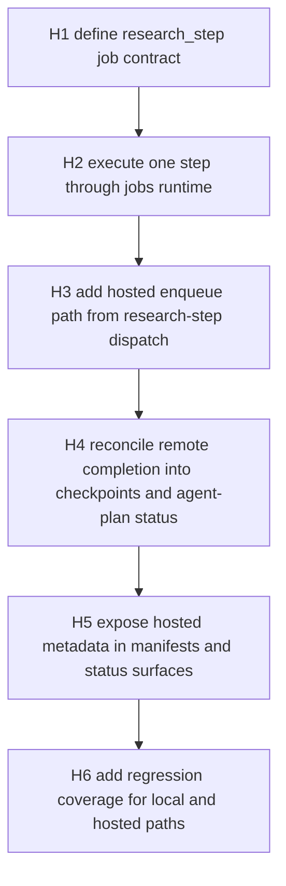

# Design: Hosted Research-Step Orchestration v1

Generated on 2026-04-14
Branch: main
Repo: shrijacked/Cognisync
Status: DRAFT
Mode: Builder

## Problem Statement

Cognisync now produces explicit research-step assignments and agent-plan artifacts, but those assignments still stop at planning metadata. Step execution is still either:

- local and direct through `research-step run`
- local and batched through `research-step dispatch`

The hosted runtime already knows how to queue jobs, lease them to workers, heartbeat them, execute them against mirrored workspaces, and sync result artifacts back. What is missing is a first-class `research_step` job that bridges those runtime primitives to the new assignment contract.

Without that bridge:

- the new agent-plan model cannot distribute work through the hosted runtime
- remote workers cannot execute research steps as native leased jobs
- operators still have to treat step orchestration as a local-only tool, even though the control plane can already coordinate other work remotely

## What Makes This Cool

This turns the planner milestone from static intent into a real distributed loop:

- the same assignment id becomes visible in the plan, queue, checkpoint, worker runtime, and review history
- a remote worker can execute one research assignment without rerunning the whole research question
- the filesystem remains canonical, so human operators, hosted workers, and future automation all reconcile through the same run directory

## Constraints

- Keep the filesystem-native contract intact.
- Reuse the existing queue, lease, worker heartbeat, and mirrored sync system instead of inventing a second orchestration runtime.
- Preserve current local `research-step` behavior.
- Keep older research runs resumable and listable.
- Avoid mixing this slice with the release-metadata cleanup.
- Treat deterministic validation and filing as local-only until the runtime proves out.

## Premises

- The highest-leverage next milestone after planner v1 is hosted research-step execution, not more plan metadata.
- The current job runtime is strong enough to host step execution if research steps become normal jobs.
- The cleanest incremental cut is one queued job per assignment-backed step, not an entirely new planner/executor subsystem.
- The first hosted slice should focus on remote-eligible research steps and preserve validation/file steps as local follow-ons.

## Approaches Considered

### Approach A: Add a dedicated `research_step` queue job on top of the existing runtime

Model each assignment-backed step as a normal queued job with explicit run, step, assignment, and adapter metadata. Remote workers claim the job through the existing control-plane APIs, execute the packet locally in their mirrored workspace, then sync the result artifacts back through the existing `complete` path.

Pros:

- reuses existing queue and worker semantics
- keeps one artifact and audit model across all hosted work
- gives research-step orchestration a first-class runtime identity
- limits blast radius to the queue, research-step code, control-plane enqueue surface, and worker execution path

Cons:

- requires careful checkpoint reconciliation when a remote completion lands
- introduces one more job type and result schema to the queue layer

### Approach B: Keep the queue generic and build a separate research-step dispatcher outside the job system

Teach `research-step dispatch` to directly talk to workers or remote adapters without creating queued jobs.

Pros:

- may feel smaller at first glance

Cons:

- duplicates queue, lease, and audit concepts the control plane already has
- makes research-step orchestration a special case instead of a first-class hosted primitive
- creates a second runtime path that future operators have to learn and debug

## Recommended Approach

Choose Approach A.

The queue already exists, remote workers already exist, and the planner already gives us stable assignment ids. The missing piece is not a new runtime concept; it is a precise connection between existing layers. Turning research steps into normal jobs is the shortest path to a durable hosted executor without creating an orchestration fork.

## Open Questions

- Should `research-step dispatch` gain an explicit queueing mode in this slice, or should hosted enqueue start on the control-plane/job surface first and let CLI routing follow immediately after?
- Should synthesis be remotely executable in v1, or should the first slice stop at note-building steps and leave synthesis local until queue reconciliation is proven?
- How should queued research-step jobs behave if a local operator already changed the same checkpoint after the job was leased?

## Success Criteria

- A research step can exist as a durable queued job with `job_type=research_step`.
- The job carries the research run id, step id, assignment id, planned adapter profile, and planned worker capability.
- A mirrored remote worker can claim and execute that job through the existing control-plane APIs.
- Completion updates the canonical run checkpoint and agent plan status without corrupting local history.
- Existing local `research-step run`, `list`, `review`, and `dispatch` paths still work.
- Backward compatibility holds for older research runs that predate the agent-plan schema.

## Distribution Plan

This remains an in-repo framework capability exposed through the existing CLI and control-plane surface. No packaging or release-shape change is required for this slice.

CI/CD stays unchanged; the existing test and verification workflow should cover the new runtime path.

## Next Steps

1. Add a first-class `research_step` job schema and executor path.
2. Add hosted enqueue surfaces that can create research-step jobs from an existing run.
3. Reconcile remote completions back into checkpoints, assignment statuses, and agent-plan artifacts.
4. Extend tests across local CLI, queue manifests, control-plane HTTP, and mirrored remote-worker execution.

## Current Runtime Audit

What already exists:

- explicit assignment and agent-plan artifacts in research runs
- deterministic step packets, checkpoints, and review state
- queue jobs with worker capabilities and leases
- control-plane endpoints for enqueue, dispatch, heartbeat, complete, and fail
- mirrored remote workers that can execute jobs against a synced local workspace and push result artifacts back

What is still missing:

- a `research_step` job type
- a queue-level result schema for step execution
- a hosted enqueue path for research steps
- checkpoint reconciliation rules for remote step completions

## Implementation Sequence

## Runtime Flow

## Proposed Public Interfaces

- Add `research_step` to the queue job model in [src/cognisync/jobs.py](/Users/owlxshri/Desktop/personal%20projects/Cognisync/src/cognisync/jobs.py).
- Add queue parameters for `research_step`:
  - `run_manifest_path`
  - `step_id`
  - `assignment_id`
  - `profile_name`
  - `planned_worker_capability`
  - `planned_review_roles`
  - `route_source`
- Add a queue result payload for `research_step`:
  - `run_manifest_path`
  - `checkpoints_path`
  - `step_id`
  - `assignment_id`
  - `profile_name`
  - `output_path`
  - `returncode`
  - `stdout`
  - `stderr`
- Add a hosted enqueue surface on the control plane:
  - `POST /api/jobs/enqueue/research-step`
- Extend `research-step dispatch` with a hosted queueing mode instead of a new command.

## File Ownership

- Queue and dispatch contract:
  - [src/cognisync/jobs.py](/Users/owlxshri/Desktop/personal%20projects/Cognisync/src/cognisync/jobs.py)
  - [src/cognisync/control_plane.py](/Users/owlxshri/Desktop/personal%20projects/Cognisync/src/cognisync/control_plane.py)
- Research-step orchestration and checkpoint reconciliation:
  - [src/cognisync/research.py](/Users/owlxshri/Desktop/personal%20projects/Cognisync/src/cognisync/research.py)
  - [src/cognisync/cli.py](/Users/owlxshri/Desktop/personal%20projects/Cognisync/src/cognisync/cli.py)
- Verification:
  - [tests/test_runtime_contracts.py](/Users/owlxshri/Desktop/personal%20projects/Cognisync/tests/test_runtime_contracts.py)
  - [tests/test_control_plane.py](/Users/owlxshri/Desktop/personal%20projects/Cognisync/tests/test_control_plane.py)

## Dependency-Ordered Task List

| ID | Task | Output | Depends On |
| --- | --- | --- | --- |
| H1 | Define `research_step` queue schema and manifest payload | queued job manifests with stable step metadata | None |
| H2 | Add executor path that runs one research step through the job runtime | `execute_job_payload(..., job_type=\"research_step\")` | H1 |
| H3 | Add hosted enqueue surfaces from CLI/control plane | queued step jobs from an existing research run | H1, H2 |
| H4 | Reconcile remote completion into checkpoints and agent plan | updated `checkpoints.json`, assignment statuses, dispatch history | H2, H3 |
| H5 | Surface hosted execution state in list and manifest outputs | richer operator visibility | H4 |
| H6 | Add runtime, HTTP, and mirrored-worker regression tests | passing test suite | H1, H2, H3, H4, H5 |

## Test Plan

- Add runtime-contract coverage that hosted dispatch creates `research_step` jobs with assignment-linked metadata.
- Add coverage that a `research_step` job executes via the jobs runtime and updates checkpoints plus assignment statuses.
- Add control-plane HTTP coverage for `POST /api/jobs/enqueue/research-step`.
- Add mirrored remote-worker coverage that a detached worker can claim and complete a queued research-step job.
- Add backward-compat coverage that older runs still work with local `research-step list/run/review`.
- Re-run:
  - `python3 -m unittest discover -s tests -q`
  - `PYTHONPYCACHEPREFIX=/tmp/cognisync-pyc python3 -m compileall src tests`

## Non-Goals For This Slice

- hosted execution for validation and filing steps
- a new standalone research-step command family
- remote synthesis plan merging across multiple workers at once
- new deployment infrastructure or auth model changes
- release-version cleanup

## GSTACK REVIEW REPORT

Review basis: builder-mode `office-hours` structure plus inline `autoplan` decision rules.

- CEO review:
  - The milestone is correctly sequenced after planner v1.
  - Reusing the existing queue/runtime is higher leverage than inventing a parallel research-step dispatcher.
- Design review:
  - This slice is operator-facing, not UI-heavy.
  - Preserving the existing `research-step` command family avoids product sprawl.
- Engineering review:
  - `research_step` should become a normal job type.
  - Validation and filing should stay local until remote step reconciliation is proven.
  - Checkpoint import and assignment-status sync are the highest-risk implementation edges.
- DX review:
  - The best user surface is extending `research-step dispatch`, not adding a second command.
  - Job manifests and status output must make hosted versus local execution obvious.

Taste decision surfaced for approval:

- Whether v1 should allow hosted execution for the final synthesis step immediately, or stop at note-building steps and add hosted synthesis in the next slice.
- Recommendation: include synthesis now, but keep validation and filing local-only.

**VERDICT:** READY FOR IMPLEMENTATION AFTER USER APPROVAL

## Approval Gate

This plan recommends one concrete next slice:

- add first-class hosted `research_step` jobs
- route them through the existing control-plane and mirrored-worker runtime
- keep validation/file steps local for now

No implementation has started yet beyond this planning document.
