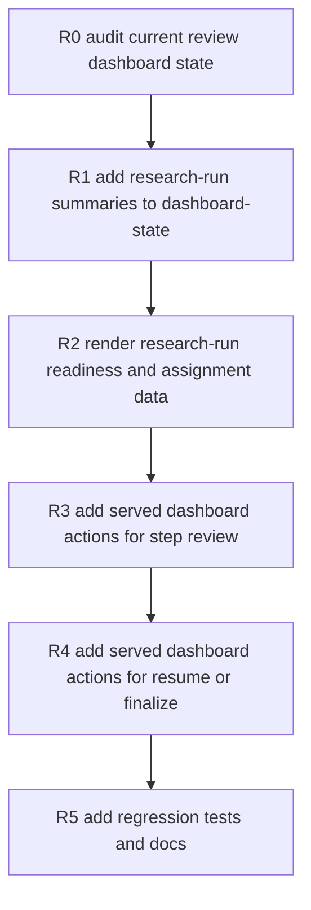
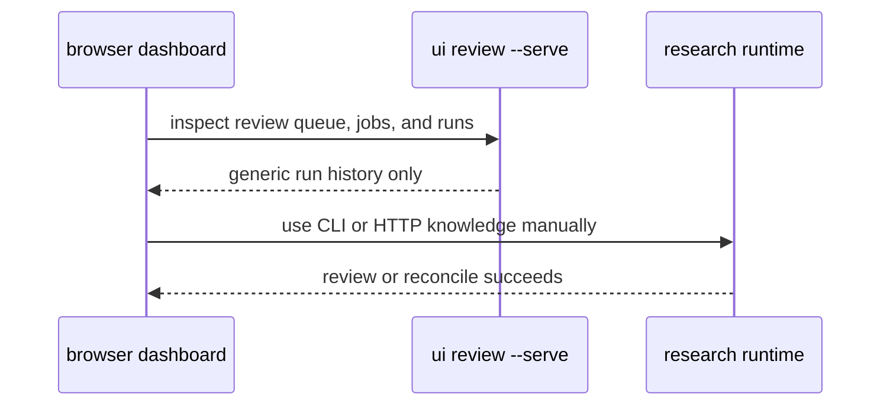
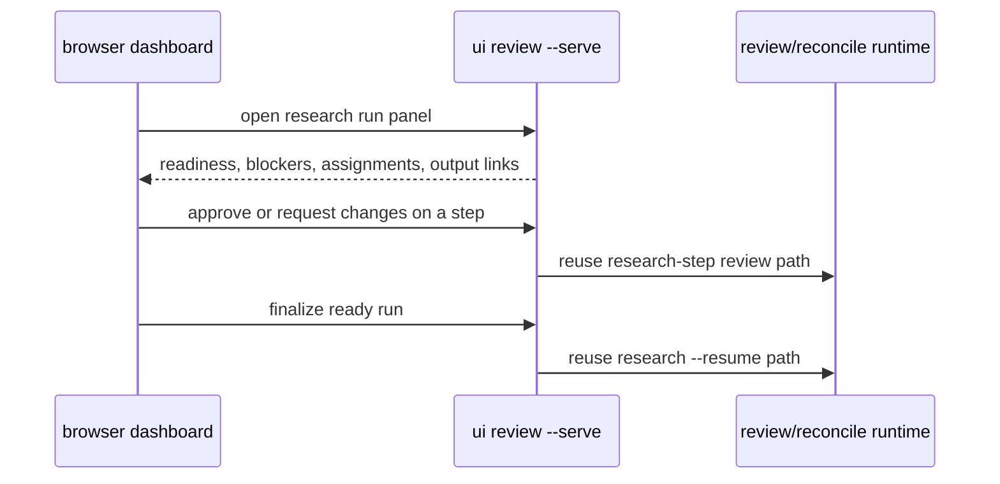

# Cognisync Review UI Research Operator Loop v1

Generated on 2026-04-21
Branch: main
Repo: shrijacked/Cognisync
Status: DRAFT
Mode: Builder

## Summary

The runtime gap that used to matter most is now closed:

- research runs write explicit agent-plan artifacts
- hosted `research_step` jobs can execute through mirrored remote workers
- hosted operators can inspect run readiness with `GET /api/research-runs`
- hosted reviewers can record step decisions with `POST /api/research-steps/review`
- hosted operators can reconcile or rerun with `POST /api/research/resume`

What still feels unfinished is the product surface.

Today Cognisync has the data and the actions, but an operator still has to know the right CLI commands or HTTP endpoints and mentally stitch together:

1. which run is blocked
2. which step needs review
3. which artifact to inspect
4. whether the run is ready to finalize

The next highest-leverage slice is to wire that research-operator loop into the existing review dashboard.

## Problem Statement

The filesystem-native runtime is now strong enough to be used end to end.

The operator experience is still weaker than the runtime:

- the review dashboard already knows about runs, jobs, workers, artifacts, notifications, and collaboration
- the research runtime already knows about assignment ids, review roles, readiness blockers, and reconcile strategy
- but those two surfaces are not joined yet

That means Cognisync still feels like an expert toolkit instead of a smoother operator product.

## Office-Hours Framing

Mode: Builder / product-surface polish.

The strongest version is not "add another page." The strongest version is:

- a reviewer can open the dashboard and see which research run is waiting on them
- that reviewer can inspect the step output and approve or request changes in place
- an operator can see when the run is ready to finalize and trigger the existing resume path from the same served dashboard

This slice should reuse the current dashboard and the current runtime contracts. It should not create a second research UI stack, a new API family, or a browser-only state store.

## Scope

In scope:

- add research-run readiness and assignment summaries to `dashboard-state.json`
- render a research-operator panel in `ui review`
- link research runs to agent-plan, checkpoints, answer, and step-output artifacts
- add served dashboard actions for:
  - research-step review
  - research resume or finalize
- preserve the current access model:
  - reviewer or operator can review steps
  - operator only can resume a run
- add regression coverage for both static render and served actions
- update README and operator docs

Out of scope:

- a new standalone web app
- hosted auth flows inside the dashboard
- browser calls directly to the control-plane HTTP surface
- automatic polling or background auto-finalization
- new runtime behavior for step execution, review semantics, or reconciliation

## Current Flow

Desired flow:

## Recommended Surface

### 1. Research run summaries in dashboard state

Extend the dashboard state payload with a dedicated research section that includes:

- run id
- question
- status
- mode
- job profile
- recommended action
- readiness for reconcile
- reconcile blockers
- plan, agent-plan, checkpoints, and answer paths
- assignment summary counts
- step entries with:
  - step id
  - assignment id
  - agent role
  - planned profile
  - planned worker capability
  - review roles
  - execution status
  - review status
  - output path

### 2. Research operator panel in the dashboard

Render a bounded panel that surfaces:

- runs ready to finalize first
- runs blocked on review second
- clear badges for `ready`, `blocked`, `completed`, and `needs_rerun`
- direct links to the relevant artifacts and previews

### 3. Served review actions

Add local served actions that reuse the existing runtime functions:

- approve step
- request changes on step
- finalize run
- rerun run with an explicit profile override

The action model should mirror the current collaboration and review actions already implemented in the dashboard server.

## File Ownership

- research-run payload shaping:
  - [src/cognisync/research.py](/Users/owlxshri/Desktop/personal projects/Cognisync/src/cognisync/research.py)
- dashboard-state and rendering:
  - [src/cognisync/review_ui.py](/Users/owlxshri/Desktop/personal projects/Cognisync/src/cognisync/review_ui.py)
- served dashboard actions:
  - [src/cognisync/review_ui.py](/Users/owlxshri/Desktop/personal projects/Cognisync/src/cognisync/review_ui.py)
- verification:
  - [tests/test_review_ui.py](/Users/owlxshri/Desktop/personal projects/Cognisync/tests/test_review_ui.py)
  - [tests/test_runtime_contracts.py](/Users/owlxshri/Desktop/personal projects/Cognisync/tests/test_runtime_contracts.py)

## Dependency-Ordered Tasks

| ID | Task | Output | Depends On |
| --- | --- | --- | --- |
| R1 | Add research-run state builder for review UI | structured research payload in dashboard state | None |
| R2 | Render research-run dashboard panel | visible operator-ready run summaries | R1 |
| R3 | Add served research-step review actions | browser review mutation path | R1, R2 |
| R4 | Add served research resume actions | browser finalize and rerun path | R1, R2, R3 |
| R5 | Add regression tests and docs | verified product surface | R1, R2, R3, R4 |

## Test Plan

- add review-ui coverage that `dashboard-state.json` includes research-run readiness, blockers, assignment summaries, and step metadata
- add review-ui coverage that served research-step review actions update checkpoints exactly like the CLI path
- add review-ui coverage that served research resume actions finalize from approved checkpoint state
- add review-ui coverage that operator-only role checks block reviewers from finalizing a run
- re-run:
  - `python3 -m unittest -q tests.test_review_ui`
  - `python3 -m unittest discover -s tests -q`
  - `PYTHONPYCACHEPREFIX=/tmp/cognisync-pyc python3 -m compileall src tests`

## Risks

| Risk | Severity | Mitigation |
| --- | ---: | --- |
| Dashboard becomes noisy | Medium | Keep a dedicated bounded research panel instead of dumping every step into the main run table. |
| Review UI duplicates hosted API logic | Medium | Reuse existing research runtime functions directly, just like current local review and job actions. |
| Access model drifts from CLI semantics | High | Reuse the same access-role gates already used by research-step review and research resume. |
| Large run histories slow dashboard generation | Medium | Bound rendered sections and sort deterministically. |

## Approval Gate

Recommended approval: implement this dashboard productization slice next.

If approved, implementation order is `R1 -> R2 -> R3 -> R4 -> R5`, with tests written before the production changes that satisfy them.
